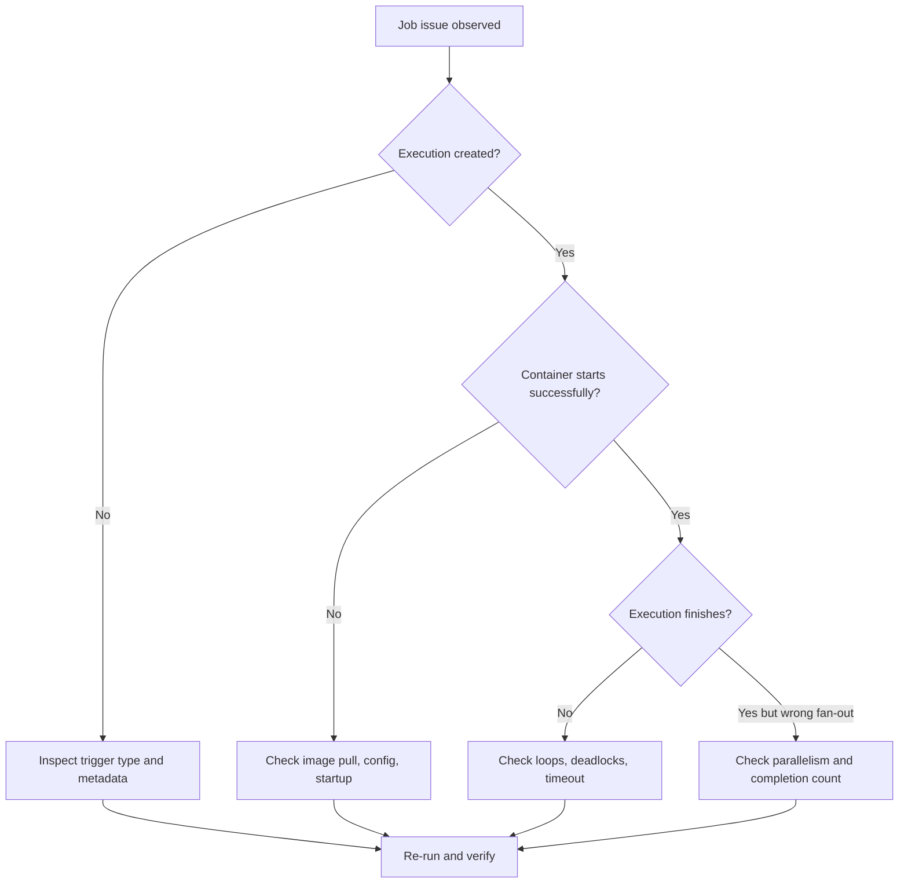

---
content_sources:
  diagrams:
    - id: jobs-troubleshooting-path
      type: flowchart
      source: self-generated
      justification: Symptom-driven troubleshooting flow synthesized from repository job playbooks and Microsoft Learn Jobs guidance.
      based_on:
        - https://learn.microsoft.com/azure/container-apps/jobs
        - https://learn.microsoft.com/azure/container-apps/troubleshooting
content_validation:
  status: pending_review
  last_reviewed: "2026-04-26"
  reviewer: ai-agent
  core_claims:
    - claim: "Job executions can fail because of startup, configuration, runtime, or timeout problems."
      source: "https://learn.microsoft.com/azure/container-apps/jobs"
      verified: true
    - claim: "Container Apps troubleshooting relies on execution inspection and log analysis."
      source: "https://learn.microsoft.com/azure/container-apps/troubleshooting"
      verified: true
---

# Jobs Troubleshooting

Use this page when a Container Apps Job fails, hangs, misses a schedule, or does not fan out the way you expected.

## Symptom

Common symptoms:

- job fails immediately after starting
- job runs but never completes
- event-driven job never triggers
- scheduled job appears to miss a window
- replica fan-out does not match expectations

<!-- diagram-id: jobs-troubleshooting-path -->


## Possible Causes

| Symptom | Possible causes |
|---|---|
| Fails immediately | bad image, registry auth, missing env var, startup crash, secret or identity issue |
| Runs but never completes | infinite loop, blocked I/O, no exit path, timeout mismatch |
| Event-driven job not triggering | scaler metadata mismatch, auth failure, unsupported scaler assumption, empty source |
| Scheduled run missed | cron misunderstanding, UTC/local-time confusion, prior long-running execution, external scheduler assumptions |
| Replica fan-out not working | `parallelism` misunderstood, `replicaCompletionCount` set too low or too high, workload itself serializes all work |

## Diagnosis Steps

### Job fails immediately

1. List executions and inspect the failed run.
2. Check image and registry configuration.
3. Review console and system logs for startup/auth errors.

```bash
az containerapp job execution list \
  --name "$JOB_NAME" \
  --resource-group "$RG" \
  --output table

az containerapp job execution show \
  --name "$JOB_NAME" \
  --resource-group "$RG" \
  --job-execution-name "$EXECUTION_NAME" \
  --output json
```

### Job runs but never completes

1. Compare observed runtime with `replicaTimeout`.
2. Look for application logs that show loops or blocked dependencies.
3. Verify the process exits after successful work.

### Event-driven job not triggering

1. Re-check scaler metadata names and values.
2. Validate identity or secret access to the event source.
3. Confirm there is actually backlog or lag to trigger on.

!!! warning "Do not assume Jobs support every app scaler"
    If you copied scaler configuration from a continuously running Container App, verify that the same scaler is currently supported for event-driven Jobs before you keep debugging metadata.

### Scheduled job missed an execution

1. Translate the cron expression into UTC and local business time.
2. Compare the expected window with recent execution timestamps.
3. Check whether the previous run was still active or failed unexpectedly.

!!! warning "Overlap behavior still needs direct verification"
    This troubleshooting path treats overlap as a possibility you must design around.
    Confirm current product behavior before you assume the platform will serialize or skip overlapping schedule windows for you.

### Replica fan-out not working

1. Confirm configured `parallelism` and `replicaCompletionCount`.
2. Inspect the workload: it may still process input sequentially inside each replica.
3. Validate that external dependencies are not enforcing serialization.

## Resolution

| Symptom | Resolution |
|---|---|
| Fails immediately | fix image pull, env vars, secret refs, identity, or startup command |
| Never completes | add explicit exit path, reduce work per execution, raise timeout only after measuring |
| Event-driven not triggering | correct scaler metadata, fix auth, switch to a verified event source if needed |
| Missed schedule | rewrite cron in UTC, widen interval, add external lock or alerting |
| Fan-out mismatch | align `parallelism`, `replicaCompletionCount`, and workload partition logic |

## Prevention

- emit structured logs with execution correlation fields
- document cron expressions in UTC and business-local time
- validate scaler config in a lower environment before production
- keep retries low until idempotency is proven
- separate input repair, replay, and dead-letter procedures in the runbook

## See Also

- [Jobs Operations](index.md)
- [Execution Lifecycle](../../platform/jobs/execution-lifecycle.md)
- [Container App Job Execution Failure Playbook](../../troubleshooting/playbooks/platform-features/container-app-job-execution-failure.md)

## Sources

- [Jobs in Azure Container Apps (Microsoft Learn)](https://learn.microsoft.com/azure/container-apps/jobs)
- [Troubleshoot Azure Container Apps (Microsoft Learn)](https://learn.microsoft.com/azure/container-apps/troubleshooting)
