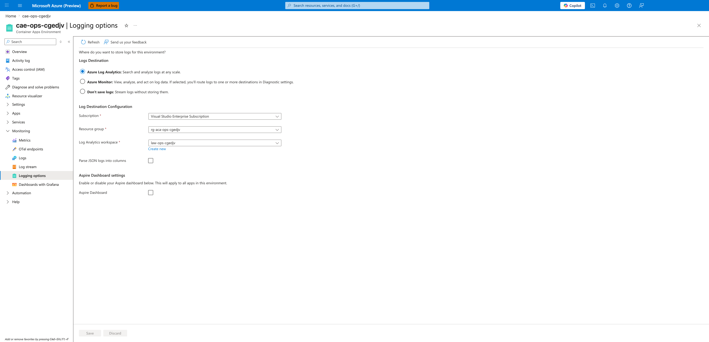
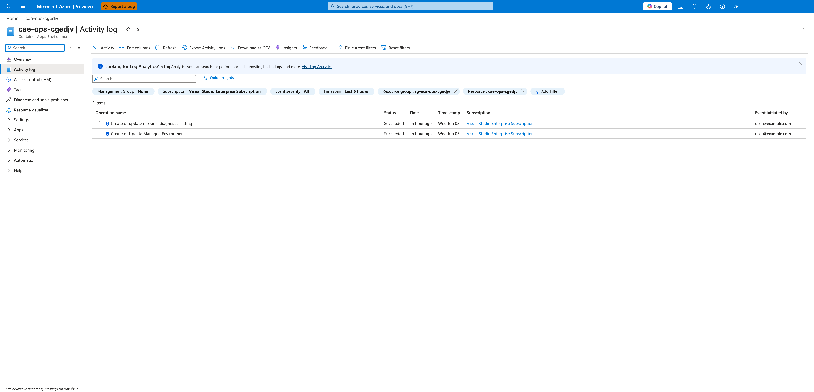
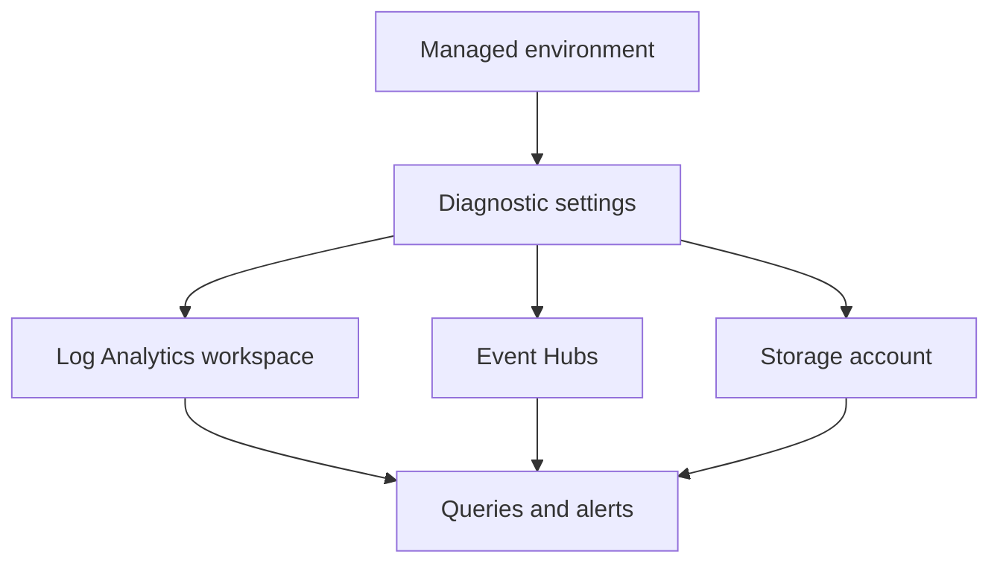

---
content_sources:
  diagrams:
  - id: diagnostic-settings-routing-flow
    type: flowchart
    source: mslearn-adapted
    based_on:
    - https://learn.microsoft.com/azure/azure-monitor/essentials/diagnostic-settings
    - https://learn.microsoft.com/azure/container-apps/log-monitoring
content_validation:
  status: pending_review
  last_reviewed: '2026-04-25'
  reviewer: agent
  core_claims:
  - claim: Azure Monitor diagnostic settings can route platform logs to supported destinations such as Log Analytics workspaces
      and Event Hubs.
    source: https://learn.microsoft.com/azure/azure-monitor/essentials/diagnostic-settings
    verified: true
  - claim: Container Apps log monitoring documentation should be checked before assuming exact category names for managed
      environments.
    source: https://learn.microsoft.com/azure/container-apps/log-monitoring
    verified: true
---
# Diagnostic Settings

Use diagnostic settings when the default workspace path is not enough and you need extra export, retention, or downstream processing for Container Apps environment logs.

## Prerequisites

- An existing Container Apps environment
- Permission to create diagnostic settings and target destinations
- Azure CLI access for both Container Apps and Azure Monitor resources

```bash
export RG="rg-aca-prod"
export ENVIRONMENT_NAME="aca-env-prod"
export ENVIRONMENT_ID="/subscriptions/<subscription-id>/resourceGroups/$RG/providers/Microsoft.App/managedEnvironments/$ENVIRONMENT_NAME"
```

## When to Use

- To send environment logs to additional Azure Monitor destinations
- To integrate with SIEM, archive, or Event Hub consumers
- To keep export scope tighter than a general workspace strategy

## Procedure

1. Identify the managed environment resource ID.
2. Decide whether you need all available log categories or a limited set.
3. Create the diagnostic setting.
4. Validate that records arrive at the destination.

Example to route logs to Log Analytics:

```bash
az monitor diagnostic-settings create \
  --name "aca-env-diagnostics" \
  --resource "$ENVIRONMENT_ID" \
  --workspace "/subscriptions/<subscription-id>/resourceGroups/$RG/providers/Microsoft.OperationalInsights/workspaces/law-aca-prod" \
  --logs '[{"categoryGroup":"allLogs","enabled":true}]'
```

| Command | Why it is used |
|---|---|
| `az monitor diagnostic-settings ...` | Creates or inspects Azure Monitor alerts, diagnostic settings, or metrics. |

### Portal view: confirm log destination on the environment

Open the Container Apps environment → **Monitoring** → **Logging options**.



[Observed] The Logging options blade shows three radio choices under **Logs Destination**: `Azure Log Analytics`, `Azure Monitor`, and `Don't save logs`. `Azure Log Analytics` is the selected option. Under **Log Destination Configuration**, `Subscription`, `Resource group` (`rg-aca-ops-cgedjv`), and `Log Analytics workspace` (`law-ops-cgedjv`) are populated, the `Parse JSON logs into columns` checkbox is unchecked, and the toolbar `Save` and `Discard` buttons are disabled.

[Inferred] The `Azure Log Analytics` selection plus the populated workspace value means this environment is already sending system and console logs to `law-ops-cgedjv`. If you intend to add an Azure Monitor diagnostic setting on top of (or instead of) this default workspace path, you usually keep `Azure Log Analytics` selected here and create a separate `az monitor diagnostic-settings` rule against the environment resource ID; switching to `Azure Monitor` in this blade is the alternative entry point that the in-blade hint text describes.

[Not Proven] This blade alone does not list the `az monitor diagnostic-settings` rules that exist on the environment, does not show the categories or category groups those rules export, and does not confirm whether records are currently arriving at the destination — those need a separate confirmation (see the Activity log view below and the Verification section).

### Portal view: confirm the diagnostic setting was created

Open the Container Apps environment → **Activity log** and filter by recent operations.



[Observed] The Activity log blade shows two rows: `Create or update resource diagnostic setting` and `Create or Update Managed Environment`, both with `Status = Succeeded`. The filter chips above the grid show `Resource group: rg-aca-ops-cgedjv` and `Resource: cae-ops-cgedjv`, the timespan is `Last 6 hours`, and the row count reads `2 items`.

[Inferred] The `Create or update resource diagnostic setting` row that targets `cae-ops-cgedjv` is the Activity-log record produced by the `az monitor diagnostic-settings create --resource $ENVIRONMENT_ID ...` call from the Procedure. A `Succeeded` status here is the operation-level result for the control-plane write, so it confirms the rule was accepted by Azure Resource Manager against the managed environment.

[Not Proven] This Activity-log row does not show which categories (`allLogs` vs. a category subset) the rule exports, does not show the destination type (Log Analytics vs. Event Hub vs. Storage), and does not confirm that log records are flowing to that destination — only that the write succeeded. Use `az monitor diagnostic-settings list --resource "$ENVIRONMENT_ID"` to read the actual rule, and the Verification section below to confirm ingestion.

Minimal Bicep pattern:

```bicep
resource diagnosticSetting 'Microsoft.Insights/diagnosticSettings@2021-05-01-preview' = {
  name: 'aca-env-diagnostics'
  scope: managedEnvironment
  properties: {
    logs: [
      {
        categoryGroup: 'allLogs'
        enabled: true
      }
    ]
    workspaceId: logAnalyticsWorkspace.id
  }
}
```

!!! warning "Confirm category names against current Container Apps documentation"
    Azure Monitor diagnostic settings documentation confirms generic `categoryGroup` values such as `allLogs`, but the cited Container Apps pages don't publish a Container Apps-specific category list for managed environments.
    Before using a production template, verify whether your environment exposes `category`, `categoryGroup`, or a more specific category set in the portal, template export, or current Microsoft Learn update.

<!-- diagram-id: diagnostic-settings-routing-flow -->


## Verification

- Confirm the diagnostic setting exists on the managed environment.
- Confirm the selected categories or category group match your intended scope.
- Confirm records arrive in the chosen destination.

## Rollback / Troubleshooting

- If ingestion cost rises, reduce categories or retention.
- If no logs arrive, verify permissions on the destination resource.
- If you see duplicate ingestion, review overlap with existing workspace collection.

## See Also

- [Logging Operations](index.md)
- [Monitoring](../monitoring/index.md)
- [Alerts](../alerts/index.md)

## Sources

- [Diagnostic settings in Azure Monitor](https://learn.microsoft.com/azure/azure-monitor/essentials/diagnostic-settings)
- [Log monitoring in Azure Container Apps](https://learn.microsoft.com/azure/container-apps/log-monitoring)
