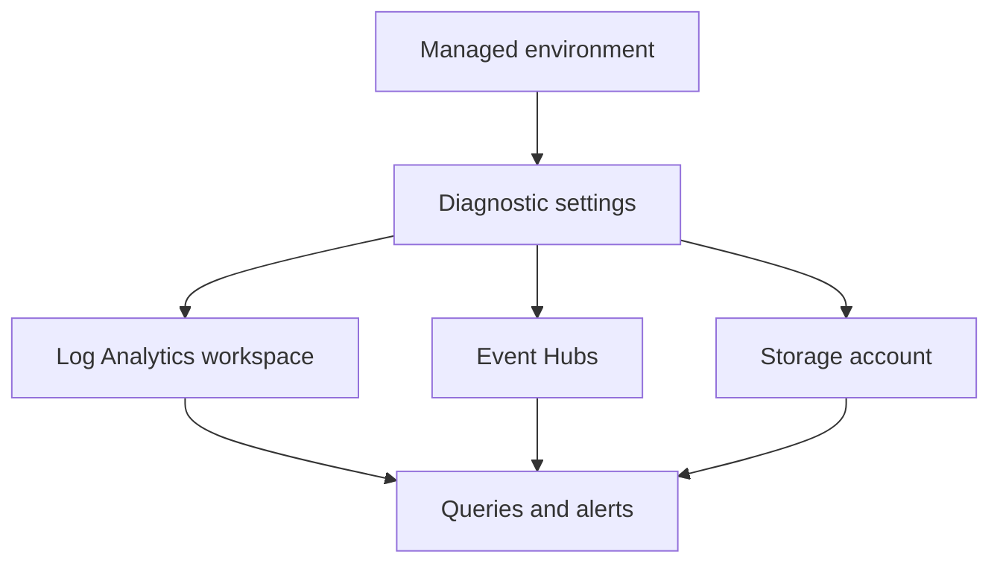

---
content_sources:
  diagrams:
    - id: diagnostic-settings-routing-flow
      type: flowchart
      source: mslearn-adapted
      based_on:
        - https://learn.microsoft.com/azure/azure-monitor/essentials/diagnostic-settings
        - https://learn.microsoft.com/azure/container-apps/log-monitoring
content_validation:
  status: pending_review
  last_reviewed: "2026-04-25"
  reviewer: agent
  core_claims:
    - claim: "Azure Monitor diagnostic settings can route platform logs to supported destinations such as Log Analytics workspaces and Event Hubs."
      source: "https://learn.microsoft.com/azure/azure-monitor/essentials/diagnostic-settings"
      verified: true
    - claim: "Container Apps log monitoring documentation should be checked before assuming exact category names for managed environments."
      source: "https://learn.microsoft.com/azure/container-apps/log-monitoring"
      verified: true
---

# Diagnostic Settings

Use diagnostic settings when the default workspace path is not enough and you need extra export, retention, or downstream processing for Container Apps environment logs.

## Prerequisites

- An existing Container Apps environment
- Permission to create diagnostic settings and target destinations
- Azure CLI access for both Container Apps and Azure Monitor resources

```bash
export RG="rg-aca-prod"
export ENVIRONMENT_NAME="aca-env-prod"
export ENVIRONMENT_ID="/subscriptions/<subscription-id>/resourceGroups/$RG/providers/Microsoft.App/managedEnvironments/$ENVIRONMENT_NAME"
```

## When to Use

- To send environment logs to additional Azure Monitor destinations
- To integrate with SIEM, archive, or Event Hub consumers
- To keep export scope tighter than a general workspace strategy

## Procedure

1. Identify the managed environment resource ID.
2. Decide whether you need all available log categories or a limited set.
3. Create the diagnostic setting.
4. Validate that records arrive at the destination.

Example to route logs to Log Analytics:

```bash
az monitor diagnostic-settings create \
  --name "aca-env-diagnostics" \
  --resource "$ENVIRONMENT_ID" \
  --workspace "/subscriptions/<subscription-id>/resourceGroups/$RG/providers/Microsoft.OperationalInsights/workspaces/law-aca-prod" \
  --logs '[{"categoryGroup":"allLogs","enabled":true}]'
```

Minimal Bicep pattern:

```bicep
resource diagnosticSetting 'Microsoft.Insights/diagnosticSettings@2021-05-01-preview' = {
  name: 'aca-env-diagnostics'
  scope: managedEnvironment
  properties: {
    logs: [
      {
        categoryGroup: 'allLogs'
        enabled: true
      }
    ]
    workspaceId: logAnalyticsWorkspace.id
  }
}
```

!!! warning "Confirm category names against current Container Apps documentation"
    Azure Monitor diagnostic settings documentation confirms generic `categoryGroup` values such as `allLogs`, but the cited Container Apps pages don't publish a Container Apps-specific category list for managed environments.
    Before using a production template, verify whether your environment exposes `category`, `categoryGroup`, or a more specific category set in the portal, template export, or current Microsoft Learn update.

<!-- diagram-id: diagnostic-settings-routing-flow -->


## Verification

- Confirm the diagnostic setting exists on the managed environment.
- Confirm the selected categories or category group match your intended scope.
- Confirm records arrive in the chosen destination.

## Rollback / Troubleshooting

- If ingestion cost rises, reduce categories or retention.
- If no logs arrive, verify permissions on the destination resource.
- If you see duplicate ingestion, review overlap with existing workspace collection.

## See Also

- [Logging Operations](index.md)
- [Monitoring](../monitoring/index.md)
- [Alerts](../alerts/index.md)

## Sources

- [Diagnostic settings in Azure Monitor](https://learn.microsoft.com/azure/azure-monitor/essentials/diagnostic-settings)
- [Log monitoring in Azure Container Apps](https://learn.microsoft.com/azure/container-apps/log-monitoring)
