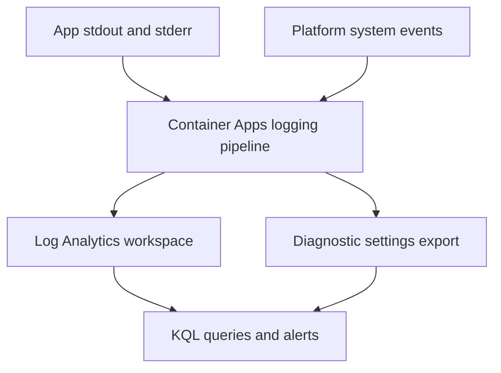

---
content_sources:
  diagrams:
    - id: logging-architecture-overview
      type: flowchart
      source: mslearn-adapted
      based_on:
        - https://learn.microsoft.com/azure/container-apps/log-monitoring
        - https://learn.microsoft.com/azure/azure-monitor/reference/tables/containerappconsolelogs
        - https://learn.microsoft.com/azure/azure-monitor/reference/tables/containerappsystemlogs
content_validation:
  status: verified
  last_reviewed: "2026-04-25"
  reviewer: agent
  core_claims:
    - claim: "Azure Container Apps exposes console logs and system logs for operations workflows."
      source: "https://learn.microsoft.com/azure/container-apps/log-monitoring"
      verified: true
    - claim: "Azure Monitor publishes table references for ContainerAppConsoleLogs and ContainerAppSystemLogs."
      source: "https://learn.microsoft.com/azure/azure-monitor/reference/tables/containerappconsolelogs"
      verified: true
    - claim: "Microsoft Learn currently documents `_CL` query examples in the Container Apps log monitoring article and native table references in Azure Monitor table reference pages."
      source: "https://learn.microsoft.com/azure/container-apps/log-monitoring"
      verified: true
---

# Logging Operations

Azure Container Apps logging operations start with separating application console output from platform system events, then deciding where those streams should be retained, queried, and exported.

## Prerequisites

- A Container Apps environment and at least one running app
- Azure CLI with the Container Apps extension installed
- Access to the workspace or monitoring destination used by the environment

```bash
export RG="rg-aca-prod"
export APP_NAME="app-python-api-prod"
export ENVIRONMENT_NAME="aca-env-prod"

az extension add --name containerapp --upgrade
```

## When to Use

- When you need to explain how Container Apps logs are produced and stored
- When you are standardizing workspace, export, or retention decisions
- When you need to separate app stdout or stderr from platform lifecycle events

## Procedure

1. Confirm the environment log destination.
2. Treat console logs and system logs as separate operational streams.
3. Query the active workspace tables before automating alerts.
4. Add diagnostic settings only when you need extra destinations or longer retention patterns.

Container Apps operationally produces two useful streams:

- **Console logs** for application stdout and stderr
- **System logs** for revision lifecycle, probe, scale, replica, and platform events

For workspace queries, use the table names that exist in your environment. Microsoft Learn currently documents both naming patterns:

- Native Azure Monitor table reference pages: `ContainerAppConsoleLogs`, `ContainerAppSystemLogs`
- Container Apps log-monitoring article and CLI examples: `ContainerAppConsoleLogs_CL`, `ContainerAppSystemLogs_CL`

Check your workspace schema before standardizing KQL. Microsoft Learn's Container Apps article still shows `_CL` tables and suffixed columns, while Azure Monitor's table reference pages document native tables and unsuffixed columns.

<!-- diagram-id: logging-architecture-overview -->


Log retention is primarily a workspace and downstream destination decision. Keep Container Apps runbooks aligned with:

- Log Analytics retention policy
- Diagnostic settings export scope
- Cost controls for noisy console logs

## Verification

Check the environment logging configuration:

```bash
az containerapp env show \
  --name "$ENVIRONMENT_NAME" \
  --resource-group "$RG" \
  --query "properties.appLogsConfiguration" \
  --output json
```

Validate that the expected tables exist by running a short query against your workspace and testing both native and legacy names if needed.

## Rollback / Troubleshooting

- If logs are missing, verify the environment log destination before changing app code.
- If KQL returns no rows, test both native and legacy table names.
- If costs spike, reduce noisy application logging before broadening export scope.

## See Also

- [Log Streaming](log-streaming.md)
- [Log Analytics Queries](log-analytics-queries.md)
- [Diagnostic Settings](diagnostic-settings.md)
- [Monitoring](../monitoring/index.md)
- [Alerts](../alerts/index.md)

## Sources

- [Log monitoring in Azure Container Apps](https://learn.microsoft.com/azure/container-apps/log-monitoring)
- [ContainerAppConsoleLogs table reference](https://learn.microsoft.com/azure/azure-monitor/reference/tables/containerappconsolelogs)
- [ContainerAppSystemLogs table reference](https://learn.microsoft.com/azure/azure-monitor/reference/tables/containerappsystemlogs)
- [ContainerAppConsoleLogs table reference](https://learn.microsoft.com/azure/azure-monitor/reference/tables/containerappconsolelogs)
- [ContainerAppSystemLogs table reference](https://learn.microsoft.com/azure/azure-monitor/reference/tables/containerappsystemlogs)
