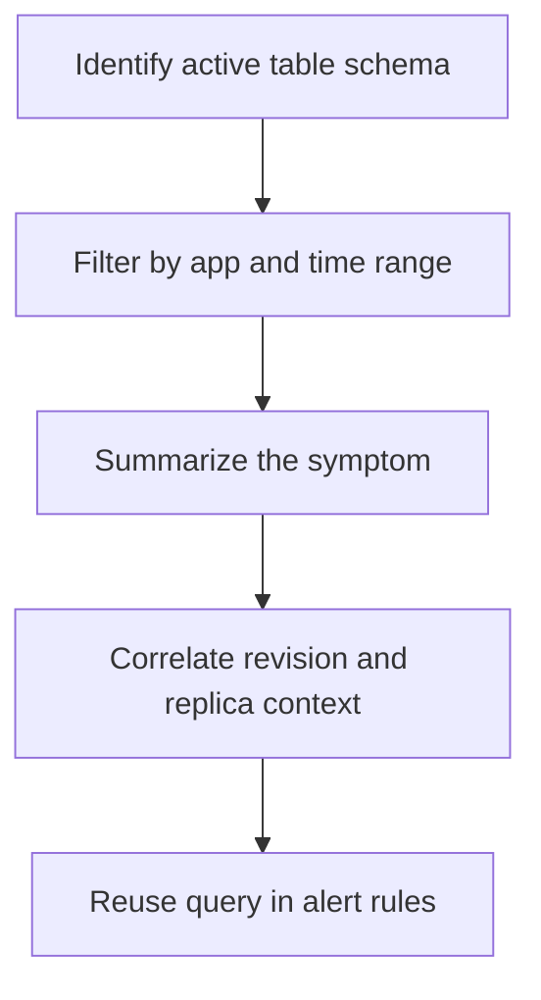

---
content_sources:
  diagrams:
    - id: log-analytics-query-workflow
      type: flowchart
      source: mslearn-adapted
      based_on:
        - https://learn.microsoft.com/azure/container-apps/log-monitoring
        - https://learn.microsoft.com/azure/azure-monitor/reference/tables/containerappconsolelogs
        - https://learn.microsoft.com/azure/azure-monitor/reference/tables/containerappsystemlogs
content_validation:
  status: verified
  last_reviewed: "2026-04-25"
  reviewer: agent
  core_claims:
    - claim: "Container Apps logs can be queried in Log Analytics with KQL."
      source: "https://learn.microsoft.com/azure/container-apps/log-monitoring"
      verified: true
    - claim: "Azure Monitor publishes native table references for ContainerAppConsoleLogs and ContainerAppSystemLogs."
      source: "https://learn.microsoft.com/azure/azure-monitor/reference/tables/containerappsystemlogs"
      verified: true
    - claim: "Microsoft Learn currently documents both `_CL` query examples and native table references for Container Apps logs."
      source: "https://learn.microsoft.com/azure/container-apps/log-monitoring"
      verified: true
---

# Log Analytics Queries

Use Log Analytics queries when you need retained history, aggregation, or alert-friendly KQL rather than a live tail.

## Prerequisites

- A Log Analytics workspace receiving Container Apps logs
- Permission to query the workspace
- App, revision, and environment naming conventions documented for responders

```bash
export WORKSPACE_ID="<log-analytics-workspace-id>"
export APP_NAME="app-python-api-prod"
```

## When to Use

- For error-rate and latency trend analysis
- For scale-event, revision, and restart investigation
- For scheduled-query alerts and reusable incident queries

## Procedure

Start by confirming whether your workspace uses native tables or legacy `_CL` tables. Then build a small query window before turning it into an alert.

Example pattern using the native table names:

```kusto
let AppName = "app-python-api-prod";
ContainerAppConsoleLogs
| where TimeGenerated > ago(15m)
| where ContainerAppName == AppName
| where Log contains "ERROR" or Log contains "Exception"
| summarize ErrorCount = count() by bin(TimeGenerated, 5m)
| order by TimeGenerated asc
```

Slow request pattern when your application writes structured request timing to console logs:

```kusto
let AppName = "app-python-api-prod";
ContainerAppConsoleLogs
| where TimeGenerated > ago(30m)
| where ContainerAppName == AppName
| where Log has "durationMs"
| project TimeGenerated, RevisionName, ContainerName, Log
```

Scale and replica events from system logs:

```kusto
let AppName = "app-python-api-prod";
ContainerAppSystemLogs
| where TimeGenerated > ago(30m)
| where ContainerAppName == AppName
| where Log has_any ("scale", "KEDA", "replica")
| project TimeGenerated, RevisionName, ReplicaName, Reason, Log
| order by TimeGenerated desc
```

Restart-loop and probe investigation:

```kusto
let AppName = "app-python-api-prod";
ContainerAppSystemLogs
| where TimeGenerated > ago(2h)
| where ContainerAppName == AppName
| where Reason has_any ("ProbeFailed", "BackOff", "CrashLoopBackOff", "ContainerTerminated")
| summarize FailureCount = count() by RevisionName, ReplicaName, Reason
| order by FailureCount desc
```

Ingress 4xx or 5xx checks depend on what your app emits to console logs. If your app writes structured HTTP status lines, query those fields or strings from the console-log table that exists in your workspace.

Microsoft Learn currently shows both schema shapes. The Container Apps log-monitoring article uses `_CL` tables and suffixed columns such as `ContainerAppName_s`, `RevisionName_s`, and `Log_s`, while Azure Monitor's table reference pages document native tables and columns such as `ContainerAppName`, `RevisionName`, and `Log`.

<!-- diagram-id: log-analytics-query-workflow -->


## Verification

- Confirm the query returns current rows for the target app.
- Confirm table and column names match the workspace schema.
- Confirm alert thresholds are stable before creating scheduled-query alerts.

## Rollback / Troubleshooting

- If no rows appear, test native and `_CL` table names.
- If a copied query fails, adapt the columns to the workspace schema before debugging the app.
- If alerts are noisy, narrow the time window or raise the threshold.

## See Also

- [Logging Operations](index.md)
- [Diagnostic Settings](diagnostic-settings.md)
- [Alerts](../alerts/index.md)
- [Troubleshooting KQL Catalog](../../troubleshooting/kql/index.md)
- [Ingress Error Analysis](../../troubleshooting/kql/ingress-and-networking/ingress-error-analysis.md)
- [Health Probe Timeline](../../troubleshooting/kql/system-and-revisions/health-probe-timeline.md)
- [Scaling Events](../../troubleshooting/kql/scaling-and-replicas/scaling-events.md)
- [Repeated Startup Attempts](../../troubleshooting/kql/restarts/repeated-startup-attempts.md)

## Sources

- [Log monitoring in Azure Container Apps](https://learn.microsoft.com/azure/container-apps/log-monitoring)
- [ContainerAppConsoleLogs table reference](https://learn.microsoft.com/azure/azure-monitor/reference/tables/containerappconsolelogs)
- [ContainerAppSystemLogs table reference](https://learn.microsoft.com/azure/azure-monitor/reference/tables/containerappsystemlogs)
