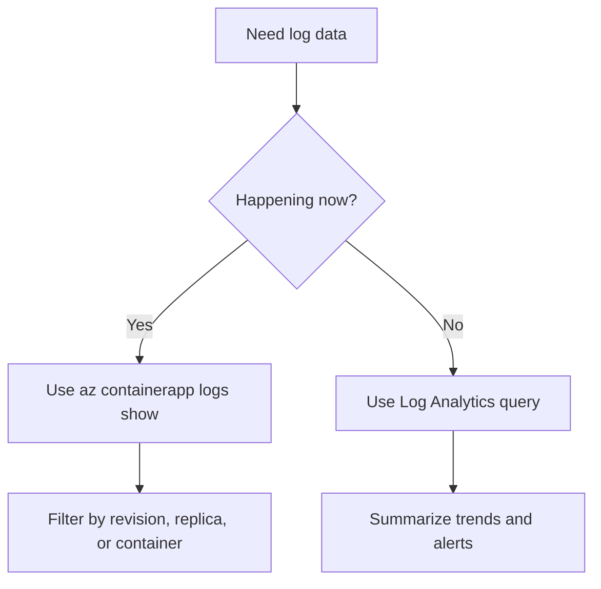

---
content_sources:
  diagrams:
    - id: log-streaming-decision-flow
      type: flowchart
      source: mslearn-adapted
      based_on:
        - https://learn.microsoft.com/azure/container-apps/log-streaming
        - https://learn.microsoft.com/azure/container-apps/log-monitoring
content_validation:
  status: pending_review
  last_reviewed: "2026-04-25"
  reviewer: agent
  core_claims:
    - claim: "Azure Container Apps supports live log streaming with az containerapp logs show."
      source: "https://learn.microsoft.com/azure/container-apps/log-streaming"
      verified: true
    - claim: "Live streaming is different from querying retained logs in Log Analytics."
      source: "https://learn.microsoft.com/azure/container-apps/log-monitoring"
      verified: true
---

# Log Streaming

Use live log streaming when you need to watch the current behavior of a running container app, revision, or replica before you move into longer-window KQL analysis.

## Prerequisites

- A running container app revision
- Azure CLI with the Container Apps extension installed
- Permission to read app logs

```bash
export RG="rg-aca-prod"
export APP_NAME="app-python-api-prod"
```

## When to Use

- During active incidents
- During rollout validation for a new revision
- When a single replica or container is failing right now

## Procedure

Start a basic live stream:

```bash
az containerapp logs show \
  --name "$APP_NAME" \
  --resource-group "$RG" \
  --follow
```

Use filters when you already know the failing scope:

```bash
az containerapp logs show \
  --name "$APP_NAME" \
  --resource-group "$RG" \
  --revision "${APP_NAME}--stable" \
  --follow
```

```bash
az containerapp logs show \
  --name "$APP_NAME" \
  --resource-group "$RG" \
  --container "$APP_NAME" \
  --replica "${APP_NAME}--stable-abc123" \
  --follow
```

Streaming is best for **current** output. Log Analytics is better when you need:

- retained history
- counts and aggregations
- cross-app or cross-revision queries
- scheduled-query alerts

<!-- diagram-id: log-streaming-decision-flow -->


## Verification

- Confirm that streaming returns recent application output.
- Confirm that filters isolate the expected revision, replica, or container.
- Confirm that incident timestamps line up with later workspace queries.

## Rollback / Troubleshooting

- If the stream is empty, verify the app is running and writing to stdout or stderr.
- If a filtered stream is empty, re-check the exact revision or replica name.
- If you need historical comparison, switch to Log Analytics instead of continuing to tail.

## See Also

- [Logging Operations](index.md)
- [Log Analytics Queries](log-analytics-queries.md)
- [Troubleshooting KQL Catalog](../../troubleshooting/kql/index.md)

## Sources

- [Stream logs in Azure Container Apps](https://learn.microsoft.com/azure/container-apps/log-streaming)
- [Log monitoring in Azure Container Apps](https://learn.microsoft.com/azure/container-apps/log-monitoring)
