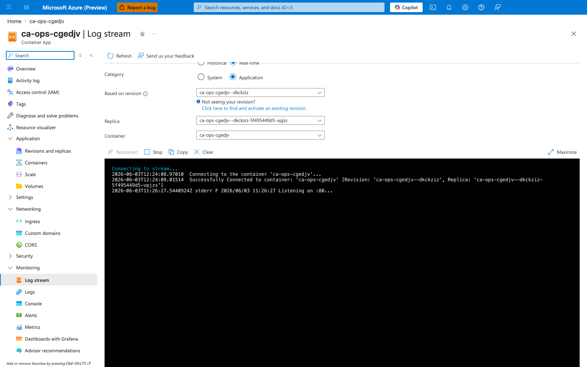
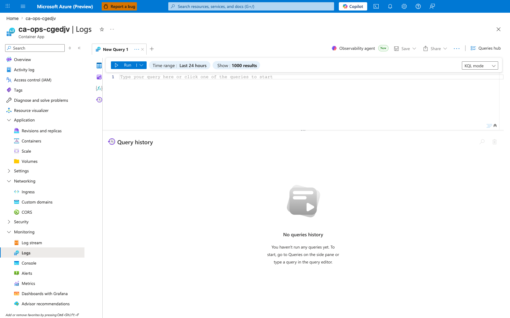
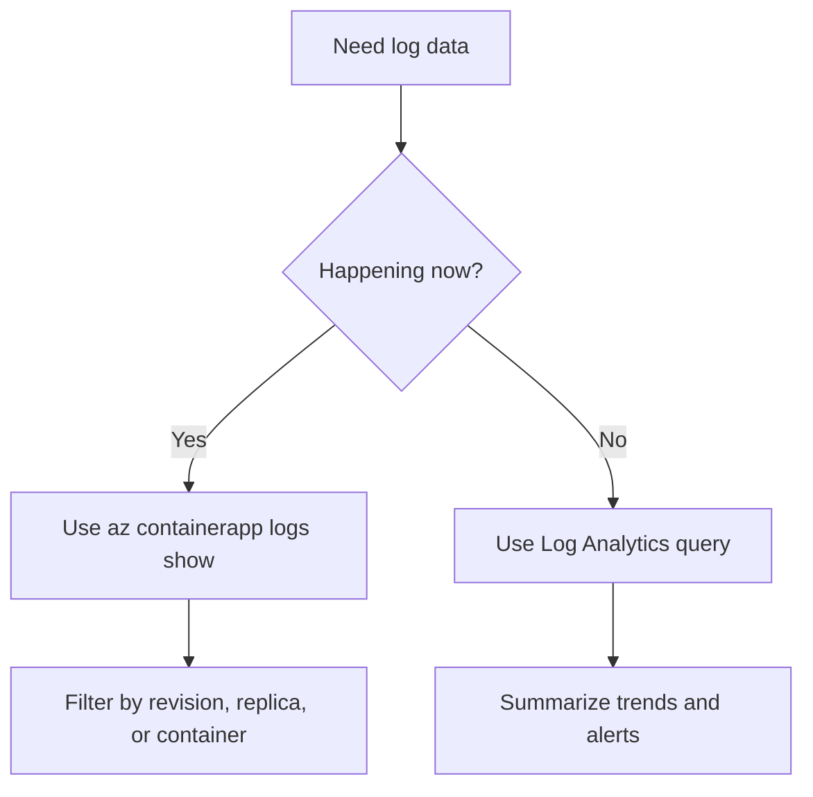

---
content_sources:
  diagrams:
    - id: log-streaming-decision-flow
      type: flowchart
      source: mslearn-adapted
      based_on:
        - https://learn.microsoft.com/en-us/azure/container-apps/log-streaming
        - https://learn.microsoft.com/en-us/azure/container-apps/log-monitoring
content_validation:
  status: pending_review
  last_reviewed: '2026-04-25'
  reviewer: agent
  core_claims:
    - claim: Azure Container Apps supports live log streaming with az containerapp logs show.
      source: https://learn.microsoft.com/en-us/azure/container-apps/log-streaming
      verified: true
    - claim: Live streaming is different from querying retained logs in Log Analytics.
      source: https://learn.microsoft.com/en-us/azure/container-apps/log-monitoring
      verified: true
---
# Log Streaming

Use live log streaming when you need to watch the current behavior of a running container app, revision, or replica before you move into longer-window KQL analysis.

## Prerequisites

- A running container app revision
- Azure CLI with the Container Apps extension installed
- Permission to read app logs

```bash
export RG="rg-aca-prod"
export APP_NAME="app-python-api-prod"
```

## When to Use

- During active incidents
- During rollout validation for a new revision
- When a single replica or container is failing right now

## Procedure

Start a basic live stream:

```bash
az containerapp logs show \
  --name "$APP_NAME" \
  --resource-group "$RG" \
  --follow
```

| Command | Why it is used |
|---|---|
| `az containerapp logs show ...` | Runs the Azure CLI operation required by the documented step. |

### Portal view: Log stream blade

Navigate: **Container App** → **Monitoring** → **Log stream**.



`[Observed]` The **Log stream** blade renders a live, append-only console of stdout/stderr from the selected revision. **Replica** and **Container** dropdowns at the top of the blade let you narrow the stream without leaving the page.

`[Inferred]` The Portal stream is the UI-equivalent of `az containerapp logs show --follow` — both subscribe to the same live log channel exposed by the Container Apps data plane, so it is the right tool when you need output during an active incident rather than retained history.

`[Not Proven]` Whether the Portal stream and the CLI stream share the exact same buffer cursor (i.e., whether they would emit identical lines for the same wall-clock window) is not verified here.

Use filters when you already know the failing scope:

```bash
az containerapp logs show \
  --name "$APP_NAME" \
  --resource-group "$RG" \
  --revision "${APP_NAME}--stable" \
  --follow
```

| Command | Why it is used |
|---|---|
| `az containerapp logs show ...` | Runs the Azure CLI operation required by the documented step. |

```bash
az containerapp logs show \
  --name "$APP_NAME" \
  --resource-group "$RG" \
  --container "$APP_NAME" \
  --replica "${APP_NAME}--stable-abc123" \
  --follow
```

| Command | Why it is used |
|---|---|
| `az containerapp logs show ...` | Runs the Azure CLI operation required by the documented step. |

Streaming is best for **current** output. Log Analytics is better when you need:

- retained history
- counts and aggregations
- cross-app or cross-revision queries
- scheduled-query alerts

### Portal view: Log Analytics workspace (retained history)

Navigate: **Container App** → **Monitoring** → **Logs**.



`[Observed]` The **Logs** blade on the Container App opens a query editor tab (**New Query 1**) with a **Run** button, a **Time range** selector (currently **Last 24 hours**), a **Show** row-limit selector (**1000 results**), a **KQL mode** dropdown, an empty editor showing the placeholder *"Type your query here or click one of the queries to start"*, and a **Query history** panel below.

`[Inferred]` This editor is the Log Analytics surface scoped to the workspace attached to the Container Apps environment — the same workspace that the environment's diagnostic settings stream logs into. It is the correct surface for **historical** analysis (counts, aggregations, cross-revision queries) because the data is persisted in the workspace; live tailing belongs on the Log stream blade, not here. The tables exposed for this workload are typically `ContainerAppConsoleLogs_CL` (stdout/stderr) and `ContainerAppSystemLogs_CL` (platform events) — confirm by expanding the **Tables** pane on the left.

`[Not Proven]` The exact ingestion lag between a log line being emitted by the container and becoming queryable in this blade depends on workspace ingestion behavior and is not measured on this page.

<!-- diagram-id: log-streaming-decision-flow -->


| Command | Why it is used |
|---|---|
| `az containerapp logs show ...` | Runs the Azure CLI operation required by the documented step. |

## Verification

- Confirm that streaming returns recent application output.
- Confirm that filters isolate the expected revision, replica, or container.
- Confirm that incident timestamps line up with later workspace queries.

## Rollback / Troubleshooting

- If the stream is empty, verify the app is running and writing to stdout or stderr.
- If a filtered stream is empty, re-check the exact revision or replica name.
- If you need historical comparison, switch to Log Analytics instead of continuing to tail.

## See Also

- [Logging Operations](index.md)
- [Log Analytics Queries](log-analytics-queries.md)
- [Troubleshooting KQL Catalog](../../troubleshooting/kql/index.md)

## Sources

- [Stream logs in Azure Container Apps](https://learn.microsoft.com/en-us/azure/container-apps/log-streaming)
- [Log monitoring in Azure Container Apps](https://learn.microsoft.com/en-us/azure/container-apps/log-monitoring)
