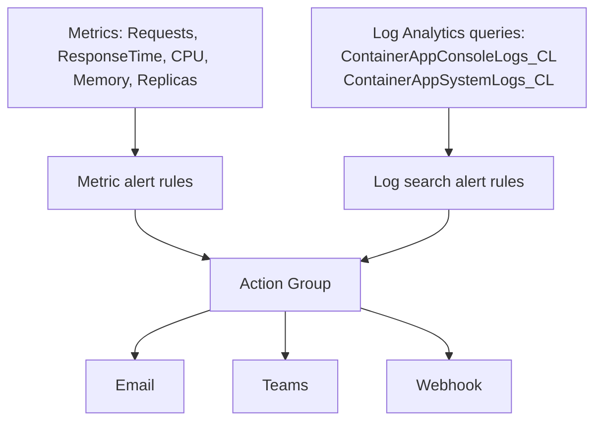

# Observability Operations

This guide covers production observability operations for Container Apps using Log Analytics, Application Insights, and distributed tracing.

## Signals and Alerting Architecture



## Prerequisites

- Log Analytics workspace connected to the Container Apps environment
- Application Insights configured for application telemetry

```bash
export RG="rg-aca-prod"
export APP_NAME="app-python-api-prod"
export ENVIRONMENT_NAME="aca-env-prod"
```

## Log Analytics Operations

Identify workspace connected to the environment:

```bash
az containerapp env show \
  --name "$ENVIRONMENT_NAME" \
  --resource-group "$RG" \
  --query "properties.appLogsConfiguration" \
  --output json
```

Run a KQL query for recent errors:

```bash
az monitor log-analytics query \
  --workspace "<log-analytics-workspace-id>" \
  --analytics-query "ContainerAppConsoleLogs_CL | where ContainerAppName_s == '$APP_NAME' | where Log_s contains 'ERROR' | limit 50" \
  --output table
```

## Application Insights Operations

List availability and request telemetry for the app:

```bash
az monitor app-insights query \
  --app "<app-insights-name>" \
  --resource-group "$RG" \
  --analytics-query "requests | where cloud_RoleName == '$APP_NAME' | summarize count() by resultCode, bin(timestamp, 5m)" \
  --output table
```

Use container logs directly during active incidents:

```bash
az containerapp logs show \
  --name "$APP_NAME" \
  --resource-group "$RG" \
  --type console \
  --follow false
```

## Distributed Tracing Operations

Confirm trace context propagation across services by querying end-to-end operation IDs in Application Insights.

```bash
az monitor app-insights query \
  --app "<app-insights-name>" \
  --resource-group "$RG" \
  --analytics-query "dependencies | where cloud_RoleName == '$APP_NAME' | project timestamp, operation_Id, target, resultCode | limit 20" \
  --output table
```

## Verification Steps

Check that logs and traces are flowing within expected delay windows.

```bash
az monitor app-insights component show \
  --app "<app-insights-name>" \
  --resource-group "$RG" \
  --output json
```

Example output (PII masked):

```json
{
  "id": "/subscriptions/<subscription-id>/resourceGroups/rg-aca-prod/providers/microsoft.insights/components/appi-aca-prod",
  "name": "appi-aca-prod",
  "provisioningState": "Succeeded"
}
```

## Troubleshooting

### No logs in workspace

- Confirm environment log configuration points to the expected workspace.
- Check regional alignment between app, environment, and workspace.
- Validate IAM permissions for querying telemetry resources.

### Missing distributed traces

- Verify OpenTelemetry exporter endpoint and connection string settings.
- Ensure incoming requests include trace context headers.

## Advanced Topics

- Define SLO-based alerts (latency, error rate, saturation).
- Build dashboards combining infra metrics and app traces.
- Use sampling strategies to balance fidelity and telemetry cost.

## See Also
- [Health and Recovery](../../platform/reliability/health-recovery.md)
- [Cost Optimization](../../platform/reliability/cost-optimization.md)

## References
- [Azure Monitor for Container Apps](https://learn.microsoft.com/azure/container-apps/log-monitoring)
- [OpenTelemetry in Azure Container Apps (Microsoft Learn)](https://learn.microsoft.com/azure/container-apps/opentelemetry-agents)
