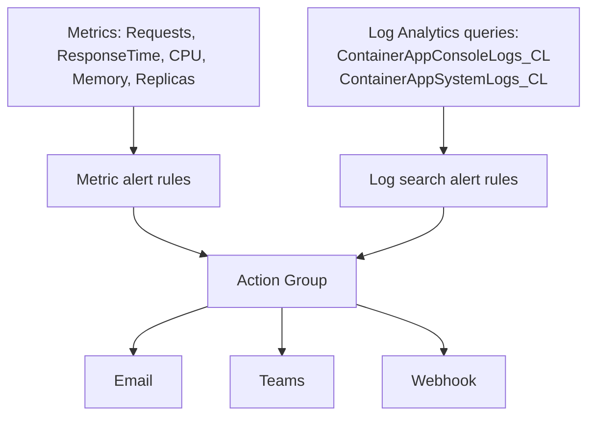
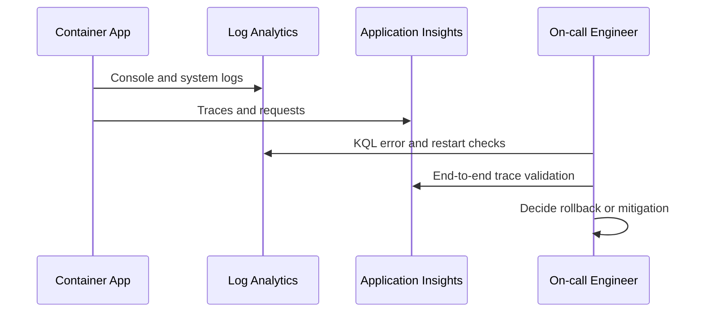

---
content_sources:
  diagrams:
    - id: signals-and-alerting-architecture
      type: flowchart
      source: mslearn-adapted
      based_on:
        - https://learn.microsoft.com/azure/container-apps/log-monitoring
        - https://learn.microsoft.com/azure/container-apps/opentelemetry-agents
    - id: telemetry-freshness-workflow
      type: sequence
      source: mslearn-adapted
      based_on:
        - https://learn.microsoft.com/azure/container-apps/log-monitoring
        - https://learn.microsoft.com/azure/container-apps/opentelemetry-agents
---

# Observability Operations

This guide covers production observability operations for Container Apps using Log Analytics, Application Insights, and distributed tracing.

## Signals and Alerting Architecture

<!-- diagram-id: signals-and-alerting-architecture -->


## Prerequisites

- Log Analytics workspace connected to the Container Apps environment
- Application Insights configured for application telemetry

```bash
export RG="rg-myapp"
export APP_NAME="ca-myapp"
export ENVIRONMENT_NAME="cae-myapp"
```

## Log Analytics Operations

Identify workspace connected to the environment:

```bash
az containerapp env show \
  --name "$ENVIRONMENT_NAME" \
  --resource-group "$RG" \
  --query "properties.appLogsConfiguration" \
  --output json
```

Example output (PII scrubbed):

```json
{
  "destination": "log-analytics",
  "logAnalyticsConfiguration": {
    "customerId": "xxxxxxxx-xxxx-xxxx-xxxx-xxxxxxxxxxxx"
  }
}
```

Run a KQL query for recent errors:

```bash
az monitor log-analytics query \
  --workspace "<log-analytics-workspace-id>" \
  --analytics-query "ContainerAppConsoleLogs_CL | where ContainerAppName_s == '$APP_NAME' | where Log_s contains 'ERROR' | limit 50" \
  --output table
```

Example output:

```text
No results found.
```

## Application Insights Operations

List availability and request telemetry for the app:

```bash
az monitor app-insights query \
  --app "<app-insights-name>" \
  --resource-group "$RG" \
  --analytics-query "requests | where cloud_RoleName == '$APP_NAME' | summarize count() by resultCode, bin(timestamp, 5m)" \
  --output table
```

Use container logs directly during active incidents:

```bash
az containerapp logs show \
  --name "$APP_NAME" \
  --resource-group "$RG" \
  --type console \
  --follow false
```

Example output from the running revision:

```json
{"status":"healthy","timestamp":"2026-04-04T11:32:37.322216+00:00"}
```

Track replica and revision health as platform signals:

```bash
az containerapp revision list \
  --name "$APP_NAME" \
  --resource-group "$RG" \
  --output json

az containerapp replica list \
  --name "$APP_NAME" \
  --resource-group "$RG" \
  --revision "ca-myapp--0000001" \
  --output json
```

Example output (PII scrubbed):

```json
[
  {
    "name": "ca-myapp--0000001",
    "active": true,
    "trafficWeight": 100,
    "replicas": 1,
    "healthState": "Healthy",
    "runningState": "Running"
  }
]
```

```json
[
  {
    "name": "ca-myapp--0000001-646779b4c5-bhc2v",
    "properties": {
      "containers": [
        {
          "name": "ca-myapp",
          "ready": true,
          "restartCount": 0,
          "runningState": "Running"
        }
      ],
      "runningState": "Running"
    }
  }
]
```

## Distributed Tracing Operations

Confirm trace context propagation across services by querying end-to-end operation IDs in Application Insights.

```bash
az monitor app-insights query \
  --app "<app-insights-name>" \
  --resource-group "$RG" \
  --analytics-query "dependencies | where cloud_RoleName == '$APP_NAME' | project timestamp, operation_Id, target, resultCode | limit 20" \
  --output table
```

## Verification Steps

Check that logs and traces are flowing within expected delay windows.

```bash
az monitor app-insights component show \
  --app "<app-insights-name>" \
  --resource-group "$RG" \
  --output json
```

Example output (PII masked):

```json
{
  "id": "/subscriptions/<subscription-id>/resourceGroups/rg-myapp/providers/microsoft.insights/components/<app-insights-name>",
  "name": "<app-insights-name>",
  "provisioningState": "Succeeded"
}
```

## Observability Decision Matrix

| Signal Type | Best For | Query Surface | Typical Alert Latency |
|---|---|---|---|
| Platform metrics | Fast saturation and availability detection | Azure Monitor metrics | 1-2 minutes |
| Console/system logs | Detailed failure context and root cause hints | Log Analytics (KQL) | 2-5 minutes |
| Distributed traces | Cross-service request path analysis | Application Insights | 2-5 minutes |

!!! tip "Pair every alert with an investigation query"
    For each alert rule, store a companion KQL query that responders can run immediately. This shortens MTTR by removing first-response guesswork.

!!! warning "Avoid unbounded log volume"
    Excessive debug logging can increase ingestion cost and hide actionable events. Use structured JSON logs and severity controls in production.

### Telemetry Freshness Workflow

<!-- diagram-id: telemetry-freshness-workflow -->


## Troubleshooting

### No logs in workspace

- Confirm environment log configuration points to the expected workspace.
- Check regional alignment between app, environment, and workspace.
- Validate IAM permissions for querying telemetry resources.

### Missing distributed traces

- Verify OpenTelemetry exporter endpoint and connection string settings.
- Ensure incoming requests include trace context headers.

## Advanced Topics

- Define SLO-based alerts (latency, error rate, saturation).
- Build dashboards combining infra metrics and app traces.
- Use sampling strategies to balance fidelity and telemetry cost.

## See Also
- [Health and Recovery](../../platform/reliability/health-recovery.md)
- [Cost Optimization](../../platform/reliability/cost-optimization.md)

## Sources
- [Azure Monitor for Container Apps](https://learn.microsoft.com/azure/container-apps/log-monitoring)
- [OpenTelemetry in Azure Container Apps (Microsoft Learn)](https://learn.microsoft.com/azure/container-apps/opentelemetry-agents)
