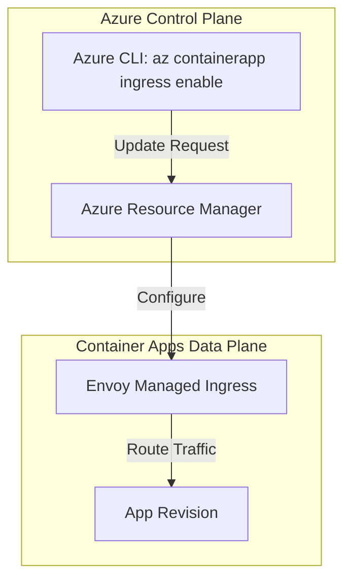
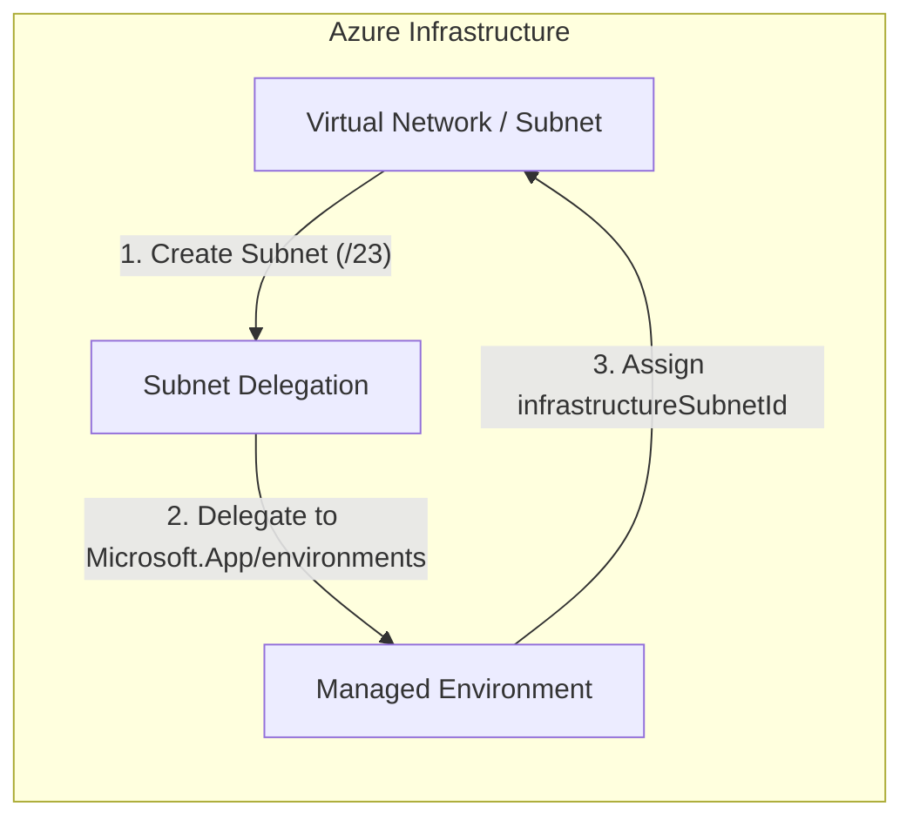

# Networking Operations

This guide covers day-2 networking operations for Container Apps: ingress updates, VNet-related checks, and service discovery between apps.

## Prerequisites

- Container Apps environment deployed with required network model
- Ingress requirements documented (internal vs external)

```bash
export RG="rg-aca-prod"
export APP_NAME="app-python-api-prod"
export ENVIRONMENT_NAME="aca-env-prod"
```

## Ingress Configuration Operations

Enable external ingress with explicit target port:

```bash
az containerapp ingress enable \
  --name "$APP_NAME" \
  --resource-group "$RG" \
  --type external \
  --target-port 8000
```

### Ingress Flow



Switch to internal ingress for private-only access:

```bash
az containerapp ingress disable \
  --name "$APP_NAME" \
  --resource-group "$RG"
```

```bash
az containerapp ingress enable \
  --name "$APP_NAME" \
  --resource-group "$RG" \
  --type internal \
  --target-port 8000
```

### Verify Ingress Configuration

**Control-plane check** — confirm ingress type and target port:

```bash
az containerapp show \
  --name "$APP_NAME" \
  --resource-group "$RG" \
  --query "properties.configuration.ingress" \
  --output json
```

Expected output (PII masked):

```json
{
  "external": false,
  "targetPort": 8000,
  "transport": "auto",
  "fqdn": "app-python-api-prod.internal.<region>.azurecontainerapps.io"
}
```

**Data-plane check** — confirm the app responds on the FQDN:

```bash
# For external ingress
FQDN=$(az containerapp show \
  --name "$APP_NAME" \
  --resource-group "$RG" \
  --query "properties.configuration.ingress.fqdn" \
  --output tsv)

curl --silent --output /dev/null --write-out "%{http_code}" "https://$FQDN/health"
```

Expected result: `200`

!!! note "Internal ingress"
    Internal ingress FQDNs resolve only from within the same VNet. Run the data-plane check from a VM or pod inside the environment's VNet.

## VNet and Environment Checks

### VNet Setup Flow



Inspect managed environment network profile:

```bash
az containerapp env show \
  --name "$ENVIRONMENT_NAME" \
  --resource-group "$RG" \
  --output json
```

Validate subnet details (Azure CLI network command):

```bash
az network vnet subnet show \
  --resource-group "$RG" \
  --vnet-name "vnet-aca-prod" \
  --name "snet-containerapps" \
  --output table
```

### Verify VNet Integration

**Control-plane check** — confirm the environment is attached to a VNet:

```bash
az containerapp env show \
  --name "$ENVIRONMENT_NAME" \
  --resource-group "$RG" \
  --query "{vnetConfig: properties.vnetConfiguration, staticIp: properties.staticIp}" \
  --output json
```

Expected output (PII masked):

```json
{
  "vnetConfig": {
    "infrastructureSubnetId": "/subscriptions/<subscription-id>/resourceGroups/rg-aca-prod/providers/Microsoft.Network/virtualNetworks/vnet-aca-prod/subnets/snet-containerapps",
    "internal": true
  },
  "staticIp": "10.0.0.4"
}
```

**Data-plane check** — confirm subnet delegation is correct:

```bash
az network vnet subnet show \
  --resource-group "$RG" \
  --vnet-name "vnet-aca-prod" \
  --name "snet-containerapps" \
  --query "delegations[].serviceName" \
  --output tsv
```

Expected result: `Microsoft.App/environments`

## Service Discovery Operations

For app-to-app calls in the same environment, use internal FQDN from ingress settings.

```bash
az containerapp show \
  --name "$APP_NAME" \
  --resource-group "$RG" \
  --query "properties.configuration.ingress.fqdn" \
  --output tsv
```

### Verify Service Discovery

**Control-plane check** — retrieve the internal FQDN of the target app:

```bash
az containerapp show \
  --name "$APP_NAME" \
  --resource-group "$RG" \
  --query "properties.configuration.ingress.{fqdn: fqdn, external: external}" \
  --output json
```

Expected output (internal app):

```json
{
  "fqdn": "app-python-api-prod.internal.<region>.azurecontainerapps.io",
  "external": false
}
```

**Data-plane check** — confirm DNS resolution from another app in the same environment using a Kudu console or exec session:

```bash
# Run from inside the calling container (exec into container or use Kudu)
nslookup app-python-api-prod.internal.<region>.azurecontainerapps.io
```

Expected result: The FQDN resolves to the environment's internal IP (e.g., `10.0.x.x`).

!!! warning "Cross-environment calls"
    Internal FQDNs are scoped to the environment. Apps in different environments cannot reach each other via these FQDNs — use VNet peering or public endpoints for cross-environment communication.

## Troubleshooting

### Requests time out

- Confirm ingress type matches caller location.
- Verify application port and `targetPort` alignment.
- Check NSG or route table updates affecting VNet path.

```bash
az network watcher test-connectivity \
  --resource-group "$RG" \
  --source-resource "/subscriptions/<subscription-id>/resourceGroups/$RG/providers/Microsoft.App/containerApps/$APP_NAME" \
  --dest-address "<dependency-hostname>" \
  --dest-port 443
```

## Advanced Topics

- Use internal ingress plus Application Gateway for centralized WAF.
- Define egress allow-list controls with Azure Firewall or NVA.
- Standardize DNS and naming for service-to-service resilience.

## See Also

- [Security](./security.md)
- [Health and Recovery](./health-recovery.md)
- [Container Apps networking](https://learn.microsoft.com/azure/container-apps/networking)
- [VNet integration in Azure Container Apps (Microsoft Learn)](https://learn.microsoft.com/azure/container-apps/vnet-custom-internal)
