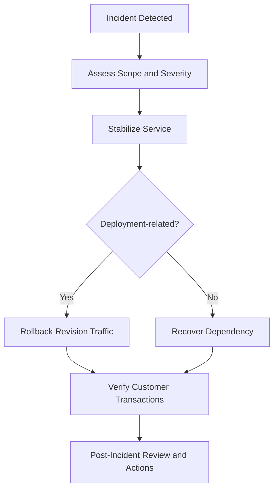

# Recovery and Incident Readiness

Recovery readiness for Container Apps combines fast rollback, dependency recovery, and clear incident operations. This document provides baseline procedures for service restoration.

## Revision Rollback Procedures

Container Apps revisions allow low-risk rollback when a deployment causes regressions.

Rollback workflow:

1. Identify last known good revision.
2. Route traffic back to that revision.
3. Confirm health and key business transactions.
4. Freeze further deployments until root cause is understood.

Example traffic rollback:

```bash
az containerapp revision set-mode \
  --name "$APP_NAME" \
  --resource-group "$RG" \
  --mode "multiple"
```

```bash
az containerapp ingress traffic set \
  --name "$APP_NAME" \
  --resource-group "$RG" \
  --revision-weight "$APP_NAME--rev-good=100"
```

## Environment Recovery

If environment-level issues occur (networking, control plane anomalies):

- Verify regional service health and platform incidents.
- Validate environment configuration drift against IaC baseline.
- Recreate non-critical environments from Bicep to verify reproducibility.
- Keep production recovery runbooks versioned and tested quarterly.

## Data Recovery Patterns

Container Apps is stateless by design, but workloads often depend on stateful services.

Recovery should include:

- Database point-in-time restore procedures
- Storage account soft-delete/versioning practices
- Queue/topic poison message handling strategy
- Data reconciliation job for partially completed workflows

## Incident Response Checklist

- Declare severity and assign incident commander.
- Establish communication channel and update cadence.
- Capture timeline of alerts, deployments, and mitigation steps.
- Restore service using rollback or dependency failover.
- Validate customer-facing transactions after mitigation.
- Open follow-up work items before closure.

## Post-Incident Review Template

Every sev1/sev2 incident should produce a concise review:

- **What happened** (symptoms and scope)
- **Why it happened** (technical and process causes)
- **What restored service** (mitigation path)
- **What prevents recurrence** (engineering and operational actions)
- **Owner and due date** for each action item

Track completion of action items in the same backlog used for feature delivery.

## Backup Strategies for Stateful Workloads

- Use native backup capabilities of each managed service (SQL, Cosmos DB, Storage).
- Verify restore objectives (RTO/RPO) with periodic drills.
- Store backup policies and retention in IaC for auditability.
- Align backup retention with compliance requirements.

## Recovery Drills

Run controlled drills at least once per quarter:

- Simulated bad deployment rollback
- Regional dependency degradation scenario
- Expired secret/credential rotation failure scenario

Measure detection-to-recovery time and refine runbooks after each drill.

## Incident Recovery Workflow



## Recovery Strategy Matrix

| Failure Type | First Response | Preferred Mitigation | Validation |
|---|---|---|---|
| Bad application release | Route traffic to stable revision | Deactivate failed revision | Health endpoint + business transaction checks |
| Secret/authentication expiry | Rotate secret and redeploy revision | Temporary failover credential if available | Authentication success rate and error logs |
| Dependency outage | Activate fallback path or queue buffering | Dependency-specific DR process | Queue drain and response-time normalization |
| Regional platform issue | Shift traffic to pre-provisioned secondary region | Rehydrate state and restore normal routing | End-to-end synthetic checks |

!!! tip "Define explicit RTO and RPO targets"
    Recovery drills should measure actual restoration against target objectives, not only procedural completion.

!!! warning "Avoid simultaneous mitigation changes"
    During active incidents, apply one mitigation at a time (rollback, scale, secret change, network update) to preserve causal clarity.

### Recovery Verification Commands

```bash
az containerapp revision list \
  --name "$APP_NAME" \
  --resource-group "$RG" \
  --output table

az containerapp ingress traffic show \
  --name "$APP_NAME" \
  --resource-group "$RG" \
  --output json

az containerapp logs show \
  --name "$APP_NAME" \
  --resource-group "$RG" \
  --type console \
  --follow false
```

### Recovery Exit Criteria

- End-user transactions succeed at normal error and latency levels.
- Alert severity is reduced and no new sev1/sev2 signals are firing.
- Rollback/mitigation steps are recorded with timestamps and owners.
- Follow-up actions are created before incident closure.

## See Also

- [Troubleshooting Hub](../../troubleshooting/index.md)
- [Troubleshooting Playbooks](../../troubleshooting/playbooks/index.md)
- [Deployment Workflows](../deployment/index.md)

## Sources

- [Revisions in Azure Container Apps](https://learn.microsoft.com/azure/container-apps/revisions)
- [Health probes in Azure Container Apps](https://learn.microsoft.com/azure/container-apps/health-probes)
