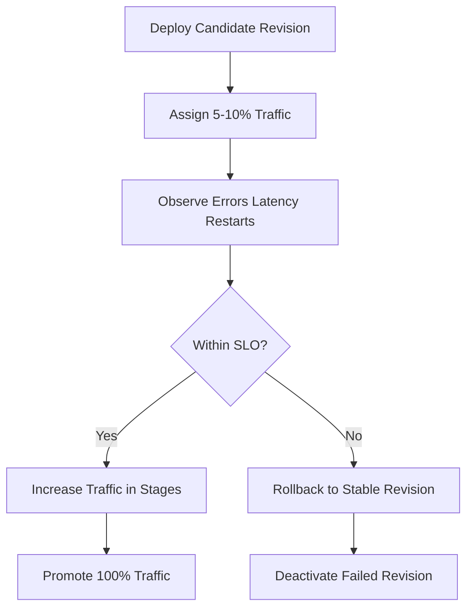

---
hide:
  - toc
---

# Revision Operations

This guide focuses on operating revisions in production: activating/deactivating revisions, splitting traffic safely, and performing fast rollbacks.

## Prerequisites

- App deployed in a Container Apps environment
- A known stable revision available for rollback

```bash
export RG="rg-aca-prod"
export APP_NAME="app-python-api-prod"
export ENVIRONMENT_NAME="aca-env-prod"
```

## Revision Mode Management

Use multiple revision mode for canary or A/B releases.

```bash
az containerapp revision set-mode \
  --name "$APP_NAME" \
  --resource-group "$RG" \
  --mode multiple
```

Review revisions and health state:

```bash
az containerapp revision list \
  --name "$APP_NAME" \
  --resource-group "$RG" \
  --output table
```

Use Activity Log for deployment event timeline:

```bash
az monitor activity-log list \
  --resource-group "$RG" \
  --max-events 20 \
  --status Succeeded \
  --output table
```

## Traffic Splitting

Shift a small percentage to the candidate revision first.

```bash
az containerapp ingress traffic set \
  --name "$APP_NAME" \
  --resource-group "$RG" \
  --revision-weight "${APP_NAME}--stable=90" "${APP_NAME}--candidate=10"
```

Gradually increase traffic only when SLOs remain healthy.

## Rollback Procedure

Return 100% traffic to last known good revision:

```bash
az containerapp ingress traffic set \
  --name "$APP_NAME" \
  --resource-group "$RG" \
  --revision-weight "${APP_NAME}--stable=100"
```

Deactivate failed revision:

```bash
az containerapp revision deactivate \
  --name "$APP_NAME" \
  --resource-group "$RG" \
  --revision "${APP_NAME}--candidate"
```

## Verification Steps

```bash
az containerapp ingress traffic show \
  --name "$APP_NAME" \
  --resource-group "$RG" \
  --output json
```

Example output (PII masked):

```json
[
  {
    "revisionName": "app-python-api-prod--stable",
    "weight": 100
  }
]
```

## Troubleshooting

### New revision is healthy but receives no traffic

- Confirm app is in multiple revision mode.
- Check exact revision name from `revision list` command.
- Ensure ingress is enabled before setting traffic weights.

```bash
az containerapp show \
  --name "$APP_NAME" \
  --resource-group "$RG" \
  --query "properties.configuration.ingress" \
  --output json
```

## Revision Promotion Workflow



| Scenario | Recommended Action | Why |
|---|---|---|
| New feature with unknown risk | Multiple revision mode + staged traffic | Limits blast radius |
| Security hotfix | Fast deploy + focused health checks | Reduces exposure window |
| Runtime regression detected | Immediate traffic rollback | Restores service quickly |
| Stable period after rollout | Deactivate stale revisions | Reduces operational noise |

!!! tip "Name revisions with meaningful image tags"
    Immutable image tags mapped to commit SHA or release IDs make revision rollback decisions deterministic during incidents.

!!! warning "Do not promote traffic without replica health checks"
    A revision can exist but still fail under real load. Validate health, restart count, and error rate before increasing traffic.

### Revision Health Validation Commands

```bash
az containerapp revision list \
  --name "$APP_NAME" \
  --resource-group "$RG" \
  --query "[].{name:name,active:properties.active,replicas:properties.replicas,healthState:properties.healthState,runningState:properties.runningState}" \
  --output table

az containerapp ingress traffic show \
  --name "$APP_NAME" \
  --resource-group "$RG" \
  --output table
```

## Advanced Topics

- Use labels for stable/candidate routing patterns.
- Implement progressive delivery with automated rollback on alert.
- Keep at least one warm standby revision for instant failback.

## See Also
- [Health and Recovery](../../platform/reliability/health-recovery.md)
- [Observability](../monitoring/index.md)

## Sources
- [Azure Container Apps revisions](https://learn.microsoft.com/azure/container-apps/revisions)
- [Traffic splitting in Azure Container Apps (Microsoft Learn)](https://learn.microsoft.com/azure/container-apps/traffic-splitting)
