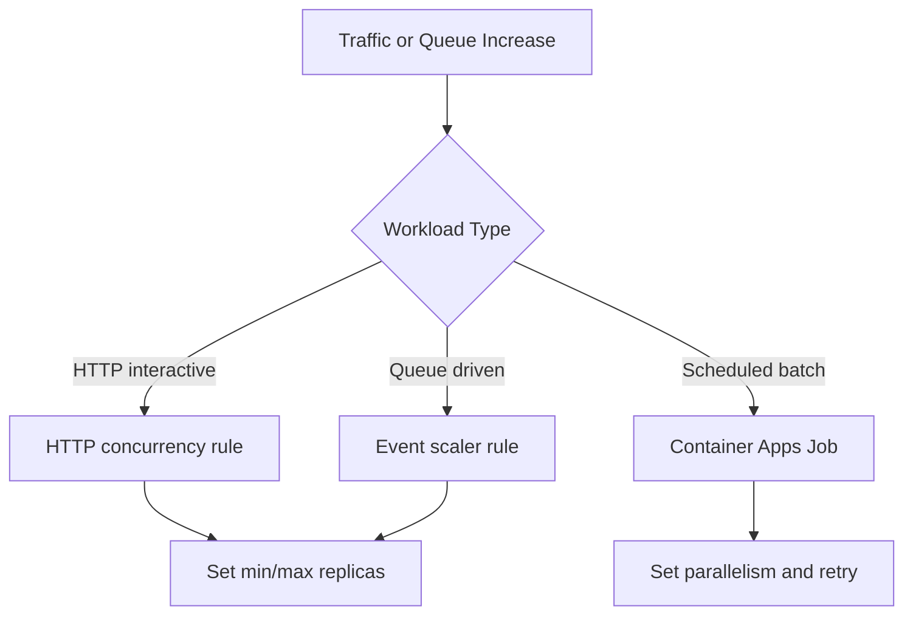

---
content_sources:
  diagrams:
  - id: scaling-decision-framework
    type: flowchart
    source: mslearn-adapted
    based_on:
    - https://learn.microsoft.com/azure/container-apps/scale-app
    - https://learn.microsoft.com/azure/container-apps/scale-app#scale-triggers
content_validation:
  status: verified
  last_reviewed: '2026-05-23'
  reviewer: agent
  core_claims:
  - claim: This page uses Microsoft Learn as the primary source basis for its Azure-specific
      guidance.
    source: https://learn.microsoft.com/azure/container-apps/scale-app
    verified: true
---
# Scaling Operations

This guide explains how to operate scaling in production, including manual replica control, KEDA-based autoscaling, and scale-to-zero behavior.

## Prerequisites

- Existing Container App in a managed environment
- Baseline performance targets (latency, throughput, queue delay)

```bash
export RG="rg-aca-prod"
export APP_NAME="app-python-api-prod"
export ENVIRONMENT_NAME="aca-env-prod"
```

## Manual Scaling for Controlled Events

Use manual scaling for maintenance windows or expected short-term load.

```bash
az containerapp update \
  --name "$APP_NAME" \
  --resource-group "$RG" \
  --min-replicas 3 \
  --max-replicas 10
```

| Command | Why it is used |
|---|---|
| `az containerapp update ...` | Updates the existing Container App configuration without recreating the app. |

Check current replica settings:

```bash
az containerapp show \
  --name "$APP_NAME" \
  --resource-group "$RG" \
  --query "properties.template.scale" \
  --output json
```

| Command | Why it is used |
|---|---|
| `az containerapp show ...` | Reads the Container App configuration so the documented setting can be verified. |

## KEDA Rule Operations

Scale based on HTTP concurrency:

```bash
az containerapp update \
  --name "$APP_NAME" \
  --resource-group "$RG" \
  --scale-rule-name "http-concurrency" \
  --scale-rule-type "http" \
  --scale-rule-metadata "concurrentRequests=100" \
  --min-replicas 1 \
  --max-replicas 20
```

| Command | Why it is used |
|---|---|
| `az containerapp update ...` | Updates the existing Container App configuration without recreating the app. |

Example queue scaler operation (Azure Service Bus):

```bash
az containerapp update \
  --name "$APP_NAME" \
  --resource-group "$RG" \
  --scale-rule-name "sb-queue" \
  --scale-rule-type "azure-servicebus" \
  --scale-rule-metadata "queueName=orders" "messageCount=50" "namespace=<servicebus-namespace>.servicebus.windows.net"
```

| Command | Why it is used |
|---|---|
| `az containerapp update ...` | Updates the existing Container App configuration without recreating the app. |

Use Azure Monitor metrics to tune thresholds:

```bash
az monitor metrics list \
  --resource "/subscriptions/<subscription-id>/resourceGroups/$RG/providers/Microsoft.App/containerApps/$APP_NAME" \
  --metric "Requests" \
  --interval "PT1M" \
  --output table
```

| Command | Why it is used |
|---|---|
| `az monitor metrics ...` | Creates or inspects Azure Monitor alerts, diagnostic settings, or metrics. |

## Scale-to-Zero Operations

Enable scale-to-zero for event-driven or intermittent workloads:

```bash
az containerapp update \
  --name "$APP_NAME" \
  --resource-group "$RG" \
  --min-replicas 0 \
  --max-replicas 10
```

| Command | Why it is used |
|---|---|
| `az containerapp update ...` | Updates the existing Container App configuration without recreating the app. |

Use this mode only when cold start impact is acceptable.

## Verification Steps

```bash
az containerapp replica list \
  --name "$APP_NAME" \
  --resource-group "$RG" \
  --output table
```

| Command | Why it is used |
|---|---|
| `az containerapp replica list ...` | Runs the Azure CLI operation required by the documented step. |

```bash
az containerapp show \
  --name "$APP_NAME" \
  --resource-group "$RG" \
  --query "{minReplicas:properties.template.scale.minReplicas,maxReplicas:properties.template.scale.maxReplicas,rules:properties.template.scale.rules}" \
  --output json
```

| Command | Why it is used |
|---|---|
| `az containerapp show ...` | Reads the Container App configuration so the documented setting can be verified. |

Example output (PII masked):

```json
{
  "minReplicas": 0,
  "maxReplicas": 20,
  "rules": [
    {
      "name": "http-concurrency",
      "custom": {
        "type": "http",
        "metadata": {
          "concurrentRequests": "100"
        }
      }
    }
  ]
}
```

## Scaling Decision Framework

<!-- diagram-id: scaling-decision-framework -->


| Symptom | Primary Knob | First Adjustment | Validation Signal |
|---|---|---|---|
| p95 latency rises while CPU moderate | HTTP concurrency threshold | Lower `concurrentRequests` target | Latency drops without excessive replicas |
| Queue delay grows steadily | Queue message threshold | Decrease `messageCount` trigger | Queue depth recovers within SLO |
| Cost spike overnight | Min replicas and max guardrail | Reduce `min-replicas` and cap `max-replicas` | Cost trend normalizes with acceptable latency |
| Frequent cold starts | Minimum replicas | Raise `min-replicas` from 0 to 1-2 | Startup-related errors decrease |

!!! tip "Tune one variable at a time"
    Change only one scaler parameter per evaluation cycle so you can attribute impact correctly.

!!! warning "Scaling cannot fix application bottlenecks alone"
    If database limits or downstream API quotas are saturated, adding replicas may increase failure rate. Validate dependency capacity before aggressive scale-out.

## Troubleshooting

### Autoscaling does not trigger

- Confirm scaler metadata values and key names.
- Check if incoming load actually reaches configured thresholds.
- Validate identity/secret references for external event sources.

```bash
az containerapp logs show \
  --name "$APP_NAME" \
  --resource-group "$RG" \
  --type system \
  --follow false
```

| Command | Why it is used |
|---|---|
| `az containerapp logs show ...` | Runs the Azure CLI operation required by the documented step. |

## Advanced Topics

- Combine multiple KEDA rules and set max replica guardrails.
- Separate interactive and batch workloads into different apps.
- Define pre-warming strategies for predictable peak windows.

## See Also
- [Cost Optimization](../../platform/reliability/cost-optimization.md)
- [Observability](../monitoring/index.md)
- [Scaling with KEDA (Concepts)](../../platform/scaling/index.md)

## Sources
- [Azure Container Apps scaling](https://learn.microsoft.com/azure/container-apps/scale-app)
- [KEDA scalers reference (Microsoft Learn)](https://learn.microsoft.com/azure/container-apps/scale-app#scale-triggers)
