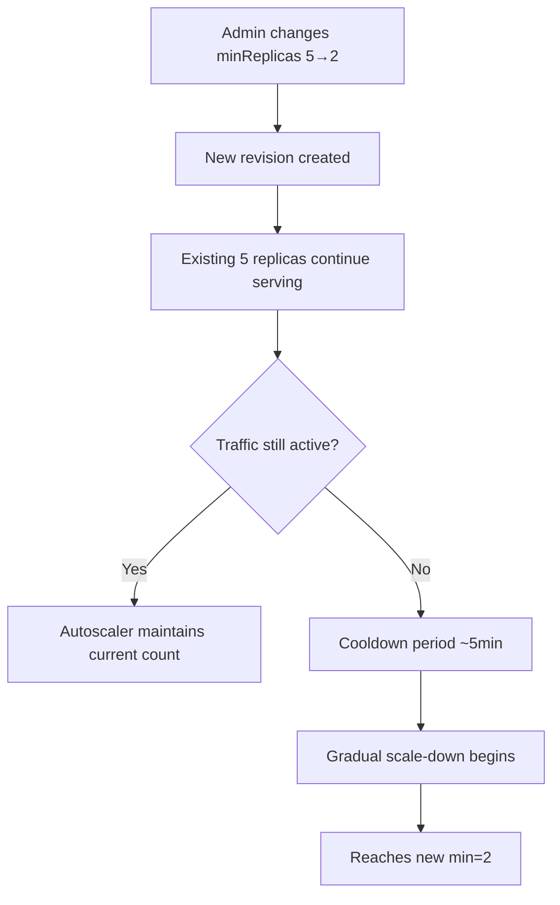

---
content_sources:
  - type: mslearn-adapted
    url: https://learn.microsoft.com/azure/container-apps/scale-app
  - type: mslearn-adapted
    url: https://learn.microsoft.com/azure/container-apps/revisions
content_validation:
  status: verified
  last_reviewed: 2026-05-18
  reviewer: agent
  core_claims:
    - claim: "Reducing minReplicas does not cause downtime — existing replicas continue serving until the autoscaler decides to terminate them."
      source: https://learn.microsoft.com/azure/container-apps/scale-app
      verified: true
    - claim: "KEDA applies a cooldown period (default 300s) before scaling down replicas."
      source: https://learn.microsoft.com/azure/container-apps/scale-app
      verified: true
    - claim: "Changing minReplicas creates a new revision in single-revision mode, but does not restart existing replicas."
      source: https://learn.microsoft.com/azure/container-apps/revisions
      verified: true
---

# Min Replica Change Impact

Reducing `minReplicas` (e.g., 100 → 50) is a common Day-2 operation for cost optimization. This page documents the actual runtime behavior, verified with a live Azure deployment.

## Prerequisites

- Existing Container App with active traffic
- Azure CLI with `containerapp` extension

## When to Use

- Reducing guaranteed replica count for cost savings
- Adjusting scaling floor after peak traffic period ends
- Right-sizing after initial over-provisioning

## Key Question

> **Does reducing `minReplicas` cause downtime?**

**No.** The change is applied without restarting or immediately terminating existing replicas. The KEDA autoscaler evaluates current load and **gradually** scales down to the new minimum during its cooldown window.

## Procedure

### Change Min Replicas

```bash
az containerapp update \
    --resource-group $RG \
    --name $APP_NAME \
    --min-replicas 2
```

| Command/Parameter | Purpose |
|---|---|
| `az containerapp update` | Updates container app configuration |
| `--min-replicas 2` | Sets the new minimum replica count |

### Monitor Replica Count

```bash
az containerapp replica list \
    --resource-group $RG \
    --name $APP_NAME \
    --output table
```

## Behavior Summary

<!-- diagram-id: min-replica-change-flow -->


| Phase | Duration | Behavior |
|---|---|---|
| Configuration update | ~20s | CLI returns; new revision created |
| Active traffic period | Indefinite | Replicas stay at current count (autoscaler evaluates load) |
| Cooldown after traffic stops | ~5 min (KEDA default 300s) | No scale-down yet |
| Gradual termination | 3–5 min | Replicas terminated one at a time with connection draining |
| Steady state | — | Replica count = new minReplicas |

## Validated Results

!!! success "Lab Validation: 2026-05-18, az CLI 2.73.0, Korea Central"

    **Test Environment**: External ingress Container App, `mcr.microsoft.com/k8se/quickstart:latest`, single-revision mode.

    | # | Test | Result |
    |---|---|---|
    | 1 | Initial replica count (min=5) | ✅ 5 replicas running |
    | 2 | Continuous HTTP requests during change (120 requests) | ✅ All returned HTTP 200 |
    | 3 | Non-200 responses during/after change | ✅ Zero errors |
    | 4 | Replica count immediately after change | 5 (unchanged) |
    | 5 | Replica count after ~5min cooldown | 4 (gradual reduction started) |
    | 6 | Replica count after ~8min | 2 (reached new minimum) |
    | 7 | App responsiveness at min=2 | ✅ HTTP 200 |

    **Key Findings:**

    - [Observed] **Zero downtime** — all 120 requests during the min replica change returned HTTP 200.
    - [Observed] Existing replicas are NOT immediately terminated. The autoscaler waits for the KEDA cooldown period (~5 min) before starting gradual scale-down.
    - [Observed] Scale-down is gradual (5→4→2), not instant (5→2). Replicas are drained one at a time.
    - [Observed] Total time from change to reaching new minimum: approximately 8 minutes (with no traffic).
    - [Observed] If traffic is still active during the change, the autoscaler keeps replicas at the level needed to handle load, regardless of the new lower minimum.

## Impact Assessment for Production (100 → 50)

| Concern | Impact | Explanation |
|---|---|---|
| Immediate downtime | **None** | Existing replicas continue serving |
| Request failures during change | **None** | No connection resets or 5xx |
| Cold starts | **Possible later** | If traffic drops and stays low, only 50 replicas remain. Sudden spike needs scale-up time. |
| Scaling speed back up | ~30s per replica | If load increases, KEDA scales up from 50 (not from 0) |

!!! warning "Peak Traffic Consideration"
    If your service consistently needs 80+ replicas under normal load, reducing min to 50 means the autoscaler must scale up 30+ replicas on every traffic spike. Factor in the ~30s/replica scale-up time for your latency SLO.

!!! tip "Recommended Approach"
    1. Change min replicas during low-traffic window
    2. Monitor p95 latency for the next 24h
    3. If latency spikes appear during traffic ramp-up, increase min back

## Rollback

If issues are observed after reducing min replicas:

```bash
az containerapp update \
    --resource-group $RG \
    --name $APP_NAME \
    --min-replicas 5
```

Scale-up to the previous minimum is immediate — new replicas start within ~30 seconds.

## See Also

- [Scaling Operations](index.md)
- [Scaling Concepts](../../platform/scaling/index.md)

## Sources

- [Set scaling rules in Azure Container Apps (Microsoft Learn)](https://learn.microsoft.com/azure/container-apps/scale-app)
- [Revisions in Azure Container Apps (Microsoft Learn)](https://learn.microsoft.com/azure/container-apps/revisions)
- [KEDA scaling behavior — cooldownPeriod](https://keda.sh/docs/latest/concepts/scaling-deployments/#cooldownperiod)
