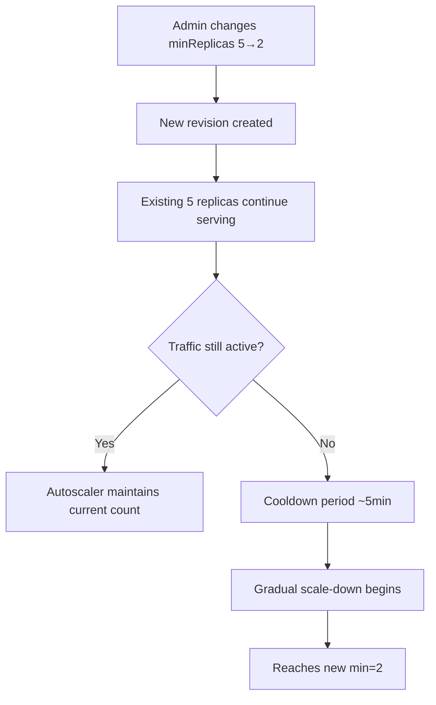

---
content_sources:
  references:
    - type: mslearn-adapted
      url: https://learn.microsoft.com/en-us/azure/container-apps/scale-app
    - type: mslearn-adapted
      url: https://learn.microsoft.com/en-us/azure/container-apps/revisions
    - type: mslearn-adapted
      url: https://learn.microsoft.com/en-us/azure/reliability/reliability-container-apps
  diagrams:
    - id: min-replica-change-flow
      type: flowchart
      source: self-generated
      justification: Synthesized from the Microsoft Learn sources cited by this page.
      based_on:
        - https://learn.microsoft.com/en-us/azure/container-apps/scale-app
        - https://learn.microsoft.com/en-us/azure/container-apps/revisions
content_validation:
  status: verified
  last_reviewed: '2026-06-11'
  reviewer: agent
  core_claims:
    - claim: Reducing minReplicas does not cause downtime — existing replicas continue serving until the autoscaler decides to terminate them.
      source: https://learn.microsoft.com/en-us/azure/container-apps/scale-app
      verified: true
    - claim: KEDA applies a cooldown period (default 300s) before scaling down replicas.
      source: https://learn.microsoft.com/en-us/azure/container-apps/scale-app
      verified: true
    - claim: Changing minReplicas creates a new revision in single-revision mode, but does not restart existing replicas.
      source: https://learn.microsoft.com/en-us/azure/container-apps/revisions
      verified: true
    - claim: During a revision update, the Container Apps platform maintains minimum replica counts by creating new containers before decommissioning old ones.
      source: https://learn.microsoft.com/en-us/azure/reliability/reliability-container-apps
      verified: true
    - claim: Replacing a lost replica requires the platform to detect that the old replica is gone, start a new replica, and wait for it to return a healthy readiness probe status before it can receive incoming requests, and the running replica count can fall below the configured minimum during this window.
      source: https://learn.microsoft.com/en-us/azure/reliability/reliability-container-apps
      verified: true
    - claim: Microsoft Learn recommends over-provisioning the minimum replica count for workloads that cannot tolerate any period with fewer than the configured minimum number of replicas.
      source: https://learn.microsoft.com/en-us/azure/reliability/reliability-container-apps
      verified: true
---
# Min Replica Change Impact

Reducing `minReplicas` (e.g., 100 → 50) is a common Day-2 operation for cost optimization. This page documents the actual runtime behavior, verified with a live Azure deployment.

## Prerequisites

- Existing Container App with active traffic
- Azure CLI with `containerapp` extension

## When to Use

- Reducing guaranteed replica count for cost savings
- Adjusting scaling floor after peak traffic period ends
- Right-sizing after initial over-provisioning

## Key Question

> **Does reducing `minReplicas` cause downtime?**

**No.** The change is applied without restarting or immediately terminating existing replicas. The KEDA autoscaler evaluates current load and **gradually** scales down to the new minimum during its cooldown window.

## Procedure

### Change Min Replicas

```bash
az containerapp update \
    --resource-group $RG \
    --name $APP_NAME \
    --min-replicas 2
```

| Command/Parameter | Purpose |
|---|---|
| `az containerapp update` | Updates container app configuration |
| `--min-replicas 2` | Sets the new minimum replica count |

### Monitor Replica Count

```bash
az containerapp replica list \
    --resource-group $RG \
    --name $APP_NAME \
    --output table
```

## Behavior Summary

<!-- diagram-id: min-replica-change-flow -->


| Phase | Duration | Behavior |
|---|---|---|
| Configuration update | ~20s | CLI returns; new revision created |
| Active traffic period | Indefinite | Replicas stay at current count (autoscaler evaluates load) |
| Cooldown after traffic stops | ~5 min (KEDA default 300s) | No scale-down yet |
| Gradual termination | 3–5 min | Replicas terminated one at a time with connection draining |
| Steady state | — | Replica count = new minReplicas |

## Validated Results

!!! success "Lab Validation: 2026-05-18, az CLI 2.73.0, Korea Central"

    **Test Environment**: External ingress Container App, `mcr.microsoft.com/k8se/quickstart:latest`, single-revision mode.

    | # | Test | Result |
    |---|---|---|
    | 1 | Initial replica count (min=5) | ✅ 5 replicas running |
    | 2 | Continuous HTTP requests during change (120 requests) | ✅ All returned HTTP 200 |
    | 3 | Non-200 responses during/after change | ✅ Zero errors |
    | 4 | Replica count immediately after change | 5 (unchanged) |
    | 5 | Replica count after ~5min cooldown | 4 (gradual reduction started) |
    | 6 | Replica count after ~8min | 2 (reached new minimum) |
    | 7 | App responsiveness at min=2 | ✅ HTTP 200 |

    **Key Findings:**

    - [Observed] **Zero downtime** — all 120 requests during the min replica change returned HTTP 200.
    - [Observed] Existing replicas are NOT immediately terminated. The autoscaler waits for the KEDA cooldown period (~5 min) before starting gradual scale-down.
    - [Observed] Scale-down is gradual (5→4→2), not instant (5→2). Replicas are drained one at a time.
    - [Observed] Total time from change to reaching new minimum: approximately 8 minutes (with no traffic).
    - [Observed] If traffic is still active during the change, the autoscaler keeps replicas at the level needed to handle load, regardless of the new lower minimum.

## Impact Assessment for Production (100 → 50)

| Concern | Impact | Explanation |
|---|---|---|
| Immediate downtime | **None** | Existing replicas continue serving |
| Request failures during change | **None** | No connection resets or 5xx |
| Cold starts | **Possible later** | If traffic drops and stays low, only 50 replicas remain. Sudden spike needs scale-up time. |
| Scaling speed back up | ~30s per replica | If load increases, KEDA scales up from 50 (not from 0) |

!!! warning "Peak Traffic Consideration"
    If your service consistently needs 80+ replicas under normal load, reducing min to 50 means the autoscaler must scale up 30+ replicas on every traffic spike. Factor in the ~30s/replica scale-up time for your latency SLO.

!!! tip "Recommended Approach"
    1. Change min replicas during low-traffic window
    2. Monitor p95 latency for the next 24h
    3. If latency spikes appear during traffic ramp-up, increase min back

## Related: Other Replica Replacement Scenarios

Reducing `minReplicas` is one of several events that can cause replicas to be replaced. Each scenario has a different replacement profile — the cooldown-driven behavior above does **not** apply universally.

### Scenario A: Revision update (surge-then-drain)

When you push a new revision, Microsoft Learn documents that the platform "maintains minimum replica counts by creating new containers before decommissioning old ones." This is a controlled, **surge-then-drain** pattern: capacity goes UP first as the new revision's replicas start warming up, then OLD replicas drain only after the new revision passes startup and readiness probes. The running replica count stays at or above `minReplicas` throughout, assuming the new revision can pass readiness on schedule.

### Scenario B: Lost-replica reclaim (zone outage, node loss, maintenance eviction)

When a replica is **lost** — due to a zone outage, a node loss, or a planned-maintenance eviction that removes the replica from service — the replacement profile is fundamentally different. Microsoft Learn is explicit:

> "It might take a short period of time for lost replicas to be replaced because the platform must **detect** that the old replicas are gone. Then new replicas must **start** and **return a healthy readiness probe status** before they can receive incoming requests. **If you can't tolerate any period with fewer than the minimum number of replicas** that you've specified, consider over-provisioning..."
>
> — [Reliability in Azure Container Apps](https://learn.microsoft.com/en-us/azure/reliability/reliability-container-apps)

The replacement cycle is: **detect (seconds)** → **schedule** → **image pull (if the image is not already cached; longer on a cold node or first scheduling into a zone)** → **container startup** → **startup probe** → **readiness probe** → **traffic eligible**. During this window the running replica count can dip **below** `minReplicas`, because nothing in the lost-replica path is gated on holding the floor.

!!! note "Scope of Scenario B"
    Scenario B covers events that actually **remove** a replica from the running set — node loss, zone outage, maintenance eviction, or a hard restart that re-schedules to a different host. Sustained readiness-probe failures and OOM-kill-restart loops do not always reduce the running replica count: an unready replica still counts toward `minReplicas` while the platform waits for the probe, and an OOM kill typically restarts the container in place. Those failures degrade **ready-serving capacity** without triggering the detect → schedule → image-pull cycle described above. Treat them as a separate failure mode.

### Comparison

| Trigger | Replacement Profile | Capacity During Replacement |
|---|---|---|
| Manual `minReplicas` decrease | Drain after KEDA cooldown (~5 min) | Stays at the OLD count, drops gradually |
| New revision deploy | Surge-then-drain | Stays at or above `minReplicas` (new revision ramps up first) |
| Zone outage / node loss / maintenance eviction | Detect → schedule → image pull → start → probe | **Running replica count can dip below** `minReplicas` |
| Sustained probe failure / OOM-kill-restart | Container restart in place or unready-but-counted | **Ready-serving capacity falls below steady-state floor** (running count usually unchanged) |

!!! warning "If you cannot tolerate any time below `minReplicas`"
    For workloads where the running replica count must never dip below your minimum (regulated workloads, hard SLO, financial systems), Microsoft Learn's prescription is **over-provisioning**: set `minReplicas` above your steady-state need so the platform has headroom while it works through a lost-replica reclaim cycle. Size the headroom to absorb the largest simultaneous replica loss you are designing for — typically one node's or one zone's worth of co-located replicas. The [Zone Redundancy Best-Effort playbook L1](../../troubleshooting/playbooks/platform-features/zone-redundancy-best-effort.md#l1-tune-container-apps-inputs-in-platform) documents this lever alongside the full four-layer mitigation matrix. The [Replica Node Spread Lab](../../troubleshooting/lab-guides/replica-node-spread.md) also illustrates an adjacent failure mode: when many replicas share one underlying node (best-effort placement), losing that node forces a single-shot reclaim of every replica it hosted, multiplying the duration of the at-risk window.

## Rollback

If issues are observed after reducing min replicas:

```bash
az containerapp update \
    --resource-group $RG \
    --name $APP_NAME \
    --min-replicas 5
```

| Command | Why it is used |
|---|---|
| `az containerapp update ...` | Updates the existing Container App configuration without recreating the app. |

Scale-up to the previous minimum is immediate — new replicas start within ~30 seconds.

## Verification

Confirm the target app, revision, job, logs, or metric state matches the expected result before closing the task.

## Rollback / Troubleshooting

If verification fails, revert only the last configuration change, capture the failing output, and use the linked troubleshooting guide before retrying.

## See Also

- [Scaling Operations](index.md)
- [Scaling Concepts](../../platform/scaling/index.md)
- [Reliability Best Practices — minReplicas is a capacity floor](../../best-practices/reliability.md#minreplicas-is-a-capacity-floor-not-a-placement-constraint)
- [Zone Redundancy Best-Effort playbook](../../troubleshooting/playbooks/platform-features/zone-redundancy-best-effort.md)
- [Replica Node Spread Lab](../../troubleshooting/lab-guides/replica-node-spread.md)

## Sources

- [Set scaling rules in Azure Container Apps (Microsoft Learn)](https://learn.microsoft.com/en-us/azure/container-apps/scale-app)
- [Revisions in Azure Container Apps (Microsoft Learn)](https://learn.microsoft.com/en-us/azure/container-apps/revisions)
- [Reliability in Azure Container Apps (Microsoft Learn)](https://learn.microsoft.com/en-us/azure/reliability/reliability-container-apps)
- [KEDA scaling behavior — cooldownPeriod](https://keda.sh/docs/latest/concepts/scaling-deployments/#cooldownperiod)
