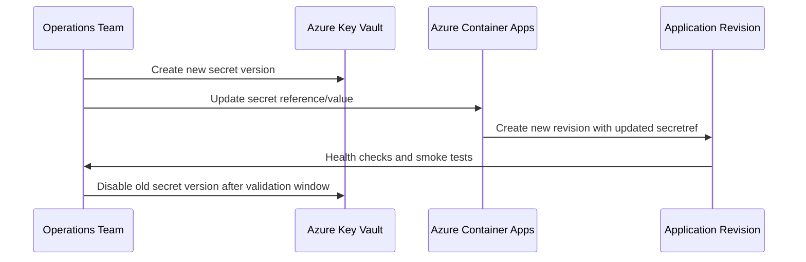

---
hide:
  - toc
content_sources:
  diagrams:
    - id: secret-rotation-lifecycle
      type: sequence
      source: mslearn-adapted
      based_on:
        - https://learn.microsoft.com/azure/container-apps/manage-secrets
        - https://learn.microsoft.com/azure/container-apps/managed-identity
---

# Secret Rotation

Secret rotation in Container Apps should be planned as an operational routine, not an emergency-only action. This guide outlines secure rotation patterns with minimal downtime.

## Secret Types in Container Apps

Container Apps supports two common secret patterns:

- **Manual secret values** stored directly in Container Apps configuration
- **Key Vault references** resolved from Azure Key Vault

Manual secrets are simple but require explicit update workflows. Key Vault references improve central governance and auditing.

## Rotation Strategies

Use one of these patterns based on dependency behavior:

1. **Dual secret versioning** (active + next)
2. **Blue/green secret cutover** via new revision
3. **Rolling replacement** with health-validated traffic shifting

Design applications to re-read credentials on restart so a new revision can apply fresh secret values deterministically.

## Key Vault Integration for Automatic Rotation

Best-practice flow:

1. Rotate secret in Key Vault.
2. Update secret version reference or allow latest-version policy.
3. Trigger app/job revision rollout.
4. Validate authentication and transaction success.

Grant managed identity the minimum required Key Vault permissions.

## Connection String Rotation Patterns

For data stores that support multiple active credentials:

- Create new credential first.
- Deploy with new secret while old credential remains valid.
- Confirm successful reads/writes.
- Revoke old credential after validation window.

For single-credential systems, schedule maintenance window and prepare rollback credential artifacts.

## Zero-Downtime Secret Updates

Use revisions to avoid hard cutovers:

```bash
az containerapp secret set \
  --name "$APP_NAME" \
  --resource-group "$RG" \
  --secrets "db-conn=<new-connection-string>"
```

```bash
az containerapp update \
  --name "$APP_NAME" \
  --resource-group "$RG" \
  --set-env-vars "DB_CONNECTION=secretref:db-conn"
```

Then shift traffic gradually to the new healthy revision.

## Monitoring Secret Expiry

Operational controls:

- Alert before certificate/client-secret expiry (30/14/7 days)
- Track authentication failure spikes after rotation windows
- Audit Key Vault secret version changes and access logs

Document secret owners and rotation cadence per dependency.

## Secret Rotation Lifecycle

<!-- diagram-id: secret-rotation-lifecycle -->


## Rotation Pattern Decision Matrix

| Pattern | Downtime Risk | Complexity | Best Fit |
|---|---|---|---|
| Dual secret versioning | Low | Medium | Services supporting parallel credentials |
| Blue/green cutover | Low | Medium | User-facing APIs requiring traffic control |
| Immediate replacement | Medium/High | Low | Non-critical internal tools only |

!!! tip "Use revision-based cutover for safer rotations"
    Secret updates should create a new revision and pass readiness checks before traffic shifts. This provides a clean rollback path.

!!! warning "Do not revoke old credentials immediately"
    Keep the previous credential active until post-rotation validation confirms successful reads/writes and no authentication errors.

### Key Vault Reference Example

```bash
az containerapp secret set \
  --name "$APP_NAME" \
  --resource-group "$RG" \
  --secrets "db-conn=keyvaultref:https://<key-vault-name>.vault.azure.net/secrets/db-conn,identityref:system"

az containerapp update \
  --name "$APP_NAME" \
  --resource-group "$RG" \
  --set-env-vars "DB_CONNECTION=secretref:db-conn"
```

### Post-Rotation Verification Checklist

| Check | Command | Expected Result |
|---|---|---|
| New revision created | `az containerapp revision list --name "$APP_NAME" --resource-group "$RG" --output table` | Latest revision is healthy |
| Auth errors not increasing | `az containerapp logs show --name "$APP_NAME" --resource-group "$RG" --type console --follow false` | No spike in auth failures |
| Traffic served by new revision | `az containerapp ingress traffic show --name "$APP_NAME" --resource-group "$RG" --output table` | Target revision receives expected weight |
| Old secret can be retired | Key Vault audit review | No calls using old version |

### Rotation Run Command Set

```bash
az containerapp secret list \
  --name "$APP_NAME" \
  --resource-group "$RG" \
  --output table

az containerapp revision list \
  --name "$APP_NAME" \
  --resource-group "$RG" \
  --output table
```

## See Also

- [Identity and Secrets](../../platform/identity-and-secrets/managed-identity.md)
- [Alerts](../alerts/index.md)
- [Recovery and Incident Readiness](../recovery/index.md)

## Sources

- [Manage secrets in Azure Container Apps](https://learn.microsoft.com/azure/container-apps/manage-secrets)
- [Use managed identity in Azure Container Apps](https://learn.microsoft.com/azure/container-apps/managed-identity)
