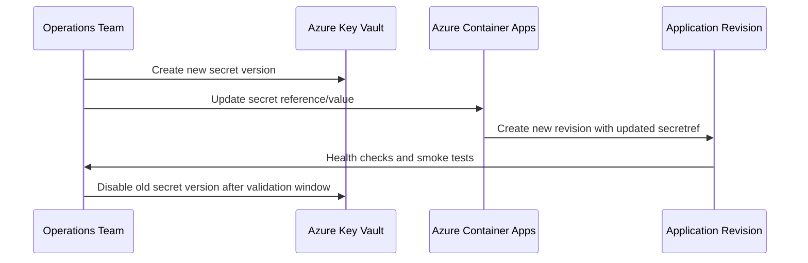
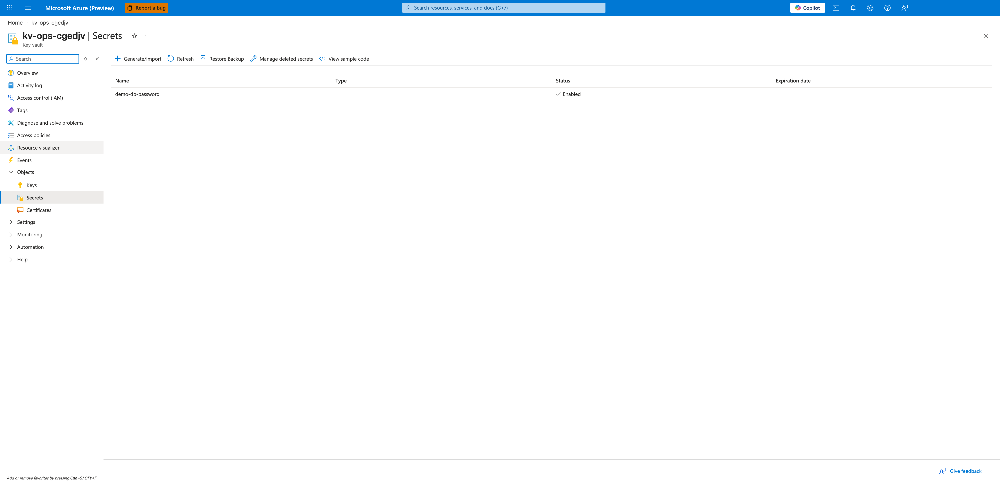
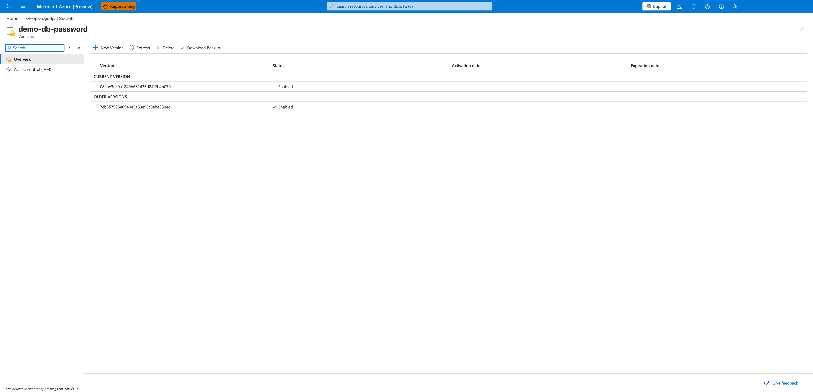
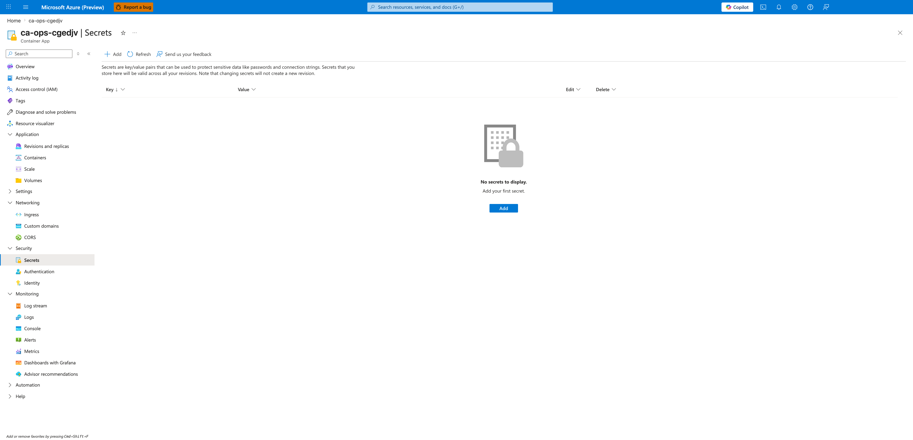
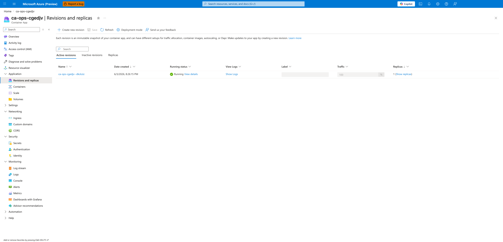

---
content_sources:
  diagrams:
  - id: secret-rotation-lifecycle
    type: sequence
    source: mslearn-adapted
    based_on:
    - https://learn.microsoft.com/azure/container-apps/manage-secrets
    - https://learn.microsoft.com/azure/container-apps/managed-identity
content_validation:
  status: verified
  last_reviewed: '2026-05-23'
  reviewer: agent
  core_claims:
  - claim: This page uses Microsoft Learn as the primary source basis for its Azure-specific
      guidance.
    source: https://learn.microsoft.com/azure/container-apps/manage-secrets
    verified: true
---
# Secret Rotation

Secret rotation in Container Apps should be planned as an operational routine, not an emergency-only action. This guide outlines secure rotation patterns with minimal downtime.

## Secret Types in Container Apps

Container Apps supports two common secret patterns:

- **Manual secret values** stored directly in Container Apps configuration
- **Key Vault references** resolved from Azure Key Vault

Manual secrets are simple but require explicit update workflows. Key Vault references improve central governance and auditing.

## Rotation Strategies

Use one of these patterns based on dependency behavior:

1. **Dual secret versioning** (active + next)
2. **Blue/green secret cutover** via new revision
3. **Rolling replacement** with health-validated traffic shifting

Design applications to re-read credentials on restart so a new revision can apply fresh secret values deterministically.

## Key Vault Integration for Automatic Rotation

Best-practice flow:

1. Rotate secret in Key Vault.
2. Update secret version reference or allow latest-version policy.
3. Trigger app/job revision rollout.
4. Validate authentication and transaction success.

Grant managed identity the minimum required Key Vault permissions.

## Connection String Rotation Patterns

For data stores that support multiple active credentials:

- Create new credential first.
- Deploy with new secret while old credential remains valid.
- Confirm successful reads/writes.
- Revoke old credential after validation window.

For single-credential systems, schedule maintenance window and prepare rollback credential artifacts.

## Zero-Downtime Secret Updates

Use revisions to avoid hard cutovers:

```bash
az containerapp secret set \
  --name "$APP_NAME" \
  --resource-group "$RG" \
  --secrets "db-conn=<new-connection-string>"
```

| Command | Why it is used |
|---|---|
| `az containerapp secret set ...` | Manages Container Apps secrets without exposing secret values in plain configuration. |

```bash
az containerapp update \
  --name "$APP_NAME" \
  --resource-group "$RG" \
  --set-env-vars "DB_CONNECTION=secretref:db-conn"
```

| Command | Why it is used |
|---|---|
| `az containerapp update ...` | Updates the existing Container App configuration without recreating the app. |

Then shift traffic gradually to the new healthy revision.

## Monitoring Secret Expiry

Operational controls:

- Alert before certificate/client-secret expiry (30/14/7 days)
- Track authentication failure spikes after rotation windows
- Audit Key Vault secret version changes and access logs

Document secret owners and rotation cadence per dependency.

## Secret Rotation Lifecycle

<!-- diagram-id: secret-rotation-lifecycle -->


## Rotation Pattern Decision Matrix

| Pattern | Downtime Risk | Complexity | Best Fit |
|---|---|---|---|
| Dual secret versioning | Low | Medium | Services supporting parallel credentials |
| Blue/green cutover | Low | Medium | User-facing APIs requiring traffic control |
| Immediate replacement | Medium/High | Low | Non-critical internal tools only |

!!! tip "Use revision-based cutover for safer rotations"
    Secret updates should create a new revision and pass readiness checks before traffic shifts. This provides a clean rollback path.

!!! warning "Do not revoke old credentials immediately"
    Keep the previous credential active until post-rotation validation confirms successful reads/writes and no authentication errors.

### Key Vault Reference Example

```bash
az containerapp secret set \
  --name "$APP_NAME" \
  --resource-group "$RG" \
  --secrets "db-conn=keyvaultref:https://<key-vault-name>.vault.azure.net/secrets/db-conn,identityref:system"

az containerapp update \
  --name "$APP_NAME" \
  --resource-group "$RG" \
  --set-env-vars "DB_CONNECTION=secretref:db-conn"
```

### Post-Rotation Verification Checklist

| Check | Command | Expected Result |
|---|---|---|
| New revision created | `az containerapp revision list --name "$APP_NAME" --resource-group "$RG" --output table` | Latest revision is healthy |
| Auth errors not increasing | `az containerapp logs show --name "$APP_NAME" --resource-group "$RG" --type console --follow false` | No spike in auth failures |
| Traffic served by new revision | `az containerapp ingress traffic show --name "$APP_NAME" --resource-group "$RG" --output table` | Target revision receives expected weight |
| Old secret can be retired | Key Vault audit review | No calls using old version |

### Rotation Run Command Set

```bash
az containerapp secret list \
  --name "$APP_NAME" \
  --resource-group "$RG" \
  --output table

az containerapp revision list \
  --name "$APP_NAME" \
  --resource-group "$RG" \
  --output table
```

## Portal Walkthrough

Use the Azure Portal to inspect the four surfaces involved in a Key Vault-backed rotation: the Key Vault secrets list, the secret versions blade, the Container App secrets blade, and the Revisions and replicas blade. Capture screenshots at each step so the rotation can be audited after the fact.

### Portal view: Key Vault Secrets list

From the Azure Portal home, open the Key Vault that holds the application credential (`kv-ops-cgedjv` in this lab), then select **Objects → Secrets** in the left navigation.



[Observed] The blade header is `kv-ops-cgedjv | Secrets` under the **Key vault** resource type. The command bar exposes `Generate/Import`, `Refresh`, `Restore Backup`, `Manage deleted secrets`, and `View sample code`. The grid columns are `Name`, `Type`, `Status`, and `Expiration date`. One row is present: `demo-db-password` with Status `✓ Enabled` and empty `Type` and `Expiration date` cells.

[Inferred] The single enabled secret indicates that Key Vault is the central source of truth for the application's database credential, matching the Key Vault reference pattern recommended in **Key Vault Integration for Automatic Rotation** above. The empty `Expiration date` column means no expiry policy is set on this secret, which is the operational risk that the **Monitoring Secret Expiry** section instructs you to alert on.

[Not Proven] This blade does not show which Container App or revision currently resolves this secret, nor which managed identity has `Get` permission on the vault. Those bindings must be verified separately on the Container App secrets blade and the Key Vault `Access policies` (or RBAC) blade.

### Portal view: Secret Versions

From the Secrets list, click `demo-db-password` to open the per-secret **Versions** blade.



[Observed] The breadcrumb reads `Home > kv-ops-cgedjv | Secrets`, with blade title `demo-db-password` under the `Versions` subtitle. The command bar shows `New Version`, `Refresh`, `Delete`, and `Download Backup`. Two sections are visible: `CURRENT VERSION` lists version `08cbe3bc0a1249b682436d24f2b4b070` with Status `✓ Enabled`, and `OLDER VERSIONS` lists version `7cb357926e0940e5a89e96c0ebe339ed` also with Status `✓ Enabled`. Both `Activation date` and `Expiration date` columns are empty for both versions.

[Inferred] Two versions of the same secret are simultaneously `Enabled`, which is the dual-version state required by the **Dual secret versioning** strategy and by the warning **Do not revoke old credentials immediately**. The newer version is promoted to `CURRENT` (used by `keyvaultref:` references without an explicit version), while the older version remains resolvable for any workload still pinned to that specific version GUID. Once the post-rotation validation window in the **Post-Rotation Verification Checklist** completes, the older version should be disabled (not deleted) using the toggle reachable from this blade.

[Not Proven] The Versions blade does not show which Container App revisions or replicas are actively reading each version. The fact that the older version is `Enabled` does not prove any workload is still calling it — to confirm that, correlate Key Vault audit logs (`AzureDiagnostics | where ResourceProvider == "MICROSOFT.KEYVAULT"`) with the revision in capture 04.

### Portal view: Container App Secrets

In the same subscription, open the Container App (`ca-ops-cgedjv`) and select **Security → Secrets** in the left navigation.



[Observed] The blade header is `ca-ops-cgedjv | Secrets` under the **Container App** resource type. The command bar shows `Add`, `Refresh`, and `Send us your feedback`. The page caption reads "Secrets are key/value pairs that can be used to protect sensitive data like passwords and connection strings. Secrets that you store here will be valid across all your revisions. Note that changing secrets will not create a new revision." The grid columns are `Key`, `Value`, `Edit`, and `Delete`. An empty-state icon is displayed with the text `No secrets to display. Add your first secret.` and an `Add` button.

[Inferred] The empty list confirms this Container App stores no app-level secret values directly — credentials are sourced from Key Vault via the `keyvaultref:` syntax shown in **Key Vault Reference Example**. The caption "changing secrets will not create a new revision" is the operational warning that justifies the **Zero-Downtime Secret Updates** pattern: updating a Container App-level secret in place does not trigger a rollout, so a manual `az containerapp update --revision-suffix` is required to pick up the new value.

[Not Proven] This blade does not display the environment variable bindings on the container definition or whether each `secretref:` resolves to a `keyvaultref:` or to a literal value defined elsewhere. To verify the actual binding, inspect `properties.template.containers[].env` via `az containerapp show` or open the **Containers** blade.

### Portal view: Revisions and replicas

From the Container App overview, select **Application → Revisions and replicas** in the left navigation to confirm which revision is currently serving traffic.



[Observed] The blade header is `ca-ops-cgedjv | Revisions and replicas`. The command bar shows `Create new revision`, `Save`, `Refresh`, `Deployment mode`, and `Send us your feedback`. The page caption reads "Each revision is an immutable snapshot of your container app, and can have different setups for traffic allocation, container images, autoscaling, or Dapr." Three tabs are visible: `Active revisions`, `Inactive revisions`, `Replicas`. The `Active revisions` tab shows one row: Name `ca-ops-cgedjv--dkckziz`, Date created `6/3/2026, 8:26:15 PM`, Running status `✓ Running` with a `View details` link, `View Logs` `Show Logs`, `Label` column empty, `Traffic` `100`%, `Replicas` `1 (Show replicas)`.

[Inferred] A single active revision is serving 100% of traffic, which is the baseline state before any rotation. After running the `az containerapp update --set-env-vars` command from the **Zero-Downtime Secret Updates** section, a second row should appear here representing the new revision; the `Traffic` column is the control surface used for the **Blue/green cutover** strategy. The empty `Label` column means no traffic label has been pinned to this revision — labels are a prerequisite for the safer label-based traffic shift described in the **Rotation Pattern Decision Matrix**.

[Not Proven] This blade does not display the Key Vault secret version that the running replica resolved at startup, nor the value of any `secretref:` environment variable. The Revisions and replicas blade alone cannot prove that a rotation occurred — it must be cross-checked with the `CURRENT VERSION` GUID from capture 02 and the revision's environment variable bindings from the **Containers** blade.

## See Also

- [Identity and Secrets](../../platform/identity-and-secrets/managed-identity.md)
- [Alerts](../alerts/index.md)
- [Recovery and Incident Readiness](../recovery/index.md)

## Sources

- [Manage secrets in Azure Container Apps](https://learn.microsoft.com/azure/container-apps/manage-secrets)
- [Use managed identity in Azure Container Apps](https://learn.microsoft.com/azure/container-apps/managed-identity)
