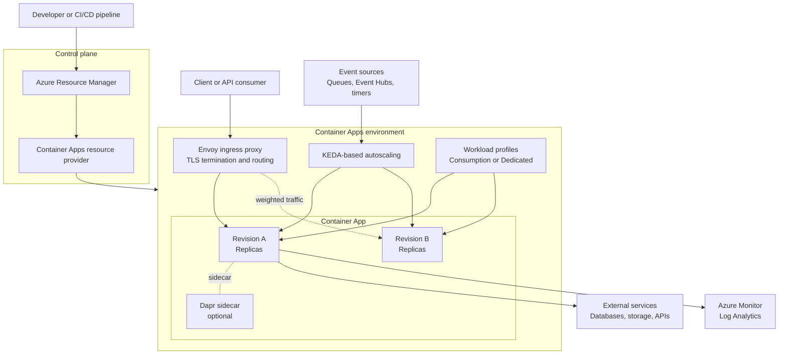
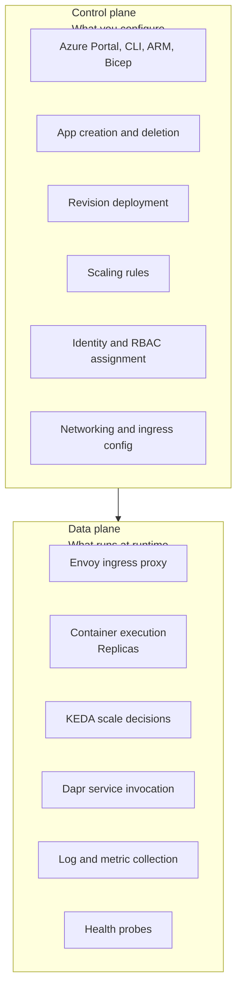
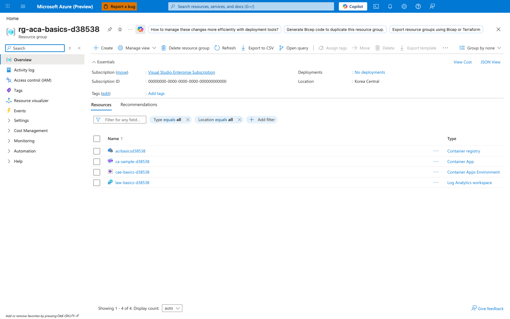

---
content_sources:
  diagrams:
  - id: architecture-overview
    type: flowchart
    source: self-generated
    justification: Synthesized from Microsoft Learn pages on Container Apps overview, environments, networking, scaling, revisions,
      and Dapr integration
    based_on:
    - https://learn.microsoft.com/azure/container-apps/overview
    - https://learn.microsoft.com/azure/container-apps/environment
    - https://learn.microsoft.com/azure/container-apps/networking
    - https://learn.microsoft.com/azure/container-apps/scale-app
    - https://learn.microsoft.com/azure/container-apps/revisions
    - https://learn.microsoft.com/azure/container-apps/dapr-overview
  - id: control-data-plane
    type: flowchart
    source: self-generated
    justification: Synthesized from Microsoft Learn pages distinguishing management operations from runtime traffic
    based_on:
    - https://learn.microsoft.com/azure/container-apps/overview
    - https://learn.microsoft.com/azure/container-apps/environment
content_validation:
  status: verified
  last_reviewed: '2026-04-27'
  reviewer: agent
  core_claims:
  - claim: Azure Container Apps is powered by KEDA for autoscaling.
    source: https://learn.microsoft.com/azure/container-apps/scale-app
    verified: true
  - claim: Container Apps uses an HTTP edge proxy (Envoy) that terminates TLS and routes requests.
    source: https://learn.microsoft.com/azure/container-apps/networking
    verified: true
  - claim: A Container Apps environment is a secure boundary that manages OS upgrades, scale operations, failover procedures,
      and resource balancing.
    source: https://learn.microsoft.com/azure/container-apps/environment
    verified: true
  - claim: Dapr integration provides service-to-service invocation, state management, and pub/sub messaging.
    source: https://learn.microsoft.com/azure/container-apps/dapr-overview
    verified: true
---
# How Container Apps Works

Azure Container Apps is a serverless container platform built on a managed, Kubernetes-based environment. This page provides the mental model you need for design reviews, deployment decisions, and production troubleshooting.

## Architecture at a Glance

<!-- diagram-id: architecture-overview -->

- The control plane starts when you deploy or update a container app through Azure Resource Manager, the Azure portal, the CLI, Bicep, or Terraform.
- The data plane starts when traffic reaches the environment's HTTP edge proxy, which terminates TLS and routes requests to the active revision and its replicas.
- The environment is the secure boundary for your apps and manages shared platform responsibilities such as workload placement, upgrades, failover, and resource balancing.
- Revisions are immutable deployment snapshots, so a single app can have multiple versions active at the same time for testing or weighted traffic rollout.
- Scaling is event-driven: HTTP traffic, TCP connections, CPU or memory thresholds, and external event sources can all influence replica count through the platform's KEDA-powered scaling model.

## Control Plane vs Data Plane

<!-- diagram-id: control-data-plane -->

Understanding the split between management and runtime behavior helps you troubleshoot faster. If an app cannot be created, updated, or granted access, the problem usually starts in the control plane. If the app deploys successfully but returns 5xx responses, fails health probes, or scales unexpectedly, the problem is usually in the data plane.

| Operation | Plane | Why it belongs there |
|---|---|---|
| Create a Container Apps environment | Control plane | This is an Azure resource management action handled through Azure Resource Manager and the resource provider. |
| Assign a managed identity | Control plane | Identity assignment and RBAC are configuration-time management operations. |
| Configure ingress mode and target port | Control plane | Ingress settings are stored as app configuration and applied by the platform. |
| Deploy a new revision | Control plane | A revision is created from a configuration or template change. |
| Route external HTTPS traffic to a replica | Data plane | This is runtime traffic handled by the HTTP edge proxy inside the environment. |
| Run startup, liveness, and readiness probes | Data plane | Probe execution happens against running containers. |
| Scale from zero to one replica after an event | Data plane | Runtime signals are evaluated by the platform's KEDA-powered scaling path. |
| Invoke another service through Dapr | Data plane | Service invocation happens between running workloads at request time. |
| Collect app logs and metrics | Data plane | Observability signals are emitted from active runtime components and forwarded to monitoring backends. |

## Control Plane

The control plane is the configuration and orchestration layer for Azure Container Apps. It is where you declare desired state and where Azure applies platform-managed operations to reach that state.

### What the control plane does

- Accepts resource creation and update requests through Azure Resource Manager.
- Stores app configuration such as image reference, ingress settings, secrets references, environment variables, scale rules, and revision mode.
- Creates new immutable revisions when you change revision-scope settings.
- Applies identity configuration, including system-assigned or user-assigned managed identity settings.
- Enforces access checks for management operations through Azure RBAC.
- Coordinates environment-level configuration such as networking boundaries, workload profiles, certificates, and diagnostics settings.

### Why control-plane issues matter operationally

Many production incidents begin before a single request reaches your application code. Common examples include:

- A deployment fails because the caller lacks permission to update the container app.
- A new revision never becomes healthy because the platform cannot pull the image or resolve referenced secrets.
- A managed identity exists, but the required RBAC role assignment was never created on the downstream resource.
- Ingress was configured as internal when the expectation was public access.

These are control-plane failures because the platform cannot establish the desired runtime state. They are the right place to investigate when the Azure portal, CLI, ARM deployment output, or activity logs show errors before traffic is served.

### Typical control-plane artifacts

| Artifact | Scope | Example questions |
|---|---|---|
| Container app resource | App | Which image, revision mode, scale rules, and ingress settings are configured? |
| Container Apps environment | Shared boundary | Which apps share the same environment, logging backend, and network boundary? |
| Managed identity | App or shared | Which principal is used to access Azure resources? |
| RBAC assignment | Azure resource | Does the identity have the required role on Key Vault, Storage, or Container Registry? |
| Revision definition | App version | What changed between the last healthy revision and the failing one? |

!!! note "Think of the control plane as declared intent"
    The control plane describes what should exist and how it should be configured.
    If Azure cannot converge the runtime to that declared state, troubleshoot management permissions,
    referenced resources, identity bindings, and deployment configuration before analyzing request traffic.

## Data Plane

The data plane is the runtime path that handles live application traffic, background events, container execution, and telemetry. Once a revision is active, most user-visible behavior happens here.

### Core runtime components

- **HTTP edge proxy**: Microsoft Learn documents an HTTP edge proxy built on Envoy. It terminates TLS for inbound HTTPS traffic and routes requests to the correct app revision.
- **Replicas**: A revision runs as one or more replicas. Each replica hosts your container and, when enabled, sidecars such as Dapr.
- **Scaling path**: Azure Container Apps is powered by KEDA for autoscaling. HTTP traffic, CPU, memory, TCP, and event-driven rules can all affect scale decisions.
- **Internal service connectivity**: Microsoft Learn documents that Envoy also routes internal traffic inside clusters, which matters for internal ingress and service-to-service patterns.
- **Observability pipeline**: Logs, console output, and metrics are emitted from runtime components and can be sent to Azure Monitor and Log Analytics.

### Typical data-plane symptoms

- Requests return 502, 503, or 504 even though deployment completed successfully.
- Health probes fail and the replica is restarted.
- Replica count oscillates unexpectedly under burst traffic.
- Event-driven scale-out does not happen because the queue trigger or scaler target is misconfigured.
- Dapr-based service invocation or pub/sub messaging fails while the app itself remains deployable.

### Data-plane troubleshooting questions

| Question | Why it matters |
|---|---|
| Did traffic reach the environment ingress endpoint? | Separates DNS, certificate, and client path issues from application issues. |
| Which revision received traffic? | Traffic splitting and multiple active revisions can hide version-specific failures. |
| Were replicas created and kept healthy? | A scaling success can still fail at readiness or runtime initialization. |
| Did the app fail before or after request routing? | Distinguishes ingress behavior from container behavior. |
| Are downstream dependencies slow or unavailable? | Many runtime symptoms are caused by databases, storage, APIs, or network egress dependencies. |

## Environment Internals

The Container Apps environment is the platform boundary that hosts one or more apps and jobs. Microsoft Learn describes it as a **secure boundary** around groups of container apps with shared networking, observability, and compute characteristics.

> "A container apps environment is a secure boundary around a group of container apps. Container Apps environments provide a secure boundary where Container Apps can run, and they manage OS upgrades, scale operations, failover procedures, and resource balancing."  
> — Microsoft Learn, *Environment in Azure Container Apps*

That definition is important because it explains what you do and do not manage:

- You manage app-level configuration, identities, secrets references, networking choices, and scaling rules.
- Azure manages the underlying platform lifecycle for the environment, including OS upgrades and balancing capacity across the managed, Kubernetes-based environment.
- Apps in the same environment share environment-level capabilities such as logging destinations, virtual network integration choices, and workload profiles.

### What the environment manages for you

| Platform concern | Managed by the environment | Operational impact |
|---|---|---|
| OS upgrades | Yes | You do not patch worker hosts directly. Platform maintenance happens beneath the app layer. |
| Scale operations | Yes | Replica placement and scale orchestration happen within the environment boundary. |
| Failover procedures | Yes | The platform handles infrastructure-level recovery mechanisms within its service design. |
| Resource balancing | Yes | Workloads are balanced according to the environment's available platform capacity and profile model. |
| Shared observability plumbing | Yes | Environment configuration determines how logs and diagnostics integrate with Azure Monitor or Log Analytics. |

### Why environment design matters

An environment is more than a deployment target. It is also a blast-radius boundary. Placing multiple apps in one environment can simplify service discovery and shared operations, but it also means those apps share:

- Environment-level networking posture.
- Logging and diagnostics configuration.
- Workload profile choices and some capacity characteristics.
- Operational dependency on the same environment lifecycle.

Use that mental model during architecture review: first decide which apps should share an environment, then decide how those apps expose ingress, consume identities, and connect to downstream services.

## Revision and Replica Model

Revisions are one of the most important architectural ideas in Azure Container Apps. Microsoft Learn defines revisions as immutable snapshots of an app version. When you change revision-scope settings, the platform creates a new revision instead of modifying the existing one in place.

### Why revisions exist

- They allow safe rollout of configuration and image changes.
- They preserve previous versions for rollback or side-by-side validation.
- They let you use single revision or multiple revision mode depending on release strategy.
- They support traffic splitting so you can direct percentages of traffic to different revisions.

### Revision lifecycle mental model

1. A deployment changes app configuration or template fields that affect revision state.
2. Azure Container Apps creates a new immutable revision.
3. The platform provisions replicas for that revision.
4. Health checks determine whether the new revision becomes ready.
5. Traffic is assigned based on revision mode and traffic rules.
6. Older revisions remain active, inactive, or deprovisioned according to your configuration and operational actions.

### Revision versus replica

| Concept | Meaning | Example |
|---|---|---|
| Revision | Immutable version of the app definition | `myapp--green` and `myapp--blue` |
| Replica | Running instance of a revision | Three running container instances of `myapp--green` |
| Traffic split | Percentage-based routing between active revisions | 90% to stable, 10% to canary |

!!! tip "Use revisions to isolate change risk"
    When a new version fails, compare the failing revision with the previous healthy revision first.
    Revisions give you a clean boundary for image, configuration, probe, and scale-rule changes.

## Scaling Model

Azure Container Apps is powered by KEDA for autoscaling. That phrasing matters because it explains why the platform can scale on more than CPU and memory alone. Container Apps can respond to runtime demand from HTTP traffic, TCP traffic, event sources, and other supported scaler types.

### Key scaling ideas

- **Scale to zero**: Consumption-based apps can scale down to zero when no work is present, then scale back out when a request or event arrives.
- **Event-driven scaling**: Queue depth, message backlogs, or other event signals can trigger additional replicas.
- **Resource-driven scaling**: CPU and memory thresholds can influence scale decisions for running workloads.
- **HTTP and TCP awareness**: Ingress traffic can participate in scaling behavior when the app is exposed through supported networking modes.

### Simplified scaling flow

1. A signal appears, such as HTTP requests, CPU pressure, or queue backlog.
2. The platform evaluates configured scale rules.
3. KEDA-powered scaling logic determines the desired replica count.
4. The environment provisions or removes replicas.
5. Health probes and readiness determine whether those replicas can serve live traffic.

### What scaling does not solve by itself

Scaling more replicas does not fix every issue. You can still have:

- Slow downstream databases that become the real bottleneck.
- Long cold-start or initialization paths that delay readiness.
- Probe failures caused by missing dependencies or wrong ports.
- Message handling patterns that are not idempotent under parallel scale-out.

## Networking Model

Networking in Azure Container Apps starts with the environment boundary and extends to ingress exposure, virtual network integration, internal service connectivity, and downstream egress paths.

### Ingress and request routing

Microsoft Learn documents an HTTP edge proxy based on Envoy. This proxy terminates TLS, enforces ingress decisions, and routes inbound requests to the correct app revision. That architecture explains several common behaviors:

- TLS termination happens at the ingress layer rather than inside each application container by default.
- Traffic can be routed to different revisions according to configured percentages.
- The ingress endpoint can be configured for external or internal reachability depending on design requirements.

### Internal and external exposure

| Mode | What it means | Common use case |
|---|---|---|
| External ingress | The app is reachable from outside the environment through its public endpoint or configured custom domain. | Public APIs, web front ends, webhook receivers |
| Internal ingress | The app is reachable only inside the environment or connected network boundary. | Private APIs, backend services, internal event processors |

### Virtual network integration

The environment can be integrated with a virtual network, which is the right level to think about networking design. Instead of asking only whether one app is private, ask these broader questions:

- Which environments require private address space and tighter east-west controls?
- Which downstream services require private connectivity?
- Which apps need only internal ingress because they are consumed by peer services rather than internet clients?

### Internal traffic inside the environment

Microsoft Learn notes that Envoy routes internal traffic inside clusters. In practice, that is useful for understanding internal ingress, service-to-service communication paths, and how requests can remain inside the platform boundary for private application topologies.

## Optional Platform Features

Not every architecture needs every platform feature. Azure Container Apps adds capabilities incrementally, so it helps to treat these as optional building blocks rather than default requirements.

### Dapr integration

Azure Container Apps supports Dapr integration for common distributed application patterns. Microsoft Learn documents Dapr support for:

- Service-to-service invocation
- State management
- Pub/sub messaging
- Bindings and actors scenarios, depending on component use

This feature is valuable when you want a consistent sidecar-based abstraction for service communication and eventing, but it also adds another runtime component to observe and troubleshoot.

### Jobs

Azure Container Apps also supports jobs for work that should run to completion instead of serving long-lived request traffic. Jobs are useful for:

- Scheduled processing
- Manual administrative execution
- Event-driven batch work

Architecturally, jobs share the Container Apps platform model but differ from apps in one key way: the primary unit of work is an execution that runs to completion, not an ingress-exposed service that continuously receives requests.

## Portal View

The diagrams above describe the architecture abstractly. This section walks through what those same concepts look like in the Azure portal, using a live Container Apps environment (`cae-basics-d38538`) and a sample app (`ca-sample-d38538`) deployed in Korea Central. Each capture is a real blade you can navigate to and confirm against your own deployment.

### Step 1: Container Apps environment overview

Start at the **Container Apps environment** resource. The environment is the platform boundary discussed in the *Environment Internals* section above: it owns shared networking, the KEDA-powered scaling layer, the Dapr runtime, and the Envoy-based ingress proxy. Navigate to the environment resource (`cae-basics-d38538` in the sample) to see this blade.

**[Observed]** The Essentials panel shows `Status : Succeeded`, `Location : Korea Central`, `Environment type : Workload profiles`, `Static IP : 4.230.156.3`, `Applications : 1`, `KEDA version : 2.18.1`, and `Dapr version : 1.16.4-msft.7`. The Applications tab below lists a single row, `ca-sample-d38538`, with `App Type : Container App` and `Resource Group : rg-aca-basics-d38538`.

**[Inferred]** The presence of `KEDA version` and `Dapr version` fields directly in the environment Essentials panel confirms what the architecture diagram shows: KEDA-powered scaling and the optional Dapr sidecar runtime are environment-level capabilities, not per-app installations. The `Static IP` field is the egress address shared by every app in this environment, which is why environment selection is a networking-design decision and not just a deployment-target choice.

**[Not Proven]** This blade does not show the Envoy ingress proxy as a discrete component. The proxy exists inside the environment per Microsoft Learn documentation but is not exposed as a separately addressable resource in the portal.

### Step 2: Resource group view

Next, navigate to the parent resource group (`rg-aca-basics-d38538`) to see the full set of Azure resources the environment depends on.

**[Observed]** The Resources list shows four rows: `acrbasicsd38538` typed `Container registry`, `ca-sample-d38538` typed `Container App`, `cae-basics-d38538` typed `Container Apps Environment`, and `law-basics-d38538` typed `Log Analytics workspace`. The Essentials panel shows `Location : Korea Central` and `Deployments : No deployments`.

**[Inferred]** A working Container Apps deployment is a small graph of Azure resources, not a single object. The Container Apps Environment and the Container App are two distinct resource types with their own lifecycle. The Container Registry holds the images that revisions reference, and the Log Analytics workspace is the observability backend that the environment forwards logs to. Deleting any one of these resources independently is possible and will produce different failure modes — this is the boundary you reason about during incident response.

**[Not Proven]** The resource list does not show wiring: it cannot tell you which app uses which registry, or whether the Log Analytics workspace is the one the environment was configured to use. Those bindings live inside each resource's configuration and are visible from the corresponding blade.

### Step 3: Container App overview

Drill into the Container App resource itself (`ca-sample-d38538`). This is the unit you deploy, scale, and version.

**[Observed]** The Essentials panel shows `Status : Running`, `Location : Korea Central`, an `Application Url` field whose value is truncated with an ellipsis (visible prefix `https://ca-sample-d38538.calmdune-5b5e37e7.koreacentral.azurecont…`), `Container Apps Environment : cae-basics-d38538`, `Environment type : Workload profiles`, `Log Analytics : law-basics-d38538`, and `Development stack : Generic`. The left navigation has expandable groups for `Application` (with child entries `Revisions and replicas`, `Containers`, `Scale`, `Volumes`), `Networking` (`Ingress`, `Custom domains`, `CORS`), `Security`, and `Monitoring` (`Log stream`, `Logs`, `Console`, `Alerts`, `Metrics`, `Dashboards with Grafana`, `Advisor recommendations`).

**[Inferred]** The Essentials panel surfaces both runtime-oriented fields (`Status`, `Application Url`) and configuration-time bindings (`Container Apps Environment`, `Log Analytics`) on the same blade, which mirrors the control-plane vs data-plane split discussed earlier on this page. The left-navigation grouping also mirrors the architecture sections of this doc — `Revisions and replicas` for the revision model, `Scale` for the scaling model, `Ingress` and `Custom domains` for the networking model, and `Log stream`/`Logs` for the observability pipeline.

**[Not Proven]** The overview blade exposes an `Application Url` field but does not by itself prove whether the ingress is configured as external or internal, or whether the URL is reachable from the public internet — that decision lives in the `Networking > Ingress` child blade.

### Step 4: Revisions and replicas

Open the **Revisions and replicas** blade to see the revision model in practice. This is the same concept described in the *Revision and Replica Model* section above.

**[Observed]** The blade header is `ca-sample-d38538 | Revisions and replicas` and includes the descriptive text *"Each revision is an immutable snapshot of your container app, and can have different setups for traffic allocation, container images, autoscaling, or Dapr."* Three tabs are visible: `Active revisions`, `Inactive revisions`, `Replicas`. The Active revisions table has one row: `ca-sample-d38538--0uzoi59`, `Date created : 6/3/2026, 10:34:26 PM`, `Running status : Running`, `Traffic : 100`%, `Replicas : 1`.

**[Inferred]** The revision suffix (`--0uzoi59`) is appended to the app name to form a revision-specific identifier. The fact that `Traffic` and `Replicas` are columns on a per-revision row — not on the app itself — confirms that traffic splitting and replica scaling are revision-scoped properties, which is why revisions are the right unit for rollout and rollback. The separate `Inactive revisions` and `Replicas` tabs reflect the lifecycle described in the *Revision lifecycle mental model* table: revisions can be active or inactive, and replicas are the running instances of an active revision.

**[Not Proven]** This blade shows the revision identifier and traffic state but does not by itself show the image tag, environment variables, or scale rules that define what makes this revision distinct from any prior revision. Those details require opening the revision's detail panel (`View details` link) or comparing JSON snapshots between revisions.

### Step 5: Containers blade (revision-bound template)

The **Containers** blade is where you see why revisions are immutable: every change here saves as a *new revision* rather than mutating the current one. This is the concrete implementation of the *Revision and Replica Model* discussed above.

**[Observed]** The blade header is `ca-sample-d38538 | Containers` and the page begins with the text *"One or more containers, along with settings such as scale rules, can be specified in a container app. Edit the container app to change the configuration."* The `Based on revision` field shows `ca-sample-d38538--0uzoi59`. The `Container` dropdown is set to `ca-sample-d38538` with `Create new container` and `Delete this container` links below it. Four tabs are visible: `Properties` (active), `Environment variables`, `Health probes`, `Volume mounts`. Under Container details: `Name : ca-sample-d38538`, `Image source : Docker Hub or other registries`, `Image type : Public`, `Registry login server : mcr.microsoft.com`, `Image and tag : k8se/quickstart:latest`, `Command override` (empty), `Arguments override` (empty). Container resource allocation shows `CPU cores : 0.5` (`Min: 0.1, Max: 4`) and `Memory (Gi) : 1` (`Min: 0.1, Max: 8`). The bottom action buttons are `Save as a new revision` and `Discard`.

**[Inferred]** The label `Based on revision : ca-sample-d38538--0uzoi59` (read-only, not editable) plus the bottom action button literally named `Save as a new revision` is the strongest visible proof of the immutable-revision model. You cannot edit the current revision in place — any change here forks a new revision. The four tabs (`Properties`, `Environment variables`, `Health probes`, `Volume mounts`) enumerate the revision-scope fields that, when changed, will produce a new revision; this directly mirrors the *Revision lifecycle mental model* step 1 ("A deployment changes app configuration or template fields that affect revision state").

**[Not Proven]** The blade shows the current image (`mcr.microsoft.com/k8se/quickstart:latest`) but does not show image *digest*, signature, or whether the registry is private — the `Image type : Public` radio reflects the user's configuration intent, not a runtime verification of registry access.

### Step 6: Scale blade (KEDA-powered rules)

The **Scale** blade exposes the KEDA-powered scaling model described above as a concrete configuration surface. This is where you see that scale rules are revision-scoped and that the rule *type* — not just min/max replicas — drives behavior.

**[Observed]** The `Based on revision` field shows `ca-sample-d38538--0uzoi59`. The Scale rule settings explanation reads *"Control automatic scaling by setting the range of application replicas that'll be deployed in response to a trigger event. Use scale rules to determine the type of events that trigger scaling."* Fields: `Min replicas : 1` (`Min: 0`), `Max replicas : 3` (`Max: 1000`), `Cooldown period : 300`, `Polling interval : 30`, `Current number of replicas : 1 (View Details)`. The Scale rules table has one row: `Name : http-scaler`, `Type : HTTP scaling`.

**[Inferred]** The fact that `Type` is a column (alongside `Name`) — not a fixed property of every app — confirms what the architecture diagram showed: scaling is pluggable, and HTTP, TCP, CPU, memory, and event-driven scalers are different rule *types* that share the same min/max/cooldown surface. The visible `Min replicas : 0` floor in the helper text (`Min: 0`) is the concrete entry point for "scale to zero" described in the *Scaling Model* section. The `Polling interval : 30` field is the cadence at which the configured scaler queries its source — this is why event-driven scale-out is not instantaneous.

**[Not Proven]** The blade shows that an HTTP scaler exists but the row alone does not show the rule's threshold (concurrent requests target). That detail lives behind the rule name link. Likewise, `Current number of replicas : 1` is a point-in-time read; it does not prove how the platform reached that count or how long it has been steady.

### Step 7: Ingress blade (Envoy proxy configuration)

The **Ingress** blade is where the Envoy-based HTTP edge proxy described in the *Networking Model* section becomes visible as a configuration surface — terminating TLS, exposing the external endpoint, and binding to a container port.

**[Observed]** A blue info banner reads *"When you enable Ingress, all traffic will be directed to your latest revision by default. To change traffic settings, go to the revision management page."* Below: *"Enable ingress for applications that need an HTTP or TCP endpoint."* The `Ingress` toggle is checked. `Ingress traffic` has two radio options — `Limited to Container Apps Environment` (unselected) and `Accepting traffic from anywhere` (selected). `Ingress type` shows `HTTP` selected and `TCP` greyed out. `Client certificate mode` has `Ignore` selected (alternatives `Accept`, `Require`). `Transport : Auto`. `Insecure connections : ` (unchecked). `Target port : 80`. `Endpoint(s) : https://<your-app-name>.<env-suffix>.koreacentral.azurecontainerapps.io`. `Session affinity : ` (unchecked). A collapsed `Additional TCP ports` panel is below. An `IP Restrictions` section reads *"Access restrictions allow you to define lists of allow/deny rules to control traffic to your app. If there are no rules defined then your app will accept traffic from any address."* with `IP Security Restrictions Mode : Allow all traffic (default)`.

**[Inferred]** The split between `Ingress traffic` (external vs internal-only) and `Target port` (the port your container listens on) is the concrete realization of the architecture statement that the Envoy proxy "terminates TLS and routes requests to the correct app revision." The `Endpoint(s)` URL uses `https://` even though `Target port` is `80` — this confirms TLS is terminated at the ingress layer, not inside the container, which is exactly the data-plane responsibility described in the *Networking Model* section. The info banner about "all traffic will be directed to your latest revision by default" plus the link to "the revision management page" connects this blade to Step 4: traffic splitting between revisions is configured there, not here.

**[Not Proven]** This blade shows that ingress is configured as external (`Accepting traffic from anywhere`) but does not by itself prove that any *specific* request was served — that requires log stream evidence or the `Endpoint(s)` URL responding. Likewise, `IP Security Restrictions Mode : Allow all traffic (default)` shows no IP allowlist is configured, but the blade does not show whether environment-level network policies (e.g., a VNet integration with NSGs) further restrict reachability.

## Design Review Checklist

Use this page as a quick architecture review guide before you deploy a new workload:

- Have you separated control-plane concerns from data-plane runtime concerns?
- Is the environment boundary appropriate for the apps that will share networking, logging, and operational lifecycle?
- Do you understand which changes create a new revision and how rollback will work?
- Are scale rules aligned with real workload signals rather than guesses?
- Is ingress configured correctly for external versus internal exposure?
- Are identity and RBAC dependencies documented for every downstream Azure resource?
- If Dapr or Jobs are enabled, is the team prepared to operate those additional runtime patterns?

## See Also
- [Resource Relationships](resource-relationships.md)
- [Networking](../networking/index.md)
- [Scaling](../scaling/index.md)

## Sources
- [Azure Container Apps overview (Microsoft Learn)](https://learn.microsoft.com/azure/container-apps/overview)
- [Environment in Azure Container Apps (Microsoft Learn)](https://learn.microsoft.com/azure/container-apps/environment)
- [Networking in Azure Container Apps (Microsoft Learn)](https://learn.microsoft.com/azure/container-apps/networking)
- [Set scaling rules in Azure Container Apps (Microsoft Learn)](https://learn.microsoft.com/azure/container-apps/scale-app)
- [Revisions in Azure Container Apps (Microsoft Learn)](https://learn.microsoft.com/azure/container-apps/revisions)
- [Dapr integration in Azure Container Apps (Microsoft Learn)](https://learn.microsoft.com/azure/container-apps/dapr-overview)
- [Managed identities in Azure Container Apps (Microsoft Learn)](https://learn.microsoft.com/azure/container-apps/managed-identity)
- [Ingress in Azure Container Apps (Microsoft Learn)](https://learn.microsoft.com/azure/container-apps/ingress-overview)
- [Jobs in Azure Container Apps (Microsoft Learn)](https://learn.microsoft.com/azure/container-apps/jobs)
