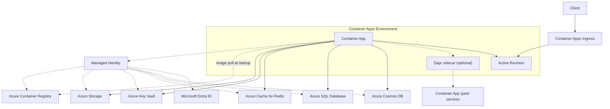

---
content_sources:
  diagrams:
    - id: architecture
      type: flowchart
      source: mslearn-adapted
      based_on:
        - https://learn.microsoft.com/en-us/azure/container-apps/overview
        - https://learn.microsoft.com/en-us/azure/container-apps/managed-identity
content_validation:
  status: verified
  last_reviewed: '2026-04-12'
  reviewer: ai-agent
  core_claims:
    - claim: Azure Container Apps uses revisions to manage different versions of a container app.
      source: https://learn.microsoft.com/en-us/azure/container-apps/revisions
      verified: true
    - claim: A managed identity from Microsoft Entra ID allows a container app to access other Microsoft Entra protected resources.
      source: https://learn.microsoft.com/en-us/azure/container-apps/managed-identity
      verified: true
    - claim: Azure Container Apps supports internal ingress and service discovery for secure internal-only endpoints with built-in DNS-based service discovery.
      source: https://learn.microsoft.com/en-us/azure/container-apps/overview
      verified: true
    - claim: Azure Container Apps can run containers from public or private registries, including Azure Container Registry.
      source: https://learn.microsoft.com/en-us/azure/container-apps/overview
      verified: true
---
# Resource Relationships

This overview maps how Azure Container Apps runtime components, identities, and dependent Azure services interact in a typical production deployment.

## Architecture

<!-- diagram-id: architecture -->

Solid arrows show runtime data flow. Dashed arrows show identity, authentication, and deployment-time dependencies.

!!! warning "Shared dependencies become shared failure domains"
    Multiple apps using the same database, cache, or Key Vault can fail together during dependency incidents.
    Design for graceful degradation and fallback behavior per service.

!!! tip "Separate control and data concerns"
    Keep deployment-time concerns (image pull, identity assignment, RBAC) in infrastructure automation,
    and runtime concerns (timeouts, retries, circuit breaking) in application configuration.

## Portal view: resource group as the visible dependency boundary

This screenshot is used here as a visual companion to the [Architecture](#architecture) diagram and the [Dependency Classification Matrix](#dependency-classification-matrix), focusing on the resource types visibly listed in the resource group.

[Observed] The Resources list shows four rows: "acrbasicsd38538" with Type "Container registry", "ca-sample-d38538" with Type "Container App", "cae-basics-d38538" with Type "Container Apps Environment", and "law-basics-d38538" with Type "Log Analytics workspace". The Essentials panel shows "Location : Korea Central" and "Deployments : No deployments".

[Inferred] The separate `Container registry`, `Container App`, and `Container Apps Environment` rows are consistent with this page's [Architecture](#architecture) diagram treating image source, application runtime, and environment boundary as different parts of the deployment. The `Container registry` row appears to map directly to the `Azure Container Registry` row in the [Dependency Classification Matrix](#dependency-classification-matrix).

[Not Proven] This blade does not show which Container App uses which Container Registry. It does not show the managed identity dashed-arrow relationships shown in [Architecture](#architecture). It does not show the Microsoft Entra ID node from the same diagram. It does not show whether `Key Vault`, `Azure SQL/Cosmos DB`, or `Redis/Storage` dependencies from the [Dependency Classification Matrix](#dependency-classification-matrix) exist in this deployment. It does not show the Dapr sidecar relationship from [Architecture](#architecture).

## Dependency Classification Matrix

| Dependency | Access Pattern | Primary Risk | Mitigation Baseline |
|---|---|---|---|
| Azure Container Registry | Startup/image pull | Revision stuck in provisioning | Private access path, pull permissions, image tag discipline |
| Key Vault | Runtime secret retrieval | Auth/RBAC or network failures | Managed identity + retry/backoff + cached defaults where safe |
| Azure SQL/Cosmos DB | Runtime data plane | Latency spikes or throttling | Connection pooling, bounded retries, schema compatibility |
| Redis/Storage | Runtime cache/object plane | Transient unavailability | Timeout tuning, fallback reads/writes, idempotent operations |

## Advanced Topics

- Add private networking controls with VNet integration and private endpoints for data services.
- Use workload profiles and KEDA scale rules to match resource behavior to traffic patterns.
- Standardize service-to-service communication and trace context propagation with Dapr.

!!! note "Model blast radius explicitly"
    During architecture review, document which services share environment, identity, network path,
    and backing stores so incident responders can quickly estimate impact scope.

## See Also
- [How Container Apps Works](../../start-here/overview.md)
- [Networking](../networking/index.md)

## Sources
- [Azure Container Apps architecture (Microsoft Learn)](https://learn.microsoft.com/en-us/azure/container-apps/overview)
- [Managed identities in Azure Container Apps (Microsoft Learn)](https://learn.microsoft.com/en-us/azure/container-apps/managed-identity)
