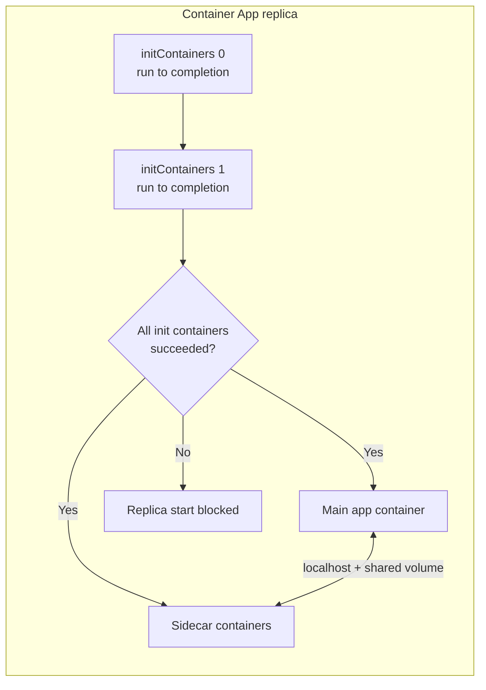

---
content_sources:
  diagrams:
    - id: replica-composition
      type: flowchart
      source: mslearn-adapted
      based_on:
        - https://learn.microsoft.com/en-us/azure/container-apps/containers
        - https://learn.microsoft.com/en-us/azure/container-apps/azure-resource-manager-api-spec
content_validation:
  status: verified
  last_reviewed: '2026-07-18'
  reviewer: ai-agent
  core_claims:
    - claim: In advanced scenarios a container app can run multiple containers, and the main app plus its sidecar containers are listed in the containers array of properties.template while init containers are listed in the initContainers array.
      source: https://learn.microsoft.com/en-us/azure/container-apps/containers
      verified: true
    - claim: Multiple containers in the same container app share hard disk and network resources and experience the same application lifecycle.
      source: https://learn.microsoft.com/en-us/azure/container-apps/containers
      verified: true
    - claim: Init containers run before the primary app container, run in the order they are defined in the initContainers array, and must complete successfully before the primary app container starts.
      source: https://learn.microsoft.com/en-us/azure/container-apps/containers
      verified: true
    - claim: For the Consumption plan the total CPU and memory allocated to all containers in a container app must add up to a supported vCPU/memory combination.
      source: https://learn.microsoft.com/en-us/azure/container-apps/containers
      verified: true
    - claim: Init containers in apps using the Dedicated plan or running in a Consumption only environment cannot access managed identity at run time.
      source: https://learn.microsoft.com/en-us/azure/container-apps/containers
      verified: true
---
# Sidecars, Multi-Container Apps, and Init Containers

Most container apps run a single container. In advanced scenarios, Azure Container Apps also supports **sidecar containers** (multiple containers that run together for the life of the replica) and **init containers** (run-to-completion containers that prepare the environment before the primary app container starts). This page explains how these patterns behave at the platform level so you can decide when — and whether — to use them.

!!! tip "Default to a single container"
    Multiple containers in one app should be used only when the containers are **tightly coupled**. For most microservice scenarios, the best practice is to deploy each service as a **separate container app** and connect them with service-to-service networking. See [Service-to-Service](../networking/service-to-service.md).

## How a replica is composed

All containers in a container app run inside the same **replica**. Init containers run first, in order, and must each exit successfully before the primary and sidecar containers start.

<!-- diagram-id: replica-composition -->

- **Init containers** are listed in the `initContainers` array of `properties.template`.
- **Main and sidecar containers** are listed together in the `containers` array of `properties.template`.
- All containers share the replica's disk and network resources and share the same [application lifecycle](https://learn.microsoft.com/en-us/azure/container-apps/application-lifecycle-management).

## Sidecar containers

Define multiple entries in the `containers` array to implement the [sidecar pattern](https://learn.microsoft.com/en-us/azure/architecture/patterns/sidecar). Sidecars run alongside the primary container for the entire life of the replica.

Common uses:

- A log-forwarding agent that reads logs the primary container writes to a [replica-scoped shared volume](https://learn.microsoft.com/en-us/azure/container-apps/storage-mounts?pivots=aca-cli#replica-scoped-storage).
- A background process that refreshes a cache the primary container consumes from a shared volume.

Because containers in a replica share network resources, the primary and sidecar containers reach each other over `localhost`. To share files, mount a common replica-scoped volume in each container.

| Behavior | Detail |
|---|---|
| Lifecycle | Sidecars share the replica lifecycle — they scale, start, and stop with the app |
| Networking | Containers in the same replica communicate over `localhost` |
| Shared storage | Use a replica-scoped volume (for example `EmptyDir`) mounted into each container |
| Probes | Health probes are defined **per container** in the `probes` array of that container |
| Resources | Each container has its own `resources.cpu` / `resources.memory` request |

## Init containers

Init containers perform initialization work — downloading data, running database migrations, or preparing a shared volume — **before** the app starts.

- Defined in the `initContainers` array of `properties.template`.
- Run in the order they are defined and must complete successfully before the primary app container starts.
- Each has its own CPU/memory request and can mount the same volumes as the app container.

!!! warning "Managed identity in init containers"
    Init containers in apps using the **Dedicated plan** or running in a **Consumption only** environment **cannot access managed identity at run time**. If an init container needs to authenticate to Azure (for example, to pull data from Key Vault or Storage), verify your plan supports it or move the work into the app container.

## Resource allocation across containers

On the **Consumption plan**, the total CPU and memory of **all** containers in a container app (init containers count while they run, and the main plus sidecar containers count together) must add up to one of the supported combinations, such as `0.5` vCPU / `1.0Gi` or `1.0` vCPU / `2.0Gi`. Apps in a *Consumption only* environment are limited to a maximum of 2 cores and 4Gi.

Plan the split deliberately: a sidecar consuming `0.25` vCPU leaves less for the primary container within the same replica budget. See [Platform Limits](../../reference/platform-limits.md) and [Container Design](../../best-practices/container-design.md).

## Failure behavior

- If **any init container** fails (non-zero exit), the primary app container does not start and the replica fails to become ready.
- If a **running container crashes**, Container Apps automatically restarts it.
- Probes are scoped to the container they are defined on, so a failing readiness probe on one container affects only that container's traffic eligibility within the replica.

## When to use multi-container vs separate apps

| Use multiple containers when… | Use separate container apps when… |
|---|---|
| Containers are tightly coupled and must scale together | Services scale independently |
| A helper must share the primary container's local disk or `localhost` | Services communicate over the network and can tolerate independent lifecycles |
| An initialization step must complete before the app starts (init container) | You want independent revisions, ingress, and deployment cadence |

## Usage Notes

- Keep the single-container default unless you have a concrete coupling reason.
- Use init containers for one-time setup, not long-running work — they must exit for the app to start.
- Size the primary and sidecar containers together so they fit one supported CPU/memory combination.
- Use `az containerapp logs show --container <name>` to read a specific container's stream, since each container logs independently.

## See Also

- [Container Design](../../best-practices/container-design.md)
- [Service-to-Service](../networking/service-to-service.md)
- [Storage Overview](../storage/index.md)
- [Revision Lifecycle](../revisions/lifecycle.md)
- [Platform Limits](../../reference/platform-limits.md)

## Sources

- [Microsoft Learn: Containers in Azure Container Apps](https://learn.microsoft.com/en-us/azure/container-apps/containers)
- [Microsoft Learn: Azure Container Apps ARM and YAML template specifications](https://learn.microsoft.com/en-us/azure/container-apps/azure-resource-manager-api-spec)
- [Microsoft Learn: Sidecar pattern](https://learn.microsoft.com/en-us/azure/architecture/patterns/sidecar)
</content>
