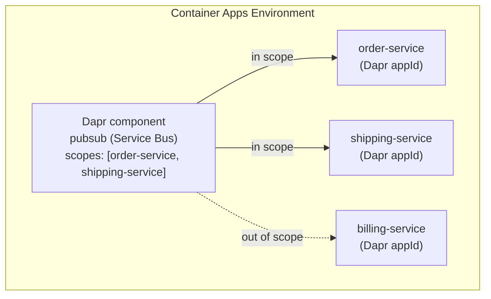

---
content_sources:
  diagrams:
    - id: dapr-component-scoping
      type: flowchart
      source: mslearn-adapted
      based_on:
        - https://learn.microsoft.com/en-us/azure/container-apps/dapr-component-resiliency
        - https://learn.microsoft.com/en-us/azure/container-apps/dapr-overview
content_validation:
  status: verified
  last_reviewed: '2026-07-18'
  reviewer: ai-agent
  core_claims:
    - claim: Dapr components in Azure Container Apps are resources defined at the environment level and are shared by the Dapr-enabled apps in that environment.
      source: https://learn.microsoft.com/en-us/azure/container-apps/dapr-overview
      verified: true
    - claim: By default a Dapr component is loaded by every Dapr-enabled app in the environment, and the scopes property restricts a component to only the apps whose Dapr application IDs are listed.
      source: https://learn.microsoft.com/en-us/azure/container-apps/dapr-overview
      verified: true
    - claim: A Dapr component can reference secrets from a configured Dapr secret store component or from Container Apps secrets instead of embedding secret values in metadata.
      source: https://learn.microsoft.com/en-us/azure/container-apps/dapr-overview
      verified: true
    - claim: Azure Container Apps supports Dapr state store, pub/sub, bindings, and secret store component types backed by Azure services such as Azure Cosmos DB, Azure Service Bus, Azure Event Hubs, and Azure Key Vault.
      source: https://learn.microsoft.com/en-us/azure/container-apps/dapr-component-resiliency
      verified: true
---
# Dapr Components, State, and Pub/Sub

Dapr building blocks such as state management and pub/sub are backed by **components** — declarative resources that bind a Dapr API to concrete infrastructure like Azure Cosmos DB or Azure Service Bus. This page covers how components are scoped in Azure Container Apps, how they reference secrets, and how to choose backing stores for state and pub/sub.

## Components Are Environment-Level Resources

Unlike the Dapr *sidecar* setting (which is application-scoped), a Dapr **component** is defined at the **Container Apps environment level**. This lets multiple apps in the same environment share one broker or state store definition.

By default, every Dapr-enabled app in the environment loads every component. The `scopes` property narrows a component to specific apps by listing their **Dapr application IDs** (`appId`) — not the container app resource names.

<!-- diagram-id: dapr-component-scoping -->


!!! tip "Scope every production component"
    Leaving `scopes` empty grants **all** Dapr-enabled apps access to the component. For least privilege, always list the exact `appId`s that need each state store, broker, or secret store.

## Component Schema

Azure Container Apps uses a simplified Dapr component schema:

| Field | Purpose |
|---|---|
| `componentType` | Dapr component type, e.g. `state.azure.cosmosdb`, `pubsub.azure.servicebus` |
| `version` | Component API version, typically `v1` |
| `initTimeout` | How long Dapr waits for the component to initialize |
| `ignoreErrors` | Whether the sidecar continues if the component fails to load |
| `metadata` | Key/value configuration for the backing service |
| `scopes` | Dapr `appId`s allowed to load the component |
| `secrets` / `secretStoreComponent` | Secret material referenced by metadata |

## Referencing Secrets Safely

Never place connection strings or keys directly in component `metadata`. Instead, reference them:

- **Dapr secret store component** — set `secretStoreComponent` on the component and use a `secretRef` in metadata that resolves through the secret store (for example, `secretstores.azure.keyvault`).
- **Container Apps secrets** — reference a secret defined on the environment/app.

```yaml
# Example: Service Bus pub/sub component referencing a Key Vault secret
componentType: pubsub.azure.servicebus
version: v1
secretStoreComponent: keyvault-secretstore
metadata:
  - name: connectionString
    secretRef: sb-connection-string
scopes:
  - order-service
  - shipping-service
```

## Choosing a State Store Backend

State management gives your app durable key/value storage with optimistic concurrency. Common Azure-backed options:

| Backend | When to use |
|---|---|
| Azure Cosmos DB | Global distribution, high throughput, low-latency key/value |
| Azure Blob Storage | Simple, low-cost persistence for coarse-grained state |
| Azure Table Storage | Cheap key/value at scale with simple queries |
| Azure SQL / PostgreSQL / MySQL | Relational durability, existing database estate |
| Redis | Fast, ephemeral or cache-like state |

State keys are namespaced by the app's `appId`, so two apps sharing a store do not overwrite each other's keys.

## Choosing a Pub/Sub Broker

Pub/sub decouples publishers from subscribers using the competing-consumer pattern. Consumer grouping is keyed by `appId`, so all replicas of an app share the same subscription.

| Broker | When to use |
|---|---|
| Azure Service Bus (queues/topics) | Enterprise messaging, ordering, sessions, dead-lettering |
| Azure Event Hubs | High-volume event streaming and telemetry ingestion |
| Redis Streams | Lightweight, low-latency messaging |

### Durability Trade-offs

- **At-least-once delivery**: brokers like Service Bus and Event Hubs redeliver on failure, so subscribers must be **idempotent**.
- **Ordering**: use Service Bus sessions or Event Hubs partitions when strict ordering matters; plain topics do not guarantee global order.
- **Scale-to-zero**: an app scaled to zero replicas is not consuming. Use a Dapr/KEDA-aware scale rule so queued messages wake the app.

## Component Resiliency

Dapr supports resiliency policies (timeouts, retries, and circuit breakers) applied to component interactions, letting you tune how the sidecar handles transient backend failures without changing application code.

## Limitations

- Components are shared at the environment level; isolate sensitive backends by using separate environments or strict `scopes`.
- Not every upstream Dapr component is available; prefer the Azure-backed types validated for Container Apps.
- Secret values must be referenced, not embedded, to pass security review.

## See Also

- [Dapr Integration in Azure Container Apps](index.md)
- [Key Vault Integration](../identity-and-secrets/key-vault.md)
- [Secrets](../security/secrets.md)
- [Event-Driven Jobs](../jobs/event-driven-jobs.md)

## Sources

- [Dapr integration with Azure Container Apps](https://learn.microsoft.com/en-us/azure/container-apps/dapr-overview)
- [Dapr component resiliency](https://learn.microsoft.com/en-us/azure/container-apps/dapr-component-resiliency)
- [Manage secrets in Azure Container Apps](https://learn.microsoft.com/en-us/azure/container-apps/manage-secrets)
