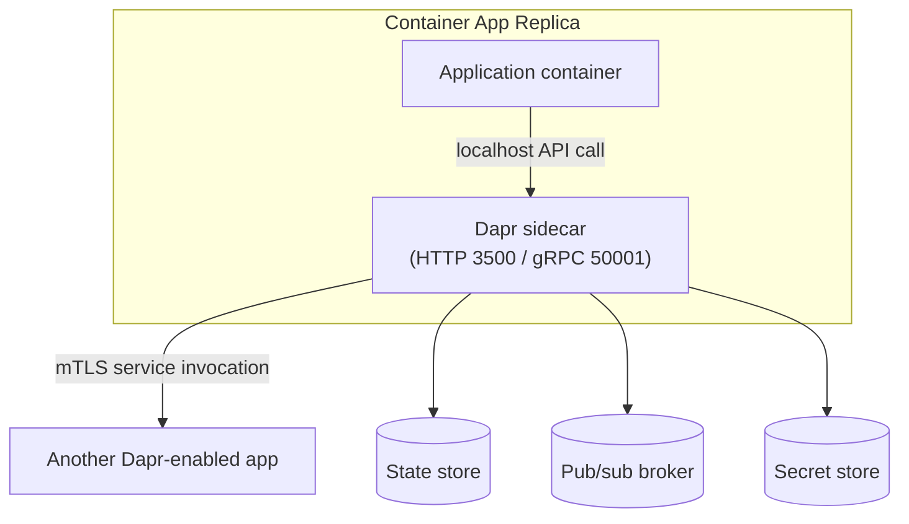

---
content_sources:
  diagrams:
    - id: dapr-sidecar-model
      type: flowchart
      source: mslearn-adapted
      based_on:
        - https://learn.microsoft.com/en-us/azure/container-apps/dapr-overview
        - https://learn.microsoft.com/en-us/azure/container-apps/microservices-dapr
content_validation:
  status: verified
  last_reviewed: '2026-07-18'
  reviewer: ai-agent
  core_claims:
    - claim: In Azure Container Apps, Dapr is enabled at the container app level and its runtime is provided as a managed sidecar that runs alongside each replica of the application.
      source: https://learn.microsoft.com/en-us/azure/container-apps/dapr-overview
      verified: true
    - claim: The Dapr sidecar exposes an HTTP endpoint on port 3500 and a gRPC endpoint on port 50001 that the application container calls to use Dapr building blocks.
      source: https://learn.microsoft.com/en-us/azure/container-apps/dapr-overview
      verified: true
    - claim: Dapr service invocation between container apps is automatically authenticated and encrypted with mutual TLS.
      source: https://learn.microsoft.com/en-us/azure/container-apps/dapr-overview
      verified: true
    - claim: A container app is identified to Dapr by a unique Dapr application ID (appId) that is used for service discovery, state encapsulation, and pub/sub consumer identification.
      source: https://learn.microsoft.com/en-us/azure/container-apps/dapr-overview
      verified: true
    - claim: Dapr is not supported for Azure Container Apps jobs.
      source: https://learn.microsoft.com/en-us/azure/container-apps/dapr-overview
      verified: true
---
# Dapr Integration in Azure Container Apps

The Distributed Application Runtime (Dapr) is a set of incrementally adoptable APIs — called *building blocks* — that simplify building resilient microservices. Azure Container Apps hosts a **managed version of Dapr**: you enable it declaratively on an app, and the platform injects and operates the Dapr sidecar for you. This page explains the managed sidecar model, how to enable it, and how applications consume Dapr APIs.

## Managed Sidecar Model

When Dapr is enabled on a container app, the platform runs the Dapr runtime as a **sidecar container in every replica**, next to your application container. Your application never talks to another service directly through Dapr — it calls its **local sidecar** over `localhost`, and the sidecar handles discovery, retries, encryption, and communication with backing infrastructure.

<!-- diagram-id: dapr-sidecar-model -->


Because the sidecar is managed, you do not deploy, patch, or scale the Dapr runtime yourself. The platform pins a specific Dapr version (for example, `1.13.6-msft.1`) and upgrades it as part of the managed environment.

### Sidecar Endpoints

| Protocol | Port | Purpose |
|---|---|---|
| HTTP | `3500` | Default API surface your app calls (`http://localhost:3500/v1.0/...`) |
| gRPC | `50001` | High-throughput API surface for the Dapr gRPC SDKs |

Your application chooses `appProtocol` (`http` or `grpc`, default `http`) to tell the sidecar how to call **back into your app** — for example when delivering a pub/sub message or an incoming service-invocation request.

## Enabling Dapr

Dapr is an **application-scoped** setting stored under the app's `properties.configuration.dapr` block. Enabling or changing Dapr settings does **not** create a new revision; in multiple-revision mode the change applies to all revisions and restarts the running replicas.

```bash
# Enable Dapr when creating an app
az containerapp create \
  --resource-group $RG \
  --name $APP_NAME \
  --environment $ENVIRONMENT \
  --image $IMAGE \
  --enable-dapr \
  --dapr-app-id order-service \
  --dapr-app-port 8080 \
  --dapr-app-protocol http
```

| Command | Purpose |
|---|---|
| `az containerapp create ... --enable-dapr` | Creates the app with the Dapr sidecar turned on from the first deployment so service invocation, pub/sub, and other Dapr building blocks are available immediately. |
| `--environment $ENVIRONMENT` | Places the app in the target Container Apps environment, which is where the managed Dapr runtime version and networking context are defined. |
| `--dapr-app-id order-service` | Sets the logical Dapr identity other services will use for service invocation, which is distinct from the Container App resource name. |
| `--dapr-app-port 8080` / `--dapr-app-protocol http` | Tells the sidecar how to call back into your app so Dapr-delivered requests reach the correct port and protocol. |

### Core Dapr Settings

| Setting | Meaning | Default |
|---|---|---|
| `enabled` | Turns the Dapr sidecar on for the app | `false` |
| `appId` | Unique Dapr identifier for the app | — (required when enabled) |
| `appPort` | Port your app listens on for Dapr-delivered traffic | — |
| `appProtocol` | How the sidecar calls your app: `http` or `grpc` | `http` |
| `httpMaxRequestSize` | Max request body size in MB | `4` |
| `httpReadBufferSize` | Max header read buffer in KB | `4` |
| `logLevel` | Sidecar log verbosity (`info`, `debug`, `warn`, `error`) | `info` |
| `enableApiLogging` | Emit an entry per Dapr API call | `false` |
| `maxConcurrency` | Max concurrent requests delivered to your app (`-1` = unlimited) | `-1` |

### App Health Checks

Dapr can probe your application before routing pub/sub or input-binding traffic to it. The `appHealth` block controls this:

| Field | Default |
|---|---|
| `enabled` | `false` |
| `path` | `/healthz` |
| `probeIntervalSeconds` | `3` |
| `probeTimeoutMilliseconds` | `500` |
| `threshold` | `3` |

## The Application ID (appId)

Each Dapr-enabled app is identified by an `appId`. This identifier is the backbone of several building blocks:

- **Service discovery** — other apps invoke this app by its `appId`, not by hostname or IP.
- **State encapsulation** — state keys are namespaced under the `appId`, so apps do not collide in a shared state store.
- **Pub/sub consumer identity** — the `appId` determines subscription grouping for competing-consumer delivery.
- **Component scoping** — environment-level Dapr components are granted to apps by listing their `appId` in the component's `scopes` array (see [Dapr Components, State, and Pub/Sub](components-state-pubsub.md)).

## Building Blocks

Dapr on Container Apps exposes the following generally available building blocks:

| Building block | Purpose |
|---|---|
| Service invocation | Reliable, mTLS-secured service-to-service calls with retries |
| State management | Key/value persistence and concurrency control |
| Pub/sub | Asynchronous message publishing and subscription |
| Bindings | Input/output integration with external systems |
| Actors | Virtual actor pattern for stateful units of concurrency |
| Secrets | Read secrets from a configured secret store |
| Configuration | Read and subscribe to configuration items |

Two operational APIs — **health** and **metadata** — are also available for probing and introspecting the sidecar.

!!! note "Actors and reminders"
    Dapr actor reminders require the app to keep at least one replica running. Set `minReplicas` to `1` or higher for apps that rely on actor reminders, otherwise scale-to-zero can prevent reminders from firing.

## Security by Default

Service invocation between Dapr-enabled apps in the same environment is **automatically authenticated and encrypted with mutual TLS (mTLS)**. You do not configure certificates for this — the managed Dapr control plane issues and rotates them. This complements the environment-level [mTLS architecture](../security/mtls.md) that Container Apps provides for general service-to-service traffic.

## Limitations

- **Jobs do not support Dapr.** Only container apps (not [jobs](../jobs/index.md)) can enable the Dapr sidecar.
- Dapr settings are application-scoped and restart replicas when changed.
- The managed Dapr version is controlled by the platform; you cannot pin an arbitrary upstream Dapr release.

## See Also

- [Dapr Components, State, and Pub/Sub](components-state-pubsub.md)
- [Service-to-Service Communication](../networking/service-to-service.md)
- [mTLS Architecture](../security/mtls.md)
- [Resource Relationships](../architecture/resource-relationships.md)

## Sources

- [Dapr integration with Azure Container Apps](https://learn.microsoft.com/en-us/azure/container-apps/dapr-overview)
- [Configure Dapr on an existing container app](https://learn.microsoft.com/en-us/azure/container-apps/enable-dapr)
- [Microservices with Dapr using the Azure Developer CLI](https://learn.microsoft.com/en-us/azure/container-apps/microservices-dapr)
