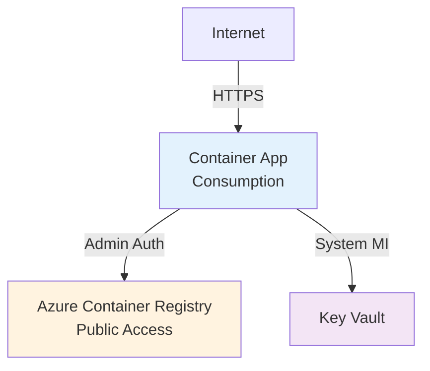
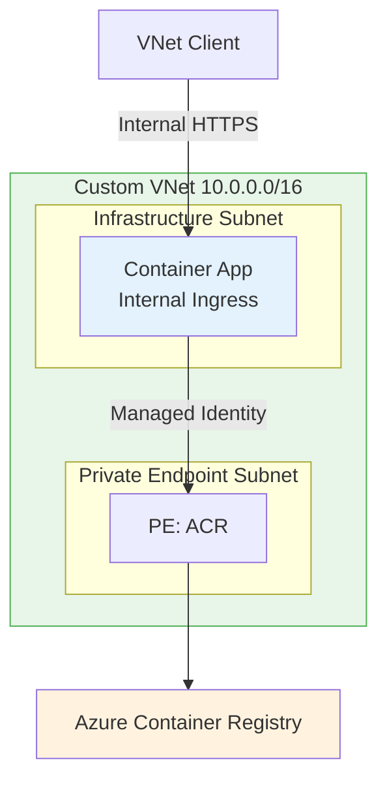
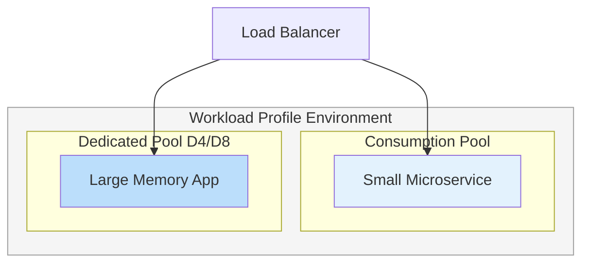

---
content_sources:
  - type: mslearn-adapted
    url: https://learn.microsoft.com/azure/container-apps/environment
  - type: mslearn-adapted
    url: https://learn.microsoft.com/azure/container-apps/workload-profiles-overview
  - type: mslearn-adapted
    url: https://learn.microsoft.com/azure/container-apps/networking
  - type: mslearn-adapted
    url: https://learn.microsoft.com/azure/container-apps/vnet-custom
  - type: mslearn-adapted
    url: https://learn.microsoft.com/azure/container-apps/managed-identity
  - type: mslearn-adapted
    url: https://learn.microsoft.com/azure/container-apps/containers
content_validation:
  status: verified
  last_reviewed: "2026-04-12"
  reviewer: ai-agent
  core_claims:
    - claim: "Workload profiles environments support both Consumption and Dedicated plan types."
      source: "https://learn.microsoft.com/azure/container-apps/networking"
      verified: true
    - claim: "Workload profiles environments support user-defined routes and egress through NAT Gateway."
      source: "https://learn.microsoft.com/azure/container-apps/networking"
      verified: true
    - claim: "Consumption only environments do not support user-defined routes or egress through NAT Gateway."
      source: "https://learn.microsoft.com/azure/container-apps/networking"
      verified: true
    - claim: "An existing virtual network deployment requires a subnet dedicated exclusively to the Container Apps environment."
      source: "https://learn.microsoft.com/azure/container-apps/networking"
      verified: true
    - claim: "Managed identity can authenticate with a private Azure Container Registry without a username and password."
      source: "https://learn.microsoft.com/azure/container-apps/managed-identity"
      verified: true
---

# Deployment Scenarios

This page compares the reference deployment patterns used in this guide across different Azure Container Apps environment configurations.

!!! info "Guide defaults, not platform limits"
    The tables below reflect the deployment patterns implemented in this repository's Bicep templates and tutorials. Azure supports additional configurations beyond what is shown here.

## Scenario Overview

<!-- diagram-id: scenario-overview -->
```mermaid
flowchart TD
    subgraph PUBLIC["Scenario A: Public Consumption"]
        A1[Consumption Only] --- A2[External Ingress]
        A2 --- A3[Public ACR / Admin Auth]
    end

    subgraph PRIVATE["Scenario B: Internal VNet"]
        B1[Consumption Only] --- B2[Internal Ingress]
        B2 --- B3[Private ACR / Managed Identity]
    end

    subgraph DEDICATED["Scenario C: Workload Profiles"]
        C1[Dedicated Compute] --- C2[Custom VNet]
        C2 --- C3[Scale to Zero (Consumption)]
    end

    PUBLIC -->|"Add VNet + Private Ingress"| PRIVATE
    PRIVATE -->|"Add Dedicated Compute"| DEDICATED
```

## Matrix A — Networking and Security

| Feature | Scenario A: Public Consumption | Scenario B: Internal VNet | Scenario C: Workload Profiles |
|---|---|---|---|
| **Environment Type** | Consumption Only | Consumption Only | Workload Profiles |
| **Network Mode** | External | Internal | Internal (typically) |
| **VNet Integration** | :material-close: No (Managed) | :material-check: Yes (Custom) | :material-check: Yes (Custom) |
| **Ingress Visibility** | Public (`external: true`) | Private (`external: false`) | Private / Hybrid |
| **Identity Type** | System-Assigned MI | User-Assigned MI | User-Assigned MI |
| **Registry Auth** | Admin Credentials | Managed Identity | Managed Identity |
| **Default Domain** | `<app-name>.<env-id>.<region>.azurecontainerapps.io` | Internal VNet DNS | Internal VNet DNS |

## Matrix B — Deployment and Container Registry Mechanics

| Feature | Scenario A: Public Consumption | Scenario B: Internal VNet | Scenario C: Workload Profiles |
|---|---|---|---|
| **Compute Billing** | Per-second (active/idle) | Per-second (active/idle) | Reserved (Dedicated) + Per-second (Consumption) |
| **Scaling Range** | 0 to 30 replicas | 0 to 30 replicas | 0 to 1000+ replicas |
| **Deployment Source** | ACR / Docker Hub | Private ACR | Private ACR / Artifact Registry |
| **Registry Pull** | Over Public Internet | Over VNet (Private Endpoint) | Over VNet (Private Endpoint) |
| **CLI Command** | `az containerapp up` | `az containerapp create` | `az containerapp create` |
| **Key Gotcha** | Admin keys must be enabled on ACR | Requires VNet DNS for image pull | Profile must be added to Environment first |

## Scenario A — Public Consumption (Simplest)

The default entry point for Azure Container Apps. The environment is managed by Azure, and the application is accessible via a public HTTPS endpoint.

<!-- diagram-id: scenario-a-public-consumption -->


**When to use**: Web apps, APIs, and microservices that require public internet access and don't need complex networking.

### CLI Implementation

```bash
# Create a container app with public ingress using admin credentials
az containerapp up \
    --resource-group $RG \
    --name $APP_NAME \
    --environment $ENV_NAME \
    --image $ACR_NAME.azurecr.io/$IMAGE_NAME:$TAG \
    --ingress external \
    --target-port 8080 \
    --registry-server $ACR_NAME.azurecr.io \
    --registry-username $ACR_USERNAME \
    --registry-password $ACR_PASSWORD
```

| Command/Parameter | Purpose |
|---|---|
| `az containerapp up` | Streamlined command to create/update environment, registry, and app |
| `--ingress external` | Enables public HTTPS endpoint |
| `--target-port 8080` | The port the container listens on |
| `--registry-username` | ACR admin username (requires Admin User enabled on ACR) |

## Scenario B — Internal VNet (Private Ingress)

For workloads that must remain private. The Container App environment is injected into a custom VNet, and ingress is restricted to internal traffic only.

<!-- diagram-id: scenario-b-internal-vnet -->


**When to use**: Internal microservices, backend APIs, or applications processing sensitive data that should never touch the public internet.

### CLI Implementation

```bash
# Create a container app in an internal environment using Managed Identity for registry pull
az containerapp create \
    --resource-group $RG \
    --name $APP_NAME \
    --environment $ENV_NAME \
    --image $ACR_NAME.azurecr.io/$IMAGE_NAME:$TAG \
    --ingress internal \
    --target-port 80 \
    --user-assigned $UAMI_ID \
    --registry-server $ACR_NAME.azurecr.io \
    --registry-identity $UAMI_ID
```

| Command/Parameter | Purpose |
|---|---|
| `--ingress internal` | Restricts access to within the VNet or connected networks |
| `--user-assigned` | Associates a User-Assigned Managed Identity with the app |
| `--registry-identity` | Uses the Managed Identity to pull images from ACR instead of passwords |

## Scenario C — Workload Profiles (Dedicated Compute)

Combines the flexibility of serverless scaling with the predictability of dedicated hardware. Useful for resource-intensive apps or those requiring specific hardware (like high memory or GPU).

<!-- diagram-id: scenario-c-workload-profiles -->


**When to use**: High-performance applications, memory-intensive jobs, or scenarios where you need to guarantee compute isolation.

### CLI Implementation

```bash
# Create a container app using a specific workload profile
az containerapp create \
    --resource-group $RG \
    --name $APP_NAME \
    --environment $ENV_NAME \
    --workload-profile-name "D4" \
    --cpu 2.0 \
    --memory 4Gi \
    --image $IMAGE_NAME
```

| Command/Parameter | Purpose |
|---|---|
| `--workload-profile-name` | Specifies the dedicated compute tier (e.g., D4, D8, D16) |
| `--cpu` / `--memory` | Defines resource allocation within the profile limits |

## Pre-Deployment Checklist

Before deploying any scenario, verify:

- [ ] **Resource group** exists in a region supporting Container Apps
- [ ] **Environment Name** is unique within the resource group
- [ ] **Subnet size** for custom VNets is at least `/23` (infrastructure requirement)
- [ ] **Managed Identity** has `AcrPull` permissions on the registry (Scenarios B, C)
- [ ] **Port mapping** matches the container's listening port
- [ ] **Scale rules** (min/max replicas) are defined to prevent unexpected costs
- [ ] **Private DNS zones** are configured for internal ingress (Scenario B)

## See Also

- [Environments](environments/index.md) — differences between Consumption and Workload Profiles
- [Networking](networking/index.md) — internal vs external ingress and VNet integration
- [Managed Identity](identity-and-secrets/managed-identity.md) — securing access to registries and other Azure resources
- [Scaling](scaling/index.md) — configuring KEDA-based scaling rules

## Sources

- [Azure Container Apps environments (Microsoft Learn)](https://learn.microsoft.com/azure/container-apps/environment)
- [Workload profiles in Azure Container Apps (Microsoft Learn)](https://learn.microsoft.com/azure/container-apps/workload-profiles-overview)
- [Networking in Azure Container Apps environment (Microsoft Learn)](https://learn.microsoft.com/azure/container-apps/networking)
- [Provide a virtual network to an Azure Container Apps environment (Microsoft Learn)](https://learn.microsoft.com/azure/container-apps/vnet-custom)
- [Managed identities in Azure Container Apps (Microsoft Learn)](https://learn.microsoft.com/azure/container-apps/managed-identity)
- [Containers in Azure Container Apps (Microsoft Learn)](https://learn.microsoft.com/azure/container-apps/containers)
