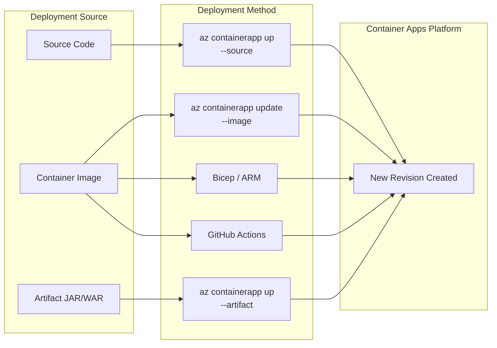
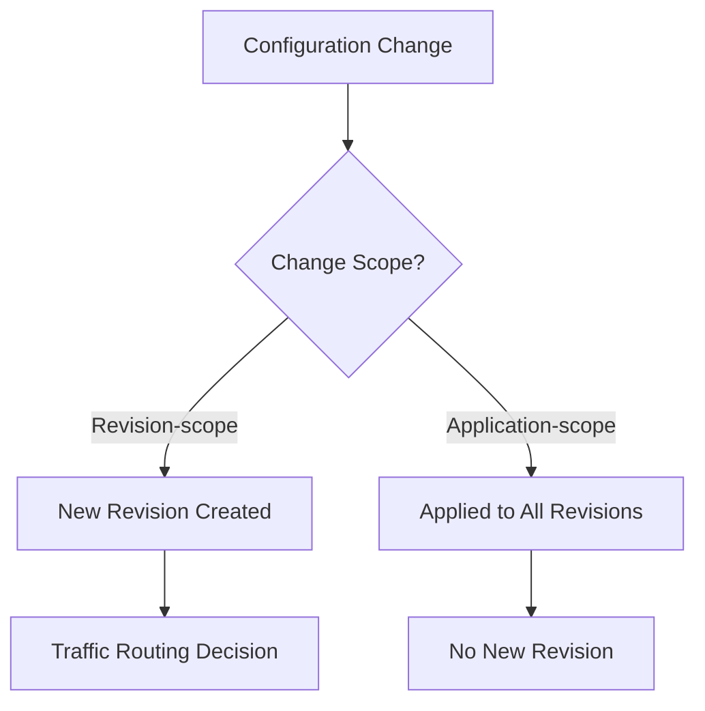

---
hide:
  - toc
content_sources:
  diagrams:
  - id: deployment-methods-flow
    type: flowchart
    source: mslearn-adapted
    based_on:
    - https://learn.microsoft.com/azure/container-apps/revisions
    - https://learn.microsoft.com/azure/container-apps/deploy-artifact
    - https://learn.microsoft.com/azure/container-apps/tutorial-deploy-first-app-cli
  - id: change-scope-decision
    type: flowchart
    source: mslearn-adapted
    based_on:
    - https://learn.microsoft.com/azure/container-apps/revisions
content_validation:
  status: verified
  last_reviewed: 2026-04-21
  reviewer: agent
  core_claims:
    - claim: "Revision-scope changes trigger a new revision; application-scope changes apply globally without creating a revision"
      source: https://learn.microsoft.com/azure/container-apps/revisions
      verified: true
    - claim: "In single revision mode, old revision stays active until new revision is ready (zero-downtime)"
      source: https://learn.microsoft.com/azure/container-apps/revisions
      verified: true
    - claim: "Artifact deployment supports JAR/WAR files without requiring a Dockerfile"
      source: https://learn.microsoft.com/azure/container-apps/deploy-artifact
      verified: true
    - claim: "Deployment labels allow URL-based routing to specific revisions"
      source: https://learn.microsoft.com/azure/container-apps/revisions
      verified: true
---

# Deployment Technologies

Azure Container Apps uses a revision-based deployment model where every meaningful change creates an immutable snapshot of your application. This page explains the available deployment methods, what triggers new revisions, and how deployments behave at the platform level.

## Deployment Methods

Container Apps supports multiple deployment paths. Each method ultimately creates or updates a revision.

<!-- diagram-id: deployment-methods-flow -->


### Method Comparison

| Method | Image Build | Revision Control | Rollback | Best For |
|---|---|---|---|---|
| `az containerapp up --source` | Platform builds from source | Automatic | Deploy previous source | Quick prototyping |
| `az containerapp up --artifact` | Platform builds from JAR/WAR | Automatic | Deploy previous artifact | Java apps without Dockerfile |
| `az containerapp update --image` | External (you build) | Automatic | Update to previous tag | Standard CI/CD |
| `az containerapp create` | External | Manual | Traffic re-routing | Initial provisioning |
| Bicep / ARM template | External | Declarative | Redeploy previous template | Infrastructure-as-code |
| GitHub Actions | Pipeline | Pipeline-controlled | Re-run previous workflow | Team-wide CI/CD |
| Azure DevOps | Pipeline | Pipeline-controlled | Re-run previous pipeline | Enterprise CI/CD |

## Source Code Deployment

Deploy directly from application source code without pre-building a container image. The platform uses Buildpacks to create the image automatically.

```bash
az containerapp up \
    --name "$APP_NAME" \
    --resource-group "$RG" \
    --environment "$ENVIRONMENT_NAME" \
    --source "./apps/python"
```

| Command | Why it is used |
|---|---|
| `az containerapp up --source` | Deploys directly from source code; the platform auto-detects the runtime and builds the container image. |

The platform:

1. Detects the language runtime from project files
2. Builds a container image using cloud buildpacks
3. Pushes the image to a managed or specified ACR
4. Creates a new revision with the built image

!!! info "Best for development and prototyping"
    Source deployment is convenient but provides less control over the build process. For production, prefer pre-built images with immutable tags.

## Artifact Deployment

Deploy Java applications (JAR or WAR) without writing a Dockerfile. The platform generates a container image from the artifact.

```bash
az containerapp up \
    --name "$APP_NAME" \
    --resource-group "$RG" \
    --environment "$ENVIRONMENT_NAME" \
    --artifact ./target/app.jar \
    --ingress external \
    --target-port 8080
```

| Command | Why it is used |
|---|---|
| `az containerapp up --artifact` | Deploys a Java artifact (JAR/WAR) without requiring a Dockerfile. |

This command:

- Creates an ACR if none exists
- Builds a container image from the artifact
- Pushes the image to the registry
- Creates or updates the Container App with a new revision

## Container Image Deployment

The standard production deployment method. Build your image externally, push to a registry, and update the app.

```bash
# Build and push to ACR
az acr build \
    --registry "$ACR_NAME" \
    --image "$APP_NAME:git-$(git rev-parse --short HEAD)" \
    --file "apps/python/Dockerfile" \
    "apps/python"

# Update app to create new revision
az containerapp update \
    --name "$APP_NAME" \
    --resource-group "$RG" \
    --image "$ACR_NAME.azurecr.io/$APP_NAME:git-$(git rev-parse --short HEAD)"
```

| Command | Why it is used |
|---|---|
| `az acr build ...` | Builds and pushes the container image to Azure Container Registry. |
| `az containerapp update --image` | Updates the app with a new container image, creating a new revision. |

## Change Types

Changes to a Container App fall into two categories that determine whether a new revision is created.

<!-- diagram-id: change-scope-decision -->


### Revision-Scope Changes

These changes create a new revision. They are defined in the `properties.template` section of the resource.

| Parameter | Example |
|---|---|
| Container image | Updating from `myapp:v1` to `myapp:v2` |
| Container configuration | CPU, memory, environment variables in template |
| Scale rules | Min/max replicas, HTTP concurrency, KEDA triggers |
| Revision suffix | Custom revision name suffix |
| Probes | Liveness, readiness, startup probe configuration |
| Init containers | Sidecar and init container changes |

### Application-Scope Changes

These changes apply globally to all revisions without creating a new one. They are defined in the `properties.configuration` section.

| Parameter | Notes |
|---|---|
| Secret values | Revisions must be restarted to pick up new values |
| Revision mode | Single ↔ Multiple |
| Ingress configuration | Turning ingress on/off, traffic splitting rules, labels |
| Registry credentials | Container registry authentication |
| Dapr settings | Dapr component configuration |

!!! warning "Secret changes require restart"
    Updating a secret value is an application-scope change (no new revision), but running replicas will not see the new value until they are restarted.

## Zero-Downtime Deployment

Container Apps ensures zero-downtime in **single revision mode** through a controlled cutover process.

**How it works:**

1. New revision is provisioned and starts health checks
2. New revision scales up to match the previous revision's replica count (respecting min/max)
3. All replicas pass startup and readiness probes
4. Traffic shifts from old revision to new revision
5. Old revision is automatically deactivated

The existing revision continues to receive 100% of traffic until the new revision is fully ready.

In **multiple revision mode** with `latestRevision` set to `true` in traffic splitting rules, traffic also waits for the new revision to become ready before shifting.

## Deployment Labels (Preview)

Labels assign meaningful names to specific revisions, providing dedicated URLs for routing.

| Feature | Description |
|---|---|
| Dedicated URL | Each label gets a unique URL independent of traffic splitting |
| Portable | Move a label between revisions; URL stays the same |
| Independent of traffic split | Label URLs route to their assigned revision regardless of percentage-based routing |
| Exclusive | A label can be assigned to only one revision at a time |

```bash
# Assign a label to a revision
az containerapp revision label add \
    --name "$APP_NAME" \
    --resource-group "$RG" \
    --revision "$APP_NAME--v2" \
    --label staging
```

| Command | Why it is used |
|---|---|
| `az containerapp revision label add` | Assigns a named label to a specific revision for dedicated URL routing. |

Common label patterns:

- `staging` — Route QA traffic to a candidate revision
- `canary` — Small percentage of real traffic for validation
- `previous` — Quick access to the last known-good revision

A label name must consist of lowercase alphanumeric characters or dashes, start with an alphabetic character, end with an alphanumeric character, and be at most 64 characters.

## Inactive Revision Management

By default, Container Apps retains up to 100 inactive revisions. You can adjust this limit:

```bash
az containerapp update \
    --name "$APP_NAME" \
    --resource-group "$RG" \
    --max-inactive-revisions 50
```

| Command | Why it is used |
|---|---|
| `az containerapp update --max-inactive-revisions` | Sets the maximum number of inactive revisions to retain. |

Inactive revisions:

- Have no running replicas and incur no compute cost
- Can be reactivated at any time
- Are automatically purged when the inactive count exceeds the limit (oldest first)

## See Also

- [Platform - Revisions Overview](revisions/index.md)
- [Operations - Deployment Workflows](../operations/deployment/index.md)
- [Best Practices - Revision Strategy](../best-practices/revision-strategy.md)
- [Platform - Scaling](scaling/index.md)

## Sources

- [Update and deploy changes in Azure Container Apps (Microsoft Learn)](https://learn.microsoft.com/azure/container-apps/revisions)
- [Deploy an artifact file to Azure Container Apps (Microsoft Learn)](https://learn.microsoft.com/azure/container-apps/deploy-artifact)
- [Deploy your first container app (Microsoft Learn)](https://learn.microsoft.com/azure/container-apps/tutorial-deploy-first-app-cli)
- [Blue-green deployment in Azure Container Apps (Microsoft Learn)](https://learn.microsoft.com/azure/container-apps/blue-green-deployment)
- [Traffic splitting in Azure Container Apps (Microsoft Learn)](https://learn.microsoft.com/azure/container-apps/traffic-splitting)
