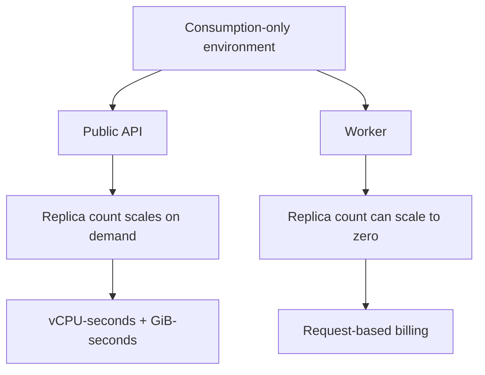

---
content_sources:
  diagrams:
    - id: consumption-only-execution-model
      type: flowchart
      source: mslearn-adapted
      based_on:
        - https://learn.microsoft.com/en-us/azure/container-apps/environment-type-consumption-only
        - https://learn.microsoft.com/en-us/azure/container-apps/billing
        - https://learn.microsoft.com/en-us/azure/container-apps/networking
content_validation:
  status: verified
  last_reviewed: "2026-04-26"
  reviewer: ai-agent
  core_claims:
    - claim: "The Consumption-only environment type is a legacy option and Workload profiles (v2) is the default and recommended choice for new environments."
      source: "https://learn.microsoft.com/en-us/azure/container-apps/environment-type-consumption-only"
      verified: true
    - claim: "Apps running in a Consumption-only environment have access to 4 vCPUs with 8 GB of memory and no GPU access."
      source: "https://learn.microsoft.com/en-us/azure/container-apps/environment-type-consumption-only"
      verified: true
    - claim: "Consumption plan billing is based on resource consumption billed in vCPU-seconds and GiB-seconds plus HTTP requests."
      source: "https://learn.microsoft.com/en-us/azure/container-apps/billing"
      verified: true
    - claim: "Consumption-only environments don't support UDR or NAT Gateway egress and require a minimum subnet size of /23."
      source: "https://learn.microsoft.com/en-us/azure/container-apps/networking"
      verified: true
---

# Consumption Plan

The Consumption-only environment is the legacy Azure Container Apps model for pure usage-based compute. It is still available, but Microsoft Learn recommends the Workload profiles (v2) environment with its built-in Consumption profile for new environments.

## Main Content

### What the Consumption-only environment is

The Consumption-only environment runs apps only on the Consumption plan:

- Compute is allocated on demand.
- Billing follows replica usage instead of node allocation.
- Scale-to-zero remains the main fit for low-idle or bursty workloads.

<!-- diagram-id: consumption-only-execution-model -->

### Billing model

Microsoft Learn describes Consumption plan charges in three buckets:

| Meter | What it tracks | Notes |
|---|---|---|
| vCPU-seconds | CPU allocated per running replica | Billed per second |
| GiB-seconds | Memory allocated per running replica | Billed per second |
| HTTP requests | Requests received by the app | External requests are billable |

!!! note "GPU-seconds are a Consumption-plan meter, but not for Consumption-only v1"
    The billing page documents GPU-seconds for serverless GPU scenarios.
    The Consumption-only environment page separately states that Consumption-only environments have no GPU access.

### Characteristics and limitations

| Area | Consumption-only (v1) behavior |
|---|---|
| Status | Legacy environment type |
| Compute ceiling per app environment model | 4 vCPUs / 8 GiB memory |
| Dedicated SKUs | Not available |
| GPUs | Not available |
| UDR | Not supported |
| NAT Gateway egress | Not supported |
| Minimum subnet size | `/23` |

### Good use cases

Consumption-only still fits when you need:

- Prototyping environments with minimal baseline cost.
- Low-traffic apps that spend meaningful time idle.
- Event-driven workers where scale-to-zero matters more than advanced networking.
- Legacy environments you are maintaining while planning a v2 landing zone.

### Migration considerations

Microsoft Learn now recommends using the built-in Consumption profile in a Workload profiles (v2) environment for new deployments.

!!! warning "Treat Consumption-only to v2 as an environment migration project"
    The Microsoft Learn pages reviewed for this guide recommend the v2 environment type, but they do not document a simple in-place conversion path from Consumption-only to Workload profiles.
    Plan a parallel environment, redeploy apps with IaC, validate networking, and then cut over.

## See Also

- [Plans and Workload Profiles](plans-and-workload-profiles.md)
- [Workload Profiles](workload-profiles.md)
- [Networking and CIDR](networking-and-cidr.md)
- [Migration](migration.md)
- [Limits and Quotas](limits-and-quotas.md)

## Sources

- [Consumption-only environment type in Azure Container Apps (legacy) (Microsoft Learn)](https://learn.microsoft.com/en-us/azure/container-apps/environment-type-consumption-only)
- [Billing in Azure Container Apps (Microsoft Learn)](https://learn.microsoft.com/en-us/azure/container-apps/billing)
- [Networking in Azure Container Apps environment (Microsoft Learn)](https://learn.microsoft.com/en-us/azure/container-apps/networking)
