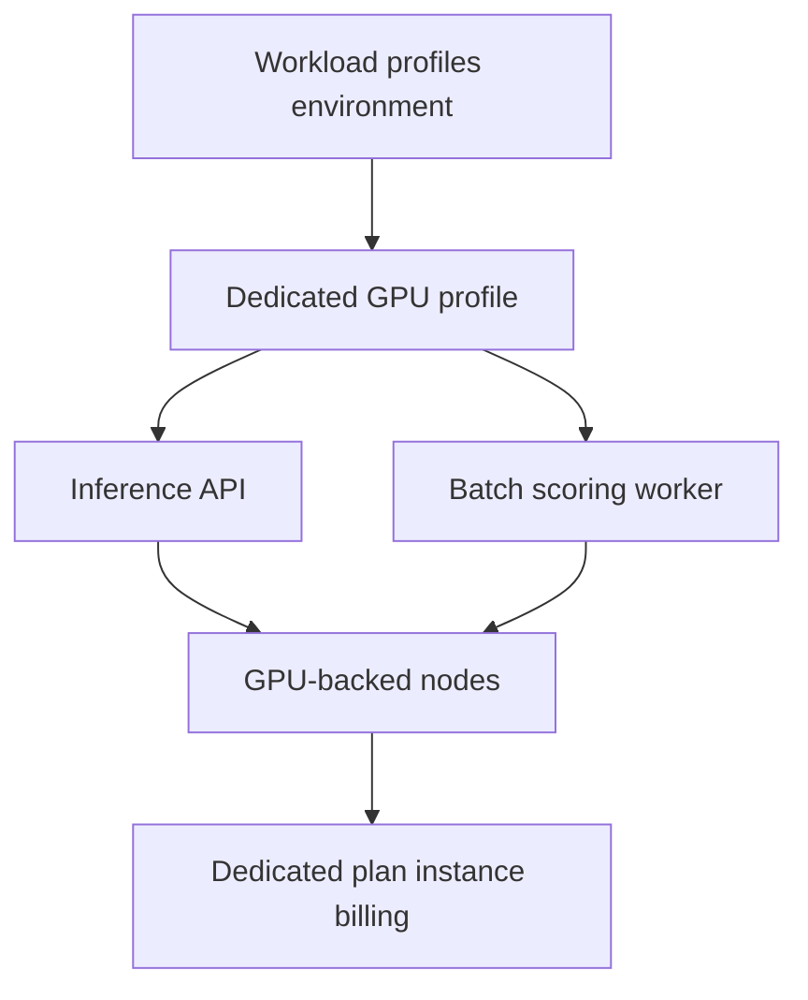

---
content_sources:
  diagrams:
    - id: gpu-profile-placement
      type: flowchart
      source: mslearn-adapted
      based_on:
        - https://learn.microsoft.com/en-us/azure/container-apps/workload-profiles-overview
        - https://learn.microsoft.com/en-us/azure/container-apps/billing
        - https://learn.microsoft.com/en-us/azure/container-apps/quotas
content_validation:
  status: verified
  last_reviewed: "2026-04-26"
  reviewer: ai-agent
  core_claims:
    - claim: "Current Dedicated GPU profile names are NC24-A100, NC48-A100, and NC96-A100."
      source: "https://learn.microsoft.com/en-us/azure/container-apps/workload-profiles-overview"
      verified: true
    - claim: "GPU-enabled Dedicated profiles are available in select regions only."
      source: "https://learn.microsoft.com/en-us/azure/container-apps/workload-profiles-overview"
      verified: true
    - claim: "GPU-enabled Dedicated profiles require capacity allocation on a per-case basis through a support ticket."
      source: "https://learn.microsoft.com/en-us/azure/container-apps/workload-profiles-overview"
      verified: true
    - claim: "Dedicated plan billing is based on workload profile instances, not individual applications."
      source: "https://learn.microsoft.com/en-us/azure/container-apps/billing"
      verified: true
---

# Dedicated GPU Profiles

Dedicated GPU profiles are the Azure Container Apps option for GPU-backed workloads that need reserved hardware instead of serverless GPU allocation. Microsoft Learn does not label these dedicated GPU profiles as preview, but it does document important region and capacity limits.

## Main Content

!!! warning "Capacity and region limits apply"
    Microsoft Learn states that GPU-enabled Dedicated profiles are available only in select regions and that capacity is allocated on a per-case basis.
    Plan capacity requests early and validate regional availability before you commit to a design.

### Current GPU profile names

| GPU model | Current Dedicated profile names | Allocation |
|---|---|---|
| A100 | `NC24-A100`, `NC48-A100`, `NC96-A100` | Per node |

Microsoft Learn also lists **serverless Consumption GPU** profile names separately:

- `Consumption-GPU-NC24-A100`
- `Consumption-GPU-NC8as-T4`

That means **T4 currently appears in Consumption GPU profiles, not in the Dedicated GPU list** reviewed for this guide.

### Placement model

<!-- diagram-id: gpu-profile-placement -->

### When Dedicated GPU is the better fit

Choose Dedicated GPU profiles when you need:

- Stable GPU-backed inference capacity.
- Multiple apps sharing the same dedicated GPU node pool.
- A reserved environment design instead of per-replica serverless GPU billing.

Typical examples include:

- Real-time model inference APIs.
- Batch image or document processing.
- GPU-heavy background workers with predictable utilization.

### Cost considerations

Dedicated GPU placement changes the cost model:

- Billing follows **workload profile instances**, not individual apps.
- Extra instances add cost as profiles scale out.
- Dedicated plan management charges apply when you use dedicated workload profiles.

!!! note "Compare serverless GPU and dedicated GPU deliberately"
    If your workload is sporadic, Consumption GPU may fit better.
    If you need reserved GPU capacity or multiple apps sharing the same GPU pool, Dedicated GPU is usually the cleaner design.

## See Also

- [Workload Profiles](workload-profiles.md)
- [Plans and Workload Profiles](plans-and-workload-profiles.md)
- [Limits and Quotas](limits-and-quotas.md)
- [Migration](migration.md)

## Sources

- [Workload profiles in Azure Container Apps (Microsoft Learn)](https://learn.microsoft.com/en-us/azure/container-apps/workload-profiles-overview)
- [Billing in Azure Container Apps (Microsoft Learn)](https://learn.microsoft.com/en-us/azure/container-apps/billing)
- [Quotas for Azure Container Apps (Microsoft Learn)](https://learn.microsoft.com/en-us/azure/container-apps/quotas)
