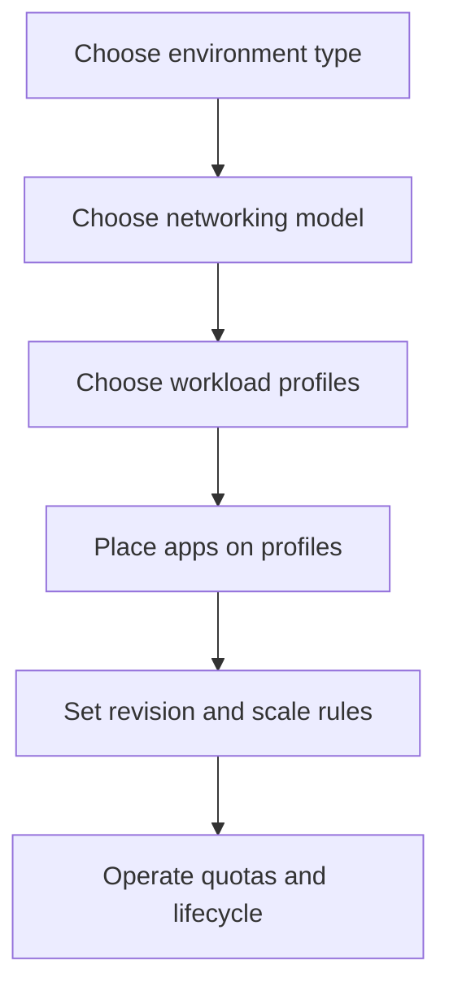
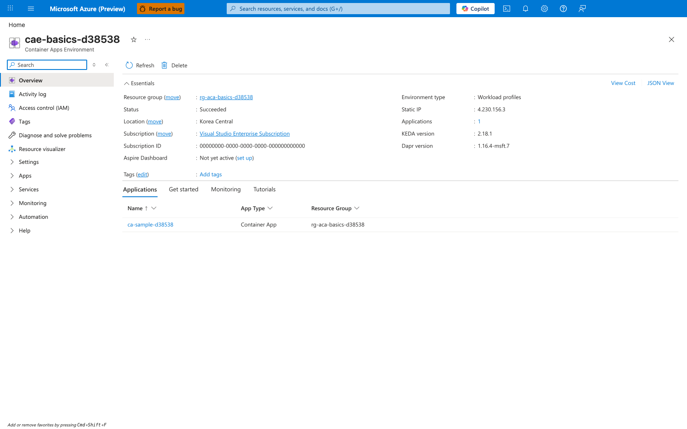
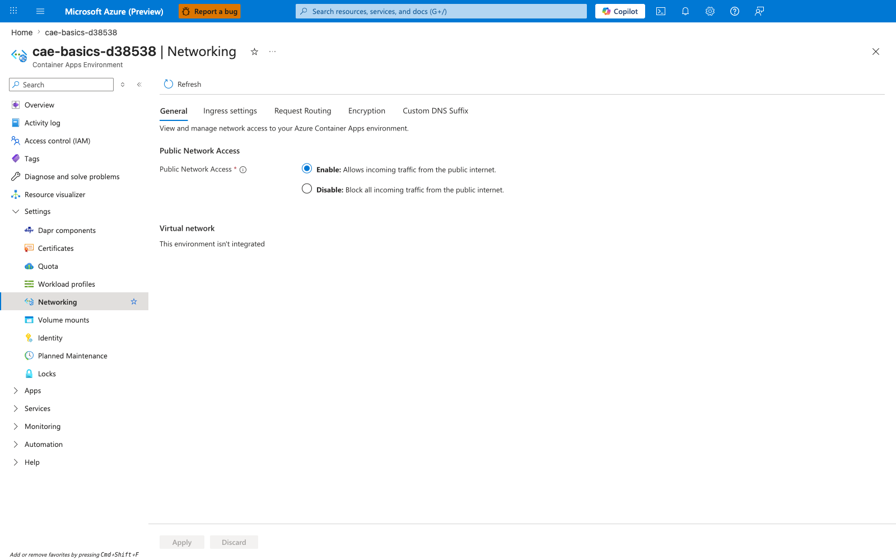
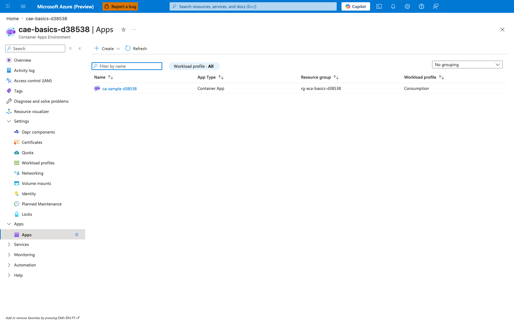

---
content_sources:
  diagrams:
    - id: environment-boundary-and-follow-on-decisions
      type: flowchart
      source: mslearn-adapted
      based_on:
        - https://learn.microsoft.com/en-us/azure/container-apps/structure
        - https://learn.microsoft.com/en-us/azure/container-apps/networking
        - https://learn.microsoft.com/en-us/azure/container-apps/revisions
content_validation:
  status: verified
  last_reviewed: '2026-04-26'
  reviewer: ai-agent
  core_claims:
    - claim: 'Azure Container Apps has two environment types: Workload profiles (v2) and Consumption-only (v1), with Workload profiles as the default.'
      source: https://learn.microsoft.com/en-us/azure/container-apps/structure
      verified: true
    - claim: Once you create an environment with either the default Azure network or an existing VNet, the network type can't be changed.
      source: https://learn.microsoft.com/en-us/azure/container-apps/networking
      verified: true
    - claim: By default, you have access to 100 inactive revisions.
      source: https://learn.microsoft.com/en-us/azure/container-apps/revisions
      verified: true
---
# Environments in Azure Container Apps

An Azure Container Apps environment is the shared boundary for networking, logging, ingress behavior, and workload placement. Use this section to decide which environment type to create, how to size networking, and when to separate workloads into different environments.

## Main Content

### Environment decisions happen before app decisions

<!-- diagram-id: environment-boundary-and-follow-on-decisions -->

### What an environment controls

An environment is the shared platform boundary for:

- Virtual network placement and ingress exposure.
- Log Analytics integration and shared platform services.
- Workload profile mix in a Workload profiles (v2) environment.
- App placement, replica capacity planning, and quota management.

!!! note "Environment boundaries are hard to change later"
    Microsoft Learn states that the network type can't be changed after environment creation.
    Decide VNet model, subnet size, and isolation boundaries before large-scale app onboarding.

### Environment map

| Page | Focus | Use it when |
|---|---|---|
| [Plans and Workload Profiles](plans-and-workload-profiles.md) | Environment types, plans, and capability comparison | You need to choose v1 vs v2 and understand plan terminology |
| [Consumption Plan](consumption-plan.md) | Legacy Consumption-only environment behavior | You inherited a v1 environment or need to understand its limits |
| [Workload Profiles](workload-profiles.md) | Consumption, Dedicated, and Flex profile placement | You need mixed compute shapes in one environment |
| [Dedicated GPU Profiles](dedicated-gpu-profiles.md) | GPU-enabled profile options and limits | You need GPU-backed inference or batch workloads |
| [Networking and CIDR](networking-and-cidr.md) | Subnet minimums, delegation, and IP planning | You are designing VNet-integrated environments |
| [Limits and Quotas](limits-and-quotas.md) | Platform ceilings, quota scope, and increase paths | You need to validate scale headroom before production |
| [Migration](migration.md) | Environment lifecycle and cutover playbooks | You are moving between environment types, regions, or subscriptions |

### Boundary heuristics

Use separate environments when you need:

- Different trust boundaries or ingress posture.
- Different subnet, NAT, or private endpoint strategies.
- Different workload profile mixes or quota domains.
- Independent lifecycle control for production vs non-production tiers.

Keep related apps together when they share:

- The same network and compliance boundary.
- The same operational ownership.
- The same dependency and traffic profile.

!!! warning "Do not treat the environment as only a folder for apps"
    Environment design changes networking, quota scope, profile selection, and migration effort.
    Rebuilding an environment later is possible, but it is always more disruptive than getting the boundary right early.

## Portal View

The Azure Portal exposes the environment as a separate resource from the apps that run on it. Walking through its blades makes the environment-level decisions in this page concrete: the type you picked at creation, the workload profiles available to host apps, the network posture, and the apps placed on it.

### Step 1: Open the environment Overview

Navigate to **Container Apps Environment** in your resource group. The Overview blade summarizes the environment-scoped facts that an app blade cannot change after creation.

[Observed] The Essentials panel reports `Environment type : Workload profiles`, `Location : Korea Central`, `Status : Succeeded`, `Static IP : 4.230.156.3`, `KEDA version : 2.18.1`, `Dapr version : 1.16.4-msft.7`, and `Applications : 1`. The Applications tab below lists one app, `ca-sample-d38538`, with `App Type : Container App`.

[Inferred] The `Environment type : Workload profiles` field corresponds to the v2 environment described in the "Environment decisions happen before app decisions" section above. Because `Static IP`, `KEDA version`, and `Dapr version` are surfaced on the environment resource — not on the listed app — this blade reinforces the page's framing that several platform settings live at the environment scope, which is what makes "Environment boundaries are hard to change later" true in practice.

[Not Proven] The Overview blade does not show whether the static IP is reused across all apps in the environment, nor whether the KEDA and Dapr versions are the active runtime for the listed app — those are platform-managed values surfaced for informational purposes.

### Step 2: Inspect Workload profiles

Expand **Settings** in the left navigation and open **Workload profiles**. This blade is the v2-only surface where you would mix Consumption, Dedicated, and (in supported regions) Flex profiles within the same environment.

[Observed] The blade shows one row under the `Consumption` group header: profile `Consumption`, capacity `Up to 4 vCPUs / 8 Gi`, `# of Apps : 1`. The `Add` button is enabled in the command bar, and the columns `Current cores usage`, `Current instances`, and `Min & Max number of instances` are dashed (empty).

[Inferred] The blade confirms this environment currently exposes a single `Consumption` profile with one app placed on it. That mapping is exactly the "Choose workload profiles → Place apps on profiles" step from the decision flow at the top of this page, made visible at the environment scope rather than on a per-app blade. The `Add` button being enabled in the command bar reflects that profile mix is an environment-level operation, not an app-level one — which is why the "Boundary heuristics" list calls out workload profile mix as a reason to split environments.

[Not Proven] The blade does not prove that the environment cannot later be downgraded to Consumption-only (v1); that constraint is documented at the platform level, not visible here. It also does not prove which apps are bound to the Consumption profile beyond the count — drilling into the app is required to see the per-app `workloadProfileName` setting.

### Step 3: Review Networking

Open **Networking** under Settings. This blade is the second decision step from the diagram at the top — networking model — and the values shown here are the ones Microsoft Learn states cannot be changed after environment creation.

[Observed] The General tab shows `Public Network Access : Enable - Allows incoming traffic from the public internet` (radio button selected), and the Virtual network section reads `This environment isn't integrated`. The tab strip lists `General`, `Ingress settings`, `Request Routing`, `Encryption`, `Custom DNS Suffix`.

[Inferred] `This environment isn't integrated` confirms this environment was created with the default Azure-managed network rather than an existing VNet. Combined with the "Environment boundaries are hard to change later" callout above, this means switching this environment to VNet integration is not a runtime configuration change — it requires a new environment. The presence of separate tabs for `Ingress settings` and `Custom DNS Suffix` shows that ingress posture and DNS suffix are environment-scoped surfaces, which is why the "Boundary heuristics" section recommends splitting environments when those properties must differ.

[Not Proven] The blade does not show whether disabling `Public Network Access` here would block all apps in the environment, or only new connections; that behavior would need to be tested or read from Microsoft Learn.

### Step 4: List Apps placed on the environment

Expand **Apps** in the left navigation and open **Apps**. This view is the inverse of the per-app blades: it lists every app that shares this environment's network boundary, quota domain, and profile mix.

[Observed] The list shows one row: `Name : ca-sample-d38538`, `App Type : Container App`, `Resource group : rg-aca-basics-d38538`, `Workload profile : Consumption`. A `Workload profile : All` filter chip is active above the list, and a `Filter by name` search box is empty.

[Inferred] The `Workload profile` column is per-app, which makes app-to-profile placement visible only when you view the environment as a whole — a per-app blade shows its own profile but not its peers. This is the operational view that supports the "Boundary heuristics" guidance: when you decide whether to add another app to this environment, you are deciding which apps share the same environment boundary, the network posture from Step 3, and the Consumption profile from Step 2.

[Not Proven] The blade does not show traffic patterns or compliance boundaries between the listed apps; those operational signals come from the apps' own ingress and identity configuration, not from this list.

## See Also

- [Concepts](../index.md)
- [Networking](../networking/index.md)
- [Scaling](../scaling/index.md)
- [Azure Container Apps Networking Best Practices](../../best-practices/networking.md)
- [Environment Design](../../best-practices/environment-design.md)

## Sources

- [Compute and billing structures in Azure Container Apps (Microsoft Learn)](https://learn.microsoft.com/en-us/azure/container-apps/structure)
- [Networking in Azure Container Apps environment (Microsoft Learn)](https://learn.microsoft.com/en-us/azure/container-apps/networking)
- [Update and deploy changes in Azure Container Apps (Microsoft Learn)](https://learn.microsoft.com/en-us/azure/container-apps/revisions)
