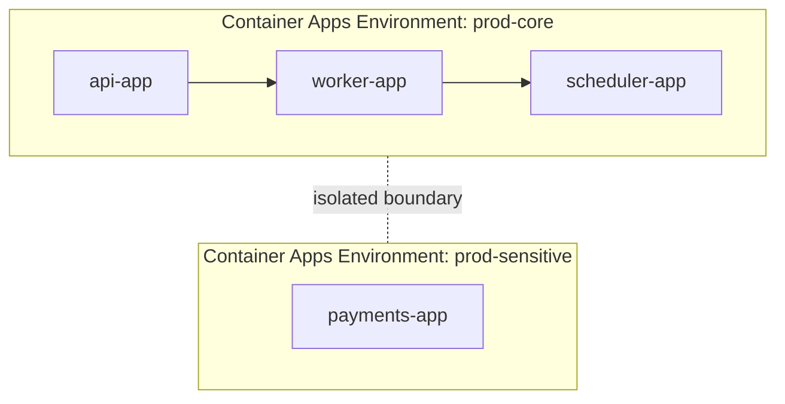
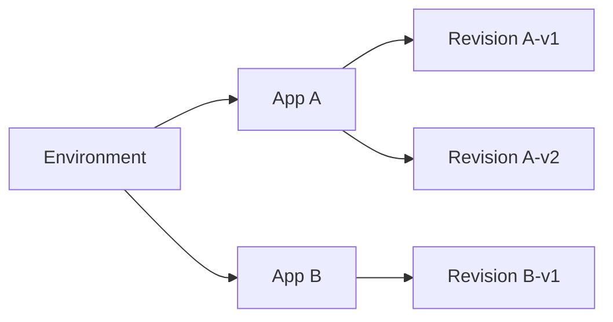

# Environments and Apps in Azure Container Apps

The most important design decision in Azure Container Apps is the boundary between a **Container Apps Environment** and the **apps inside it**. This boundary determines networking scope, isolation, and operational blast radius.

## Environment and App Relationship

Apps in the same environment can communicate more directly using internal service discovery patterns. Separate environments create stronger isolation at the platform boundary.

## Environment Types

Container Apps supports different resource execution models in the environment:

| Environment Model | Conceptual Fit | Why Teams Choose It |
|---|---|---|
| **Consumption** | Variable traffic, bursty or idle workloads | Pay closer to usage, supports scale-to-zero behavior |
| **Workload profiles** | Predictable or specialized performance needs | More control over resource shape and workload placement |

## How to Decide Environment Boundaries

Use separate environments when you need:

- Different network trust boundaries.
- Different compliance or data-handling controls.
- Different scaling/cost governance domains.

Keep apps in one environment when you need:

- Low-friction service-to-service communication.
- Shared operational visibility and common lifecycle.

## Revisions Inside an App

Revisions are scoped per app, not per environment.

This allows one app to run canary traffic while other apps in the same environment remain stable.

## Practical Example: Team Topology

| Team Goal | Suggested Layout |
|---|---|
| Shared platform for internal services | One environment with multiple internal apps |
| Strict isolation for regulated workloads | Dedicated environment per trust zone |
| Mixed workload behavior | Use workload profiles for heavy services, consumption-style apps for bursty services |

## Advanced Topics

- Multi-environment promotion (dev → staging → production) with consistent app naming.
- Environment-level governance with policy and RBAC boundaries.
- Interplay between internal ingress, Dapr service invocation, and trust segmentation.

## See Also
- [How Container Apps Works](../../start-here/overview.md)
- [Networking](../networking/index.md)
- [Scaling with KEDA](../scaling/index.md)
- [Revision Management and Traffic Splitting](../../language-guides/python/07-revisions-traffic.md)

## Sources
- [Azure Container Apps Environments and Apps (Microsoft Learn)](https://learn.microsoft.com/azure/container-apps/environment)
- [Workload profiles in Azure Container Apps (Microsoft Learn)](https://learn.microsoft.com/azure/container-apps/workload-profiles-overview)
