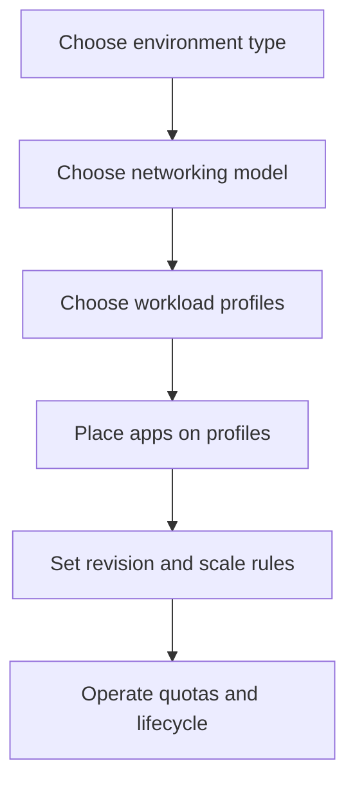

---
content_sources:
  diagrams:
    - id: environment-boundary-and-follow-on-decisions
      type: flowchart
      source: mslearn-adapted
      based_on:
        - https://learn.microsoft.com/en-us/azure/container-apps/structure
        - https://learn.microsoft.com/en-us/azure/container-apps/networking
        - https://learn.microsoft.com/en-us/azure/container-apps/revisions
content_validation:
  status: verified
  last_reviewed: "2026-04-26"
  reviewer: ai-agent
  core_claims:
    - claim: "Azure Container Apps has two environment types: Workload profiles (v2) and Consumption-only (v1), with Workload profiles as the default."
      source: "https://learn.microsoft.com/en-us/azure/container-apps/structure"
      verified: true
    - claim: "Once you create an environment with either the default Azure network or an existing VNet, the network type can't be changed."
      source: "https://learn.microsoft.com/en-us/azure/container-apps/networking"
      verified: true
    - claim: "By default, you have access to 100 inactive revisions."
      source: "https://learn.microsoft.com/en-us/azure/container-apps/revisions"
      verified: true
---

# Environments in Azure Container Apps

An Azure Container Apps environment is the shared boundary for networking, logging, ingress behavior, and workload placement. Use this section to decide which environment type to create, how to size networking, and when to separate workloads into different environments.

## Main Content

### Environment decisions happen before app decisions

<!-- diagram-id: environment-boundary-and-follow-on-decisions -->

### What an environment controls

An environment is the shared platform boundary for:

- Virtual network placement and ingress exposure.
- Log Analytics integration and shared platform services.
- Workload profile mix in a Workload profiles (v2) environment.
- App placement, replica capacity planning, and quota management.

!!! note "Environment boundaries are hard to change later"
    Microsoft Learn states that the network type can't be changed after environment creation.
    Decide VNet model, subnet size, and isolation boundaries before large-scale app onboarding.

### Environment map

| Page | Focus | Use it when |
|---|---|---|
| [Plans and Workload Profiles](plans-and-workload-profiles.md) | Environment types, plans, and capability comparison | You need to choose v1 vs v2 and understand plan terminology |
| [Consumption Plan](consumption-plan.md) | Legacy Consumption-only environment behavior | You inherited a v1 environment or need to understand its limits |
| [Workload Profiles](workload-profiles.md) | Consumption, Dedicated, and Flex profile placement | You need mixed compute shapes in one environment |
| [Dedicated GPU Profiles](dedicated-gpu-profiles.md) | GPU-enabled profile options and limits | You need GPU-backed inference or batch workloads |
| [Networking and CIDR](networking-and-cidr.md) | Subnet minimums, delegation, and IP planning | You are designing VNet-integrated environments |
| [Limits and Quotas](limits-and-quotas.md) | Platform ceilings, quota scope, and increase paths | You need to validate scale headroom before production |
| [Migration](migration.md) | Environment lifecycle and cutover playbooks | You are moving between environment types, regions, or subscriptions |

### Boundary heuristics

Use separate environments when you need:

- Different trust boundaries or ingress posture.
- Different subnet, NAT, or private endpoint strategies.
- Different workload profile mixes or quota domains.
- Independent lifecycle control for production vs non-production tiers.

Keep related apps together when they share:

- The same network and compliance boundary.
- The same operational ownership.
- The same dependency and traffic profile.

!!! warning "Do not treat the environment as only a folder for apps"
    Environment design changes networking, quota scope, profile selection, and migration effort.
    Rebuilding an environment later is possible, but it is always more disruptive than getting the boundary right early.

## See Also

- [Concepts](../index.md)
- [Networking](../networking/index.md)
- [Scaling](../scaling/index.md)
- [Azure Container Apps Networking Best Practices](../../best-practices/networking.md)
- [Environment Design](../../best-practices/environment-design.md)

## Sources

- [Compute and billing structures in Azure Container Apps (Microsoft Learn)](https://learn.microsoft.com/en-us/azure/container-apps/structure)
- [Networking in Azure Container Apps environment (Microsoft Learn)](https://learn.microsoft.com/en-us/azure/container-apps/networking)
- [Update and deploy changes in Azure Container Apps (Microsoft Learn)](https://learn.microsoft.com/en-us/azure/container-apps/revisions)
