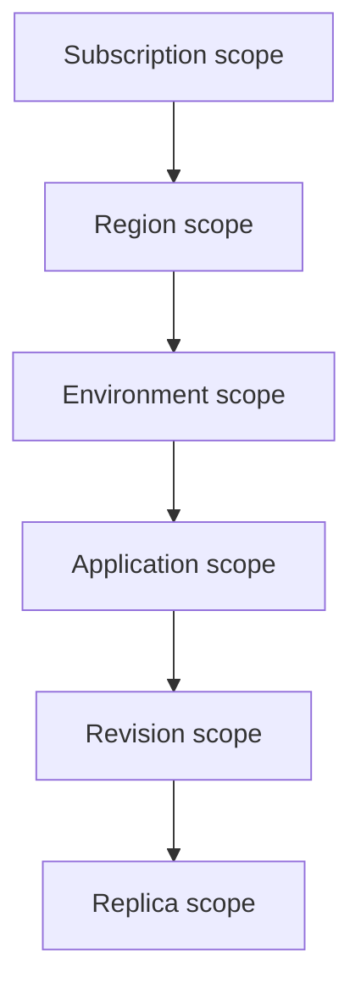

---
content_sources:
  diagrams:
    - id: quota-and-limit-scope-stack
      type: flowchart
      source: mslearn-adapted
      based_on:
        - https://learn.microsoft.com/en-us/azure/container-apps/quotas
        - https://learn.microsoft.com/en-us/azure/container-apps/scale-app
        - https://learn.microsoft.com/en-us/azure/container-apps/revisions
content_validation:
  status: verified
  last_reviewed: "2026-04-26"
  reviewer: ai-agent
  core_claims:
    - claim: "Azure Container Apps applies quotas at region, environment, and application scopes."
      source: "https://learn.microsoft.com/en-us/azure/container-apps/quotas"
      verified: true
    - claim: "The maximum configurable replicas per revision is 1,000."
      source: "https://learn.microsoft.com/en-us/azure/container-apps/scale-app"
      verified: true
    - claim: "By default, you have access to 100 inactive revisions."
      source: "https://learn.microsoft.com/en-us/azure/container-apps/revisions"
      verified: true
    - claim: "Default quotas depend on factors including the age and type of your subscription and service use."
      source: "https://learn.microsoft.com/en-us/azure/container-apps/quotas"
      verified: true
---

# Environment Limits and Quotas

Azure Container Apps mixes fixed platform limits with quotas that vary by subscription, region, and environment. Use this page as a planning reference before you size environments or request production increases.

## Topic Groups

### Scope stack

<!-- diagram-id: quota-and-limit-scope-stack -->

### What Microsoft Learn publishes directly

| Item | Current Learn guidance | Type |
|---|---|---|
| Maximum replicas per revision | `1,000` | Fixed application/revision limit |
| Inactive revisions retained by default | `100` | Adjustable behavior |
| Managed Environment Count | Region-scoped quota | Quota, not a single universal hardcoded number |
| Managed Environment Consumption Cores | Environment-scoped quota | Adjustable quota |
| Managed Environment General Purpose Cores | Environment-scoped quota | Adjustable quota |
| Managed Environment Memory Optimized Cores | Environment-scoped quota | Adjustable quota |
| GPU quotas | Environment and region scoped | Adjustable quota |

### Limits the current Learn pages do not publish as one universal number

| Requested planning question | Conservative answer |
|---|---|
| Max apps per environment | Current Microsoft Learn quota pages reviewed for this guide do not publish one universal numeric cap; quota guidance focuses on environment count and environment cores. |
| Max environments per region per subscription | Microsoft Learn documents the **Managed Environment Count** quota, but states that default quotas depend on your subscription and service use instead of publishing one fixed number for all tenants. |

!!! warning "Do not copy old quota screenshots into design docs"
    The current Learn guidance explicitly says default quotas depend on subscription factors.
    Check your tenant's actual values before load testing or production rollout.

## Usage Notes

### Soft vs. hard boundaries

Use this model when reading the tables:

- **Hard / platform-style limits**: examples include the 1,000 maximum configurable replicas per revision.
- **Quota-style limits**: region and environment quotas that can be increased through Azure Quota Management System.

### How to request increases

Microsoft Learn documents two request paths:

| Request path | Best fit |
|---|---|
| Integrated request | Region and subscription-scoped quotas via Azure portal |
| Manual request | Environment-scoped quotas via Azure CLI workflow |

Useful Learn-backed checkpoints:

1. Review current quotas in Azure Quota Management System.
2. For environment-scoped values, inspect usage with `az containerapp env list-usages`.
3. Request increases before production events, not during incident response.

### Planning guidance

- Validate quota headroom before rollout if you expect thousands of requests per minute.
- Treat replica limits, subnet limits, and environment core quotas as separate constraints.
- Re-check quotas whenever you introduce GPU, new regions, or multi-team environments.

## See Also

- [Reference: Platform Limits](../../reference/platform-limits.md)
- [Networking and CIDR](networking-and-cidr.md)
- [Workload Profiles](workload-profiles.md)
- [Migration](migration.md)

## Sources

- [Quotas for Azure Container Apps (Microsoft Learn)](https://learn.microsoft.com/en-us/azure/container-apps/quotas)
- [Scaling in Azure Container Apps (Microsoft Learn)](https://learn.microsoft.com/en-us/azure/container-apps/scale-app)
- [Update and deploy changes in Azure Container Apps (Microsoft Learn)](https://learn.microsoft.com/en-us/azure/container-apps/revisions)
- [Azure Container Apps - Frequently asked questions (Microsoft Learn)](https://learn.microsoft.com/en-us/azure/container-apps/faq)
