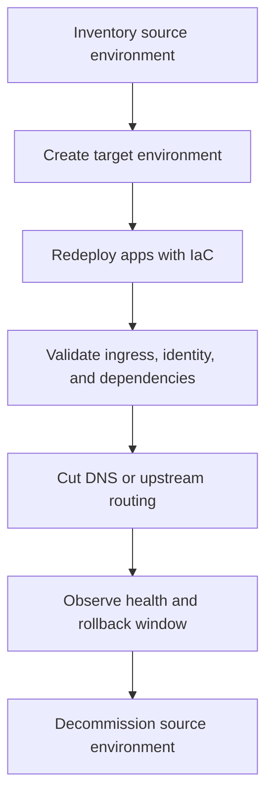

---
content_sources:
  diagrams:
    - id: parallel-environment-cutover
      type: flowchart
      source: mslearn-adapted
      based_on:
        - https://learn.microsoft.com/en-us/azure/container-apps/structure
        - https://learn.microsoft.com/en-us/azure/container-apps/environment-type-consumption-only
        - https://learn.microsoft.com/en-us/azure/container-apps/networking
        - https://learn.microsoft.com/en-us/azure/azure-resource-manager/management/move-support-resources
        - https://learn.microsoft.com/en-us/azure/templates/microsoft.app/containerapps
content_validation:
  status: verified
  last_reviewed: "2026-04-26"
  reviewer: ai-agent
  core_claims:
    - claim: "Workload profiles (v2) is the default environment type and is recommended for new Azure Container Apps environments."
      source: "https://learn.microsoft.com/en-us/azure/container-apps/structure"
      verified: true
    - claim: "Once you create an environment with either the default Azure network or an existing VNet, the network type can't be changed."
      source: "https://learn.microsoft.com/en-us/azure/container-apps/networking"
      verified: true
    - claim: "Microsoft.App/managedEnvironments supports resource group and subscription moves, but not region moves."
      source: "https://learn.microsoft.com/en-us/azure/azure-resource-manager/management/move-support-resources"
      verified: true
    - claim: "The container app resource exposes environmentId and workloadProfileName for redeployment via IaC."
      source: "https://learn.microsoft.com/en-us/azure/templates/microsoft.app/containerapps"
      verified: true
---

# Environment Migration

Environment migration in Azure Container Apps is usually a controlled rebuild and cutover exercise, not a live in-place flip. This page covers the conservative playbook for moving between environment models, regions, and subscriptions.

## Prerequisites

- Source environment configuration is captured in IaC or exportable configuration.
- DNS, certificates, secrets, and image registry dependencies are inventoried.
- Target region and workload profile availability are confirmed.
- Quota and subnet headroom are validated before cutover.

## When to Use

Use this playbook for:

- **Consumption-only (v1) to Workload profiles (v2)** modernization.
- **Cross-region** rebuilds and disaster-recovery-style cutovers.
- **Cross-subscription** moves when governance boundaries change.

## Procedure

### Scenario guidance

| Scenario | Learn-backed guidance | Conservative recommendation |
|---|---|---|
| Consumption-only → Workload profiles | Learn recommends v2 for new environments, but the reviewed Learn pages do not document an in-place conversion path | Build a parallel v2 environment and redeploy apps |
| Cross-region | Microsoft.App/managedEnvironments region move support is **No** | Recreate in target region and cut over |
| Cross-subscription | Microsoft.App/managedEnvironments subscription move support is **Yes** | Validate dependencies carefully; parallel redeploy is often safer for app-by-app testing |

!!! warning "Prefer parallel environments for predictable cutover"
    Even where a raw resource move is supported, app dependencies such as VNets, DNS, certificates, registries, identities, and private endpoints often make a rebuild-and-validate workflow easier to reason about.

### Parallel environment cutover

<!-- diagram-id: parallel-environment-cutover -->


### Reference Bicep pattern for app recreation

```bicep
param location string
param environmentId string
param appName string
param image string
param workloadProfileName string = 'Consumption'

resource app 'Microsoft.App/containerApps@2026-01-01' = {
  name: appName
  location: location
  properties: {
    environmentId: environmentId
    workloadProfileName: workloadProfileName
    configuration: {
      activeRevisionsMode: 'Single'
      ingress: {
        external: true
        targetPort: 8080
      }
    }
    template: {
      containers: [
        {
          name: 'main'
          image: image
          resources: {
            cpu: 0.5
            memory: '1Gi'
          }
        }
      ]
      scale: {
        minReplicas: 1
        maxReplicas: 5
      }
    }
  }
}
```

## Verification

Before final cutover, verify:

- App URLs and ingress exposure match the target design.
- Managed identity, Key Vault, storage, and private dependency paths work.
- Workload profile placement and replica scaling behave as expected.
- DNS, certificates, and upstream routing point to the target environment.

## Rollback / Troubleshooting

If the target environment fails validation:

1. Keep traffic on the source environment.
2. Fix the target environment in isolation.
3. Re-run smoke tests and dependency tests.
4. Only restart cutover when the target passes again.

For cross-region or major network changes, keep the source environment alive until log, metric, and business-transaction health remain stable through the agreed rollback window.

## See Also

- [Plans and Workload Profiles](plans-and-workload-profiles.md)
- [Consumption Plan](consumption-plan.md)
- [Networking and CIDR](networking-and-cidr.md)
- [Recovery and Incident Readiness](../../operations/recovery/index.md)
- [VNet Integration](../networking/vnet-integration.md)

## Sources

- [Compute and billing structures in Azure Container Apps (Microsoft Learn)](https://learn.microsoft.com/en-us/azure/container-apps/structure)
- [Consumption-only environment type in Azure Container Apps (legacy) (Microsoft Learn)](https://learn.microsoft.com/en-us/azure/container-apps/environment-type-consumption-only)
- [Networking in Azure Container Apps environment (Microsoft Learn)](https://learn.microsoft.com/en-us/azure/container-apps/networking)
- [Azure resource types for move operations (Microsoft Learn)](https://learn.microsoft.com/en-us/azure/azure-resource-manager/management/move-support-resources)
- [Microsoft.App/containerApps template reference (Microsoft Learn)](https://learn.microsoft.com/en-us/azure/templates/microsoft.app/containerapps)
