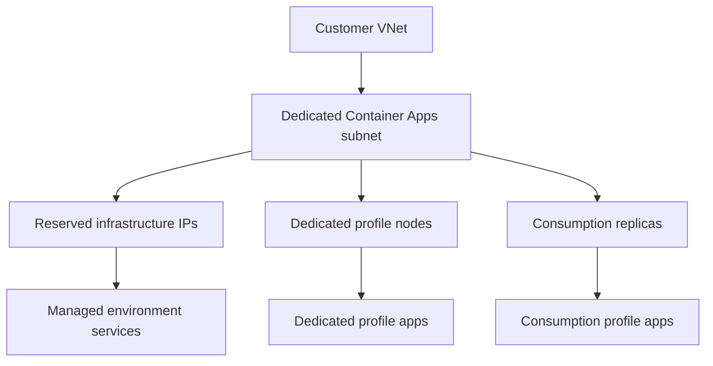

---
content_sources:
  diagrams:
    - id: delegated-subnet-capacity-model
      type: flowchart
      source: mslearn-adapted
      based_on:
        - https://learn.microsoft.com/en-us/azure/container-apps/networking
        - https://learn.microsoft.com/en-us/azure/container-apps/vnet-custom
        - https://learn.microsoft.com/en-us/azure/container-apps/workload-profiles-manage-cli
        - https://learn.microsoft.com/en-us/azure/templates/microsoft.app/managedenvironments
content_validation:
  status: verified
  last_reviewed: "2026-04-26"
  reviewer: ai-agent
  core_claims:
    - claim: "Workload profiles environments require a minimum subnet size of /27 and Consumption-only environments require a minimum subnet size of /23."
      source: "https://learn.microsoft.com/en-us/azure/container-apps/networking"
      verified: true
    - claim: "When using the Workload profiles environment, the subnet must be delegated to Microsoft.App/environments, and Consumption-only should not delegate the subnet."
      source: "https://learn.microsoft.com/en-us/azure/container-apps/vnet-custom"
      verified: true
    - claim: "The infrastructure subnet resource ID is the subnet for infrastructure components and user application containers."
      source: "https://learn.microsoft.com/en-us/azure/container-apps/vnet-custom"
      verified: true
    - claim: "In the /27 planning example, Container Apps reserves 11 IP addresses, Consumption assigns IPs per replica, and Dedicated assigns IPs per VM node."
      source: "https://learn.microsoft.com/en-us/azure/container-apps/workload-profiles-manage-cli"
      verified: true
---

# Networking and CIDR

Subnet planning for Azure Container Apps is an environment design task, not a last-minute deployment detail. The minimum CIDR, delegation model, and IP allocation rules all depend on which environment type you create.

## Main Content

### Minimum subnet sizes

| Environment type | Minimum subnet size | Notes |
|---|---|---|
| Workload profiles (v2) | `/27` | Supports newer networking features |
| Consumption-only (v1) | `/23` | Legacy model with different internal addressing needs |

!!! warning "Do not reuse the environment subnet"
    Microsoft Learn requires a subnet that is dedicated exclusively to the Container Apps environment.
    Treat it as environment-owned capacity, not shared subnet space.

### Delegation and subnet roles

For custom VNets:

- **Workload profiles (v2)**: delegate the subnet to `Microsoft.App/environments`.
- **Consumption-only (v1)**: do **not** delegate the subnet.

Microsoft Learn also describes the `infrastructureSubnetId` as the subnet for **infrastructure components and user application containers**. In other words, the standard deployment model uses one customer-managed infrastructure subnet rather than separate customer-managed runtime and platform subnets.

For the legacy Consumption-only environment, Learn also documents optional internal ranges such as `platformReservedCidr` and `dockerBridgeCidr` for platform networking.

<!-- diagram-id: delegated-subnet-capacity-model -->

### IP allocation model

Microsoft Learn's `/27` planning example is the key rule of thumb:

- A `/27` subnet has **32 IPs total**.
- **11 IP addresses are reserved** for Container Apps infrastructure.
- That leaves **21 available IP addresses**.

The same example then differentiates how those remaining IPs are consumed:

| Placement model | IP pressure driver | Practical meaning |
|---|---|---|
| Consumption | Per replica | Replica count can become the limiting factor |
| Dedicated | Per VM node | Many replicas can share fewer node IPs |

!!! note "Zero-downtime rollouts can increase temporary IP demand"
    The CLI guidance explicitly notes that Consumption can need double IPs during zero-downtime deployment because the old revision remains until the new revision is healthy.

### Sizing guidance

Start larger than the documented minimum when:

- You expect many Consumption replicas.
- You want headroom for revision overlap during rollout.
- You plan to add more dedicated node pools later.
- You expect the environment to become a shared landing zone for multiple teams.

## See Also

- [VNet Integration](../networking/vnet-integration.md)
- [Private Endpoints](../networking/private-endpoints.md)
- [Plans and Workload Profiles](plans-and-workload-profiles.md)
- [Workload Profiles](workload-profiles.md)
- [Environment Design](../../best-practices/environment-design.md)

## Sources

- [Networking in Azure Container Apps environment (Microsoft Learn)](https://learn.microsoft.com/en-us/azure/container-apps/networking)
- [Integrate a virtual network with an Azure Container Apps environment (Microsoft Learn)](https://learn.microsoft.com/en-us/azure/container-apps/vnet-custom)
- [Create a Container Apps environment with the Azure CLI (Microsoft Learn)](https://learn.microsoft.com/en-us/azure/container-apps/workload-profiles-manage-cli)
- [Microsoft.App/managedEnvironments template reference (Microsoft Learn)](https://learn.microsoft.com/en-us/azure/templates/microsoft.app/managedenvironments)
