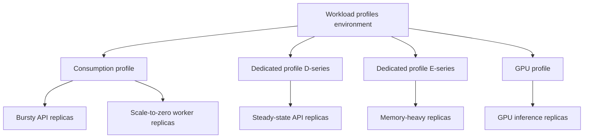

---
content_sources:
  diagrams:
    - id: one-environment-many-workload-profiles
      type: flowchart
      source: mslearn-adapted
      based_on:
        - https://learn.microsoft.com/en-us/azure/container-apps/structure
        - https://learn.microsoft.com/en-us/azure/container-apps/workload-profiles-overview
        - https://learn.microsoft.com/en-us/azure/container-apps/networking
content_validation:
  status: verified
  last_reviewed: "2026-04-26"
  reviewer: ai-agent
  core_claims:
    - claim: "Azure Container Apps features two different environment types: Workload profiles and Consumption-only."
      source: "https://learn.microsoft.com/en-us/azure/container-apps/structure"
      verified: true
    - claim: "Workload profiles (v2) is the default environment type and Consumption-only (v1) is legacy."
      source: "https://learn.microsoft.com/en-us/azure/container-apps/structure"
      verified: true
    - claim: "Workload profiles environments support UDR, NAT Gateway egress, and private endpoints on the environment, while Consumption-only environments do not."
      source: "https://learn.microsoft.com/en-us/azure/container-apps/networking"
      verified: true
    - claim: "Each Container Apps environment includes a default Consumption profile, and Dedicated or Consumption GPU profiles can be added."
      source: "https://learn.microsoft.com/en-us/azure/container-apps/workload-profiles-overview"
      verified: true
---

# Plans and Workload Profiles

Azure Container Apps separates environment type, plan type, and workload profile. This page connects those terms so you can pick the right environment model before you design app placement, networking, and scaling.

## Main Content

### Current Microsoft Learn taxonomy

Current Microsoft Learn pages use these environment names:

| Current term | Status | Notes |
|---|---|---|
| **Workload profiles (v2)** | Default | Recommended for new environments |
| **Consumption-only (v1)** | Legacy | Still available, but no longer the default |

!!! note "Use current Learn terminology"
    The current Microsoft Learn pages reviewed for this guide use **Workload profiles (v2)** and **Consumption-only (v1)**.
    Older Premium or Standard wording is not the active environment taxonomy in the current Learn pages cited below.

### How the layers fit together

- **Environment type** decides the broad capability set.
- **Plan type** decides how billing is calculated.
- **Workload profile** decides the compute shape where an app runs.

In practice:

- A **Consumption-only (v1)** environment runs only on the **Consumption plan**.
- A **Workload profiles (v2)** environment includes a built-in **Consumption** workload profile and can add **Dedicated** workload profiles.

<!-- diagram-id: one-environment-many-workload-profiles -->

### Capability comparison

| Capability | Workload profiles (v2) | Consumption-only (v1) |
|---|---|---|
| Environment status | Default | Legacy |
| Supported plan types | Consumption, Dedicated | Consumption |
| Built-in consumption option | Yes | Yes |
| Dedicated SKUs | Yes | No |
| Multiple profile mix in one environment | Yes | No |
| UDR support | Yes | No |
| NAT Gateway egress | Yes | No |
| Private endpoints on the environment | Yes | No |
| Minimum subnet size for custom VNet | `/27` | `/23` |
| GPU support | Yes, via Consumption GPU or Dedicated GPU profiles | No |
| Scale-to-zero | Yes on Consumption profile apps | Yes |
| Replica ceiling per revision | Up to 1,000 configurable replicas, subject to quota and subnet realities | Up to 1,000 configurable replicas, subject to quota and subnet realities |

### When to choose which

Choose **Workload profiles (v2)** when you need:

- Long-term flexibility between usage-based and dedicated compute.
- UDR, NAT Gateway, or private endpoints on the environment.
- Different app classes in one environment, such as bursty APIs and steady backends.
- GPU or larger dedicated shapes.

Choose **Consumption-only (v1)** only when:

- You already run legacy environments and need to understand or maintain them.
- Your workloads fit within the Consumption-only limits and you don't need the newer networking features.

!!! warning "Consumption pricing no longer requires a Consumption-only environment"
    Microsoft Learn recommends using a **Workload profiles (v2)** environment with the built-in Consumption profile when you want consumption-style billing.
    That keeps the option to add dedicated resources later without redesigning the environment type first.

## See Also

- [Environments in Azure Container Apps](index.md)
- [Consumption Plan](consumption-plan.md)
- [Workload Profiles](workload-profiles.md)
- [Networking and CIDR](networking-and-cidr.md)
- [Limits and Quotas](limits-and-quotas.md)

## Sources

- [Compute and billing structures in Azure Container Apps (Microsoft Learn)](https://learn.microsoft.com/en-us/azure/container-apps/structure)
- [Consumption-only environment type in Azure Container Apps (legacy) (Microsoft Learn)](https://learn.microsoft.com/en-us/azure/container-apps/environment-type-consumption-only)
- [Workload profiles in Azure Container Apps (Microsoft Learn)](https://learn.microsoft.com/en-us/azure/container-apps/workload-profiles-overview)
- [Networking in Azure Container Apps environment (Microsoft Learn)](https://learn.microsoft.com/en-us/azure/container-apps/networking)
- [Scaling in Azure Container Apps (Microsoft Learn)](https://learn.microsoft.com/en-us/azure/container-apps/scale-app)
