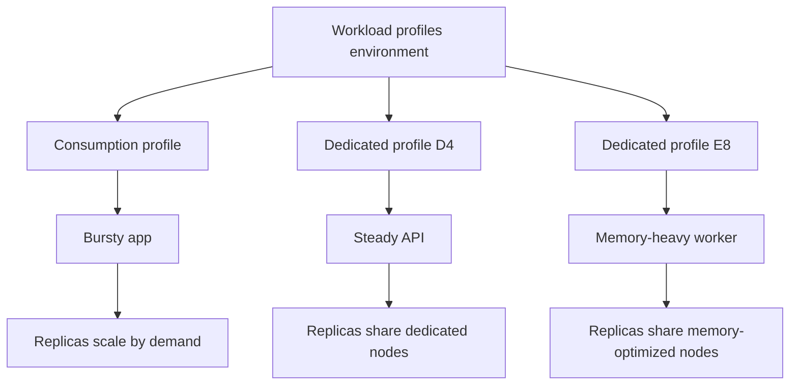

---
content_sources:
  diagrams:
    - id: environment-to-profiles-to-apps
      type: flowchart
      source: mslearn-adapted
      based_on:
        - https://learn.microsoft.com/en-us/azure/container-apps/workload-profiles-overview
        - https://learn.microsoft.com/en-us/azure/container-apps/workload-profiles-manage-cli
        - https://learn.microsoft.com/en-us/azure/templates/microsoft.app/containerapps
        - https://learn.microsoft.com/en-us/azure/templates/microsoft.app/managedenvironments
content_validation:
  status: verified
  last_reviewed: "2026-04-26"
  reviewer: ai-agent
  core_claims:
    - claim: "Azure Container Apps supports Consumption, Dedicated, and Flex workload profile types, and each environment includes a default Consumption profile."
      source: "https://learn.microsoft.com/en-us/azure/container-apps/workload-profiles-overview"
      verified: true
    - claim: "Current Dedicated profile names include D4/D8/D16/D32, E4/E8/E16/E32, and NC24-A100/NC48-A100/NC96-A100."
      source: "https://learn.microsoft.com/en-us/azure/container-apps/workload-profiles-overview"
      verified: true
    - claim: "The CLI uses --workload-profile-type, --workload-profile-name, --min-nodes, and --max-nodes to add workload profiles."
      source: "https://learn.microsoft.com/en-us/azure/container-apps/workload-profiles-manage-cli"
      verified: true
    - claim: "The container app resource exposes workloadProfileName to pin execution to a workload profile."
      source: "https://learn.microsoft.com/en-us/azure/templates/microsoft.app/containerapps"
      verified: true
---

# Workload Profiles

Workload profiles let one Azure Container Apps environment host different compute shapes at the same time. This is the core reason Workload profiles (v2) is the default environment type for new deployments.

## Main Content

### Profile types inside a v2 environment

Microsoft Learn currently lists three workload profile types:

| Profile type | Current status | Best fit |
|---|---|---|
| **Consumption** | GA | Bursty, idle-prone, scale-to-zero workloads |
| **Dedicated** | GA | Steady workloads that need reserved compute or larger shapes |
| **Flex** | Preview | Single-tenant style profile with larger replica sizes, but no scale-to-zero |

Each v2 environment includes a default **Consumption** profile. You can then add specialized profiles for apps that need different resource behavior.

### Current dedicated profile families

| Classification | Current profile names | Allocation model |
|---|---|---|
| General purpose | `D4`, `D8`, `D16`, `D32` | Per node |
| Memory optimized | `E4`, `E8`, `E16`, `E32` | Per node |
| GPU | `NC24-A100`, `NC48-A100`, `NC96-A100` | Per node |

!!! note "Flexible is preview"
    Microsoft Learn lists **Flexible** as a preview profile type.
    This page focuses on the generally available Consumption and Dedicated placement options first.

### Profile properties and app targeting

At environment level, workload profiles are configured with:

- A profile **name**.
- A **workloadProfileType**.
- Minimum and maximum node counts.

At app level, a container app targets a profile with **workloadProfileName**.

```bicep
resource env 'Microsoft.App/managedEnvironments@2026-01-01' = {
  name: 'cae-prod'
  location: location
  properties: {
    workloadProfiles: [
      {
        name: 'gp-steady'
        workloadProfileType: 'D4'
        minimumCount: 2
        maximumCount: 6
      }
      {
        name: 'memory-heavy'
        workloadProfileType: 'E8'
        minimumCount: 1
        maximumCount: 3
      }
    ]
  }
}

resource app 'Microsoft.App/containerApps@2026-01-01' = {
  name: 'ca-api-prod'
  location: location
  properties: {
    environmentId: env.id
    workloadProfileName: 'gp-steady'
    configuration: {
      activeRevisionsMode: 'Single'
      ingress: {
        external: true
        targetPort: 8080
      }
    }
    template: {
      containers: [
        {
          name: 'api'
          image: 'mcr.microsoft.com/azuredocs/containerapps-helloworld:latest'
          resources: {
            cpu: 1
            memory: '2Gi'
          }
        }
      ]
      scale: {
        minReplicas: 2
        maxReplicas: 20
      }
    }
  }
}
```

### Scaling model: profile nodes vs app replicas

Workload profiles add a second scaling layer:

- **Profile scale** adds or removes nodes within the profile's min/max node range.
- **App scale** adds or removes replicas according to the app's scale rules.

<!-- diagram-id: environment-to-profiles-to-apps -->


### When to use Dedicated profiles

Dedicated profiles are the better fit when you need:

- Reserved compute for steady workloads.
- Larger instance sizes than the default Consumption profile.
- Memory-optimized shapes.
- GPU-enabled dedicated hardware.
- Networking features that require a Workload profiles environment, such as UDR or NAT Gateway egress.

## See Also

- [Plans and Workload Profiles](plans-and-workload-profiles.md)
- [Consumption Plan](consumption-plan.md)
- [Dedicated GPU Profiles](dedicated-gpu-profiles.md)
- [Networking and CIDR](networking-and-cidr.md)
- [Migration](migration.md)

## Sources

- [Workload profiles in Azure Container Apps (Microsoft Learn)](https://learn.microsoft.com/en-us/azure/container-apps/workload-profiles-overview)
- [Create a Container Apps environment with the Azure CLI (Microsoft Learn)](https://learn.microsoft.com/en-us/azure/container-apps/workload-profiles-manage-cli)
- [Microsoft.App/managedEnvironments template reference (Microsoft Learn)](https://learn.microsoft.com/en-us/azure/templates/microsoft.app/managedenvironments)
- [Microsoft.App/containerApps template reference (Microsoft Learn)](https://learn.microsoft.com/en-us/azure/templates/microsoft.app/containerapps)
- [Networking in Azure Container Apps environment (Microsoft Learn)](https://learn.microsoft.com/en-us/azure/container-apps/networking)
