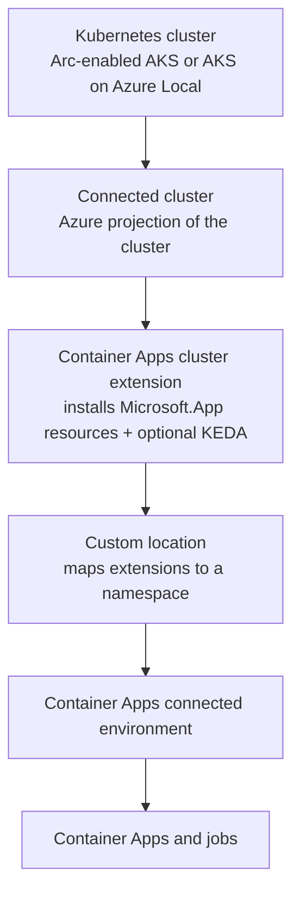

---
content_sources:
  diagrams:
    - id: connected-environment-topology
      type: flowchart
      source: mslearn-adapted
      based_on:
        - https://learn.microsoft.com/en-us/azure/container-apps/azure-arc-overview
content_validation:
  status: verified
  last_reviewed: '2026-07-18'
  reviewer: ai-agent
  core_claims:
    - claim: Azure Container Apps can run on an Azure Arc-enabled AKS or AKS on Azure Local cluster, letting IT administrators host Container Apps on internal infrastructure.
      source: https://learn.microsoft.com/en-us/azure/container-apps/azure-arc-overview
      verified: true
    - claim: A Container Apps connected environment is deployed into a custom location on the Arc-enabled cluster and enables configuration common across apps but not related to cluster operations.
      source: https://learn.microsoft.com/en-us/azure/container-apps/azure-arc-overview
      verified: true
    - claim: Managed identities are not supported for Container Apps running on Azure Arc, and apps cannot pull images from ACR with managed identity; an application service principal should be used instead.
      source: https://learn.microsoft.com/en-us/azure/container-apps/azure-arc-overview
      verified: true
    - claim: The Container Apps Arc cluster must support the Kubernetes LoadBalancer service type and run on Linux nodes only; Windows and Arm64 clusters are not supported.
      source: https://learn.microsoft.com/en-us/azure/container-apps/azure-arc-overview
      verified: true
    - claim: Applications on Azure Container Apps on Azure Arc scale within the limits of the underlying Kubernetes cluster's available CPU and memory.
      source: https://learn.microsoft.com/en-us/azure/container-apps/azure-arc-overview
      verified: true
---
# Container Apps on Azure Arc (Connected Environments)

Azure Container Apps normally runs in a fully managed Azure environment. With **Azure Arc**, you can instead run Container Apps on your own **Azure Arc-enabled AKS or AKS on Azure Local** cluster — bringing the Container Apps developer experience to on-premises or non-Azure Kubernetes while keeping Azure-based management. This page explains connected environments, how they are set up, and how they differ from managed environments.

## Why Connected Environments

Running Container Apps on an Arc-enabled Kubernetes cluster lets:

- **Developers** keep using Container Apps concepts (apps, revisions, ingress, scaling, jobs) unchanged.
- **IT administrators** maintain corporate compliance by hosting apps on internal infrastructure they control.

This is the option to evaluate when data residency, regulatory, or existing on-premises Kubernetes investments prevent using the managed Azure environment.

## How a Connected Environment Is Assembled

Setting up Container Apps on Arc builds up several layered resources on top of your Kubernetes cluster:

<!-- diagram-id: connected-environment-topology -->

| Layer | Role |
|---|---|
| **Connected cluster** | An Azure projection of your Kubernetes infrastructure via Azure Arc-enabled Kubernetes |
| **Cluster extension** | Installs the Container Apps resources (the `Microsoft.App` provider surface) into the cluster; optionally installs KEDA for event-driven scaling |
| **Custom location** | Bundles the extensions and maps them to a namespace where resources are created |
| **Connected environment** | Deployed into the custom location; holds configuration common across apps but unrelated to cluster operations. Developers deploy apps into this environment |

!!! note "KEDA installation constraint"
    The extension can optionally install KEDA for event-driven scaling, but **only one KEDA installation is allowed per cluster**. If KEDA is already installed, disable the extension's KEDA installation during setup.

## Managed vs Connected Environments

| Aspect | Managed environment | Connected environment (Arc) |
|---|---|---|
| Hosting | Fully managed Azure | Your Arc-enabled AKS / AKS on Azure Local |
| Managed identities | Supported | **Not supported** — use an application service principal |
| ACR pull with managed identity | Supported | **Not supported** (depends on managed identities) |
| Scaling ceiling | Platform/quota governed | Bounded by the cluster's available CPU and memory |
| Node OS | Managed by Azure | **Linux only** (no Windows, no Arm64) |
| Networking requirement | Managed | Cluster must support the `LoadBalancer` service type |
| Logs | Azure Monitor / Log Analytics | Written to stdout; Log Analytics is configured at the **cluster extension** level, not per application |
| Region availability | Broad | Limited set of regions |

### Supported Features on Arc

Labels, metrics, Easy Auth, log stream, resilience, custom domains, Container Apps jobs, revision management, and the app container console are supported. Managed identities and managed-identity-based ACR pulls are the primary omissions. Always check the portal for the current feature list — unsupported features are grayed out.

## Prerequisites and Setup Considerations

- An **Azure Arc-enabled Kubernetes** cluster (AKS or AKS on Azure Local) with a `LoadBalancer`-capable network and Linux nodes.
- Install the **Container Apps cluster extension**, create a **custom location**, then create the **connected environment**.
- For **AKS on Azure Local**, configure HAProxy as the load balancer and enable custom CoreDNS **before** installing the extension.
- If you hit a `No registered resource provider found` error when creating the connected environment, re-register the provider with `az provider register --namespace Microsoft.App --wait` and retry. Re-registration does not affect existing apps.
- To use Azure File SMB storage, install the CSI SMB driver (`>= v1.18.0`) first.

## Identity Without Managed Identities

Because managed identities are unavailable on Arc, apps that must authenticate to other Azure resources should use an **application service principal** and supply its credentials as secrets. Plan credential rotation accordingly, since you lose the automatic rotation that managed identity provides.

## Logging Model

System component and application logs are written to **standard output** and can be collected with standard Kubernetes tooling. Optionally, configure the cluster extension with a Log Analytics workspace to forward logs. Application log forwarding can be disabled by setting `logProcessor.enabled=false` as an extension configuration setting.

## When to Choose Connected Environments

Choose a connected environment when:

- Workloads must stay **on-premises or in a specific data center** for compliance or residency.
- You already operate **Arc-enabled Kubernetes** and want the Container Apps developer model on it.

Prefer a **managed environment** when you need managed identities, managed-identity ACR pulls, the broadest region and feature availability, and no cluster to operate yourself.

## See Also

- [Environments Overview](../environments/index.md)
- [Managed Identity](../identity-and-secrets/managed-identity.md)
- [Dapr Integration in Azure Container Apps](../dapr/index.md)

## Sources

- [Container Apps on Azure Arc overview](https://learn.microsoft.com/en-us/azure/container-apps/azure-arc-overview)
- [Set up an Azure Arc-enabled Kubernetes cluster to run Azure Container Apps](https://learn.microsoft.com/en-us/azure/container-apps/azure-arc-enable-cluster)
- [What is Azure Arc-enabled Kubernetes?](https://learn.microsoft.com/en-us/azure/azure-arc/kubernetes/overview)
