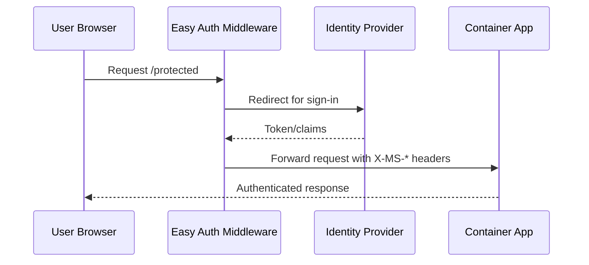

---
hide:
  - toc
content_sources:
  diagrams:
    - id: when-you-enable-authentication-the-platform-s
      type: sequence
      source: mslearn-adapted
      based_on:
        - https://learn.microsoft.com/azure/container-apps/authentication
        - https://learn.microsoft.com/azure/container-apps/authentication-oidc
content_validation:
  status: verified
  last_reviewed: "2026-04-12"
  reviewer: ai-agent
  core_claims:
    - claim: "Azure Container Apps provides built-in authentication and authorization features to secure external ingress-enabled container apps with minimal or no code."
      source: "https://learn.microsoft.com/azure/container-apps/authentication"
      verified: true
    - claim: "The authentication and authorization middleware runs as a sidecar container on each replica in the application."
      source: "https://learn.microsoft.com/azure/container-apps/authentication"
      verified: true
    - claim: "The platform middleware injects identity information into HTTP request headers."
      source: "https://learn.microsoft.com/azure/container-apps/authentication"
      verified: true
    - claim: "Built-in authentication supports Microsoft Entra ID, Facebook, GitHub, Google, X, and custom OpenID Connect providers."
      source: "https://learn.microsoft.com/azure/container-apps/authentication"
      verified: true
---

# Built-in Authentication (Easy Auth)

Azure Container Apps (ACA) provides built-in authentication and authorization, often referred to as "Easy Auth." This allows you to secure your Python application without writing complex authentication code.

## How it Works

When you enable authentication, the platform's built-in authentication middleware intercepts incoming requests and validates the user's identity before forwarding the request to your application container.

<!-- diagram-id: when-you-enable-authentication-the-platform-s -->


!!! warning "Easy Auth does not replace app authorization"
    Easy Auth authenticates users, but your application still must enforce role/tenant/resource-level authorization rules.

## Enabling Authentication

To enable authentication with Microsoft Entra ID (formerly Azure AD):

```bash
export RG="rg-myapp"
export APP_NAME="ca-myapp"
export CLIENT_ID="<client-id>"
export CLIENT_SECRET="<client-secret>"
export TENANT_ID="<tenant-id>"
```

```bash
az containerapp auth microsoft update \
  --name "$APP_NAME" \
  --resource-group "$RG" \
  --client-id "$CLIENT_ID" \
  --client-secret "$CLIENT_SECRET" \
  --tenant-id "$TENANT_ID" \
  --action RedirectToLoginPage
```

!!! note "Use secret references for client secrets"
    Avoid storing raw client secrets directly in scripts. Use secure secret handling workflows and rotate credentials regularly.

## Accessing User Information

Once a user is authenticated, the platform middleware adds headers to the request that your Python application can use:

- `X-MS-CLIENT-PRINCIPAL-NAME`: The user's username or email.
- `X-MS-CLIENT-PRINCIPAL-ID`: The user's unique identifier.
- `X-MS-CLIENT-PRINCIPAL`: A base64-encoded JSON object containing the user's claims.

### Python Example

```python
import base64
import json
from flask import Flask, request

app = Flask(__name__)

@app.route('/')
def home():
    principal_header = request.headers.get('X-MS-CLIENT-PRINCIPAL')
    if principal_header:
        # Decode the principal header
        principal = json.loads(base64.b64decode(principal_header).decode('utf-8'))
        user_name = principal.get('name', 'Unknown User')
        return f"Hello, {user_name}!"
    return "Hello, anonymous user!"
```

## Why use Easy Auth?

- **Simplicity:** No need to implement OAuth/OpenID Connect flows in your Python code.
- **Security:** Managed by Azure, ensuring it's always up to date with the latest security standards.
- **Flexibility:** Supports multiple identity providers, including Google, Facebook, and GitHub.

## Easy Auth Capability Matrix

| Capability | Easy Auth Coverage | App Responsibility |
|---|---|---|
| Authentication handshake | Built-in | Configure provider correctly |
| Token/header injection | Built-in (`X-MS-*`) | Validate claim assumptions |
| Business authorization | Partial | Enforce route/resource policies |
| Session/user experience | Partial | Handle app-specific redirects and UX |

## See Also
- [Managed Identity](managed-identity.md)
- [Operations: Security](security-operations.md)
- [Python Guide Configuration](../../language-guides/python/tutorial/03-configuration.md)

## Sources
- [Container Apps authentication and authorization](https://learn.microsoft.com/azure/container-apps/authentication)
- [Enable authentication with a custom OpenID Connect provider (Microsoft Learn)](https://learn.microsoft.com/azure/container-apps/authentication-oidc)
