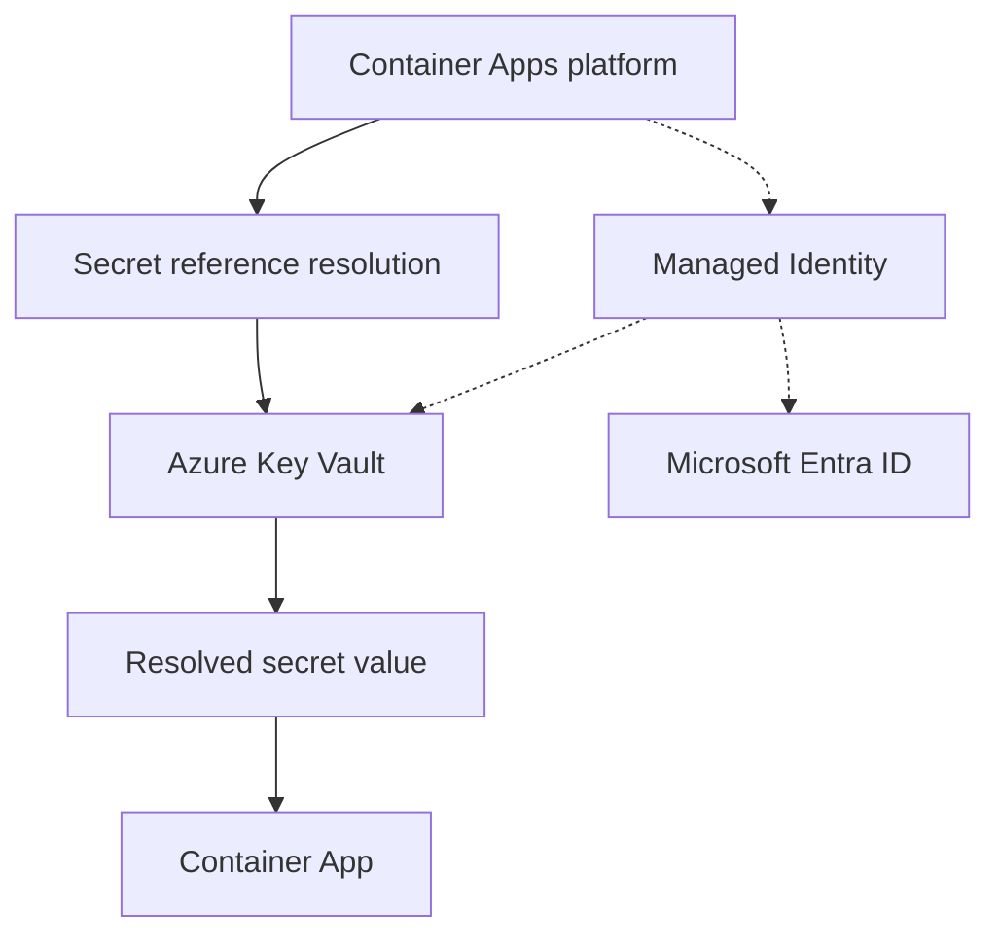
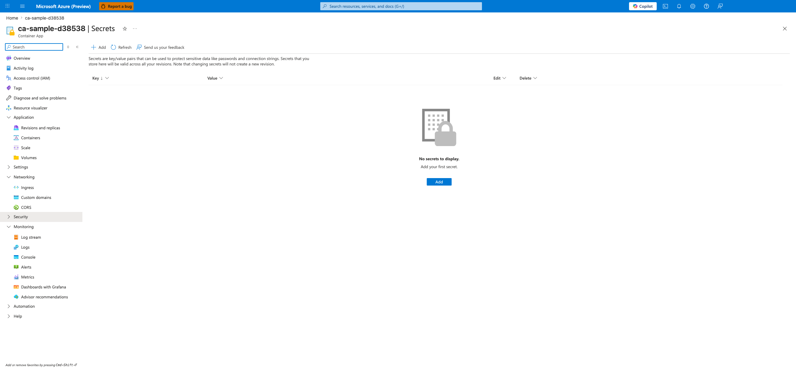

---
content_sources:
  diagrams:
    - id: architecture
      type: flowchart
      source: mslearn-adapted
      based_on:
        - https://learn.microsoft.com/en-us/azure/container-apps/manage-secrets
        - https://learn.microsoft.com/en-us/azure/app-service/app-service-key-vault-references
content_validation:
  status: verified
  last_reviewed: '2026-04-12'
  reviewer: ai-agent
  core_claims:
    - claim: A managed identity from Microsoft Entra ID allows a container app to access other Microsoft Entra protected resources.
      source: https://learn.microsoft.com/en-us/azure/container-apps/managed-identity
      verified: true
    - claim: Calls from a container app to services such as Azure Key Vault can be rejected without the required role assignments even when the app uses a valid token for its managed identity.
      source: https://learn.microsoft.com/en-us/azure/container-apps/managed-identity
      verified: true
    - claim: A container app with a managed identity exposes a local identity endpoint that the app can use to request tokens.
      source: https://learn.microsoft.com/en-us/azure/container-apps/managed-identity
      verified: true
    - claim: Using an existing virtual network allows Container Apps to access resources behind private endpoints in the virtual network.
      source: https://learn.microsoft.com/en-us/azure/container-apps/networking
      verified: true
---
# Key Vault Secrets Management (Managed Identity)

Use this recipe to access Key Vault secrets from a Python Container App without embedding secrets in code or images.

## Architecture

<!-- diagram-id: architecture -->


Solid arrows show runtime data flow. Dashed arrows show identity and authentication.

## Prerequisites

- Existing Container App: `$APP_NAME` in `$RG`
- Existing Key Vault with RBAC authorization enabled
- Azure CLI with Container Apps extension

## Step 1: Enable managed identity on the Container App

```bash
az containerapp identity assign \
  --name "$APP_NAME" \
  --resource-group "$RG" \
  --system-assigned

export PRINCIPAL_ID=$(az containerapp show \
  --name "$APP_NAME" \
  --resource-group "$RG" \
  --query "identity.principalId" \
  --output tsv)
```

| Command | Why it is used |
|---|---|
| `az containerapp identity assign ...` | Assigns or inspects managed identity configuration for the Container App. |

## Step 2: Grant Key Vault secret permissions via RBAC

```bash
export KEY_VAULT_ID=$(az keyvault show \
  --name "$KEY_VAULT_NAME" \
  --resource-group "$RG" \
  --query "id" \
  --output tsv)

az role assignment create \
  --assignee-object-id "$PRINCIPAL_ID" \
  --assignee-principal-type ServicePrincipal \
  --role "Key Vault Secrets User" \
  --scope "$KEY_VAULT_ID"
```

| Command | Why it is used |
|---|---|
| `az keyvault show ...` | Creates or inspects Key Vault resources used by managed identity or secret references. |

## Step 3: Add secret and app configuration

Set a sample secret in Key Vault:

```bash
az keyvault secret set \
  --vault-name "$KEY_VAULT_NAME" \
  --name "api-base-url" \
  --value "https://example.internal"
```

| Command | Why it is used |
|---|---|
| `az keyvault secret ...` | Creates or inspects Key Vault resources used by managed identity or secret references. |

Store Key Vault URL in Container Apps settings:

```bash
az containerapp update \
  --name "$APP_NAME" \
  --resource-group "$RG" \
  --set-env-vars KEY_VAULT_URL="https://$KEY_VAULT_NAME.vault.azure.net/"
```

| Command | Why it is used |
|---|---|
| `az containerapp update ...` | Updates the existing Container App configuration without recreating the app. |

!!! warning "Key Vault references still require correct RBAC and network path"
    Secret resolution fails when identity permissions, private DNS linkage, or endpoint connectivity are incomplete.

### Portal view: Secrets blade (empty state)



**[Observed]** The Secrets blade for the `ca-sample-d38538` Container App is open. The command bar exposes **Add**, **Refresh**, and **Send us your feedback** controls. A descriptive paragraph reads "Secrets are key/value pairs that can be used to protect sensitive data like passwords and connection strings. Secrets that you store here will be valid across all your revisions. Note that changing secrets will not create a new revision." Below it is a table header with **Key**, **Value**, **Edit**, and **Delete** columns. The central area shows an empty-state lock illustration with the text "No secrets to display." and "Add your first secret." above a primary **Add** button.

**[Inferred]** The two-column **Key** / **Value** layout is consistent with the documented Container App secret store model where each secret is a named key/value pair. The header sentence "changing secrets will not create a new revision" appears to map to the documented behavior that secret updates take effect without producing a new revision. The presence of a single primary **Add** button on an otherwise empty list appears to indicate the starting point for declaring either an inline secret value or a Key Vault reference in the portal.

**[Not Proven]** Additional secret entry detail, reference configuration detail, identity detail, and RBAC detail are not visible on this view.

## Step 4: Python code (SDK access)

Install dependencies:

```bash
pip install azure-identity azure-keyvault-secrets
```

Read secrets using `DefaultAzureCredential`:

```python
import os
from azure.identity import DefaultAzureCredential
from azure.keyvault.secrets import SecretClient

vault_url = os.environ["KEY_VAULT_URL"]
credential = DefaultAzureCredential()
client = SecretClient(vault_url=vault_url, credential=credential)

secret = client.get_secret("api-base-url")
print(secret.value)
```

## Container Apps specifics

- Use Container App secrets for app-level values that are not in Key Vault.
- Use Key Vault for centralized secret lifecycle and rotation.
- For private access, combine with VNet integration and Key Vault private endpoint.

## Secret Access Pattern Comparison

| Pattern | Security Posture | Operational Overhead | Recommended Usage |
|---|---|---|---|
| Inline secret in app config | Lowest | Low initially, high long-term risk | Avoid in production |
| Container App secret store | Medium | Medium | App-local secrets with periodic rotation |
| Key Vault + managed identity | Highest | Medium upfront, lower ongoing | Production baseline for sensitive secrets |

!!! tip "Separate secret naming from business naming"
    Use stable secret names (for example `database-password`) and rotate values behind the same key
    to reduce application change frequency.

## Verification steps

1. Validate role assignment:

```bash
az role assignment list \
  --assignee "$PRINCIPAL_ID" \
  --scope "$KEY_VAULT_ID" \
  --output table
```

| Command | Why it is used |
|---|---|
| `az role assignment list ...` | Lists Azure RBAC assignments to verify access or diagnose conflicts. |

2. Verify secret read in app logs:

```bash
az containerapp logs show \
  --name "$APP_NAME" \
  --resource-group "$RG" \
  --follow false
```

| Command | Why it is used |
|---|---|
| `az containerapp logs show ...` | Runs the Azure CLI operation required by the documented step. |

3. Validate secret metadata (without exposing secret values):

```bash
az keyvault secret show \
  --vault-name "$KEY_VAULT_NAME" \
  --name "api-base-url" \
  --query "{name:name,enabled:attributes.enabled,updated:attributes.updated}"
```

| Command | Why it is used |
|---|---|
| `az keyvault secret ...` | Creates or inspects Key Vault resources used by managed identity or secret references. |

## See Also
- [Managed Identity](managed-identity.md)
- [Private Endpoints](../networking/private-endpoints.md)
- [Operations Security](security-operations.md)
- [Secrets in Azure Container Apps](../security/secrets.md)

## Sources
- [Key Vault secrets in Azure Container Apps (Microsoft Learn)](https://learn.microsoft.com/en-us/azure/container-apps/manage-secrets)
- [Use Key Vault references in App Service and Azure Functions (Microsoft Learn)](https://learn.microsoft.com/en-us/azure/app-service/app-service-key-vault-references)
