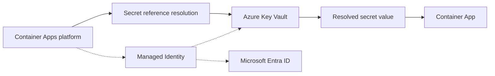

# Key Vault Secrets Management (Managed Identity)

Use this recipe to access Key Vault secrets from a Python Container App without embedding secrets in code or images.

## Architecture



Solid arrows show runtime data flow. Dashed arrows show identity and authentication.

## Prerequisites

- Existing Container App: `$APP_NAME` in `$RG`
- Existing Key Vault with RBAC authorization enabled
- Azure CLI with Container Apps extension

## Step 1: Enable managed identity on the Container App

```bash
az containerapp identity assign \
  --name "$APP_NAME" \
  --resource-group "$RG" \
  --system-assigned

export PRINCIPAL_ID=$(az containerapp show \
  --name "$APP_NAME" \
  --resource-group "$RG" \
  --query "identity.principalId" \
  --output tsv)
```

## Step 2: Grant Key Vault secret permissions via RBAC

```bash
export KEY_VAULT_ID=$(az keyvault show \
  --name "$KEY_VAULT_NAME" \
  --resource-group "$RG" \
  --query "id" \
  --output tsv)

az role assignment create \
  --assignee-object-id "$PRINCIPAL_ID" \
  --assignee-principal-type ServicePrincipal \
  --role "Key Vault Secrets User" \
  --scope "$KEY_VAULT_ID"
```

## Step 3: Add secret and app configuration

Set a sample secret in Key Vault:

```bash
az keyvault secret set \
  --vault-name "$KEY_VAULT_NAME" \
  --name "api-base-url" \
  --value "https://example.internal"
```

Store Key Vault URL in Container Apps settings:

```bash
az containerapp update \
  --name "$APP_NAME" \
  --resource-group "$RG" \
  --set-env-vars KEY_VAULT_URL="https://$KEY_VAULT_NAME.vault.azure.net/"
```

## Step 4: Python code (SDK access)

Install dependencies:

```bash
pip install azure-identity azure-keyvault-secrets
```

Read secrets using `DefaultAzureCredential`:

```python
import os
from azure.identity import DefaultAzureCredential
from azure.keyvault.secrets import SecretClient

vault_url = os.environ["KEY_VAULT_URL"]
credential = DefaultAzureCredential()
client = SecretClient(vault_url=vault_url, credential=credential)

secret = client.get_secret("api-base-url")
print(secret.value)
```

## Container Apps specifics

- Use Container App secrets for app-level values that are not in Key Vault.
- Use Key Vault for centralized secret lifecycle and rotation.
- For private access, combine with VNet integration and Key Vault private endpoint.

## Verification steps

1. Validate role assignment:

```bash
az role assignment list \
  --assignee "$PRINCIPAL_ID" \
  --scope "$KEY_VAULT_ID" \
  --output table
```

2. Verify secret read in app logs:

```bash
az containerapp logs show \
  --name "$APP_NAME" \
  --resource-group "$RG" \
  --follow false
```

3. Validate secret metadata (without exposing secret values):

```bash
az keyvault secret show \
  --vault-name "$KEY_VAULT_NAME" \
  --name "api-base-url" \
  --query "{name:name,enabled:attributes.enabled,updated:attributes.updated}"
```

## See Also
- [Managed Identity](managed-identity.md)
- [Private Endpoints](../networking/private-endpoints.md)
- [Operations Security](security-operations.md)

## Sources
- [Key Vault secrets in Azure Container Apps (Microsoft Learn)](https://learn.microsoft.com/azure/container-apps/manage-secrets)
- [Use Key Vault references in App Service and Azure Functions (Microsoft Learn)](https://learn.microsoft.com/azure/app-service/app-service-key-vault-references)
