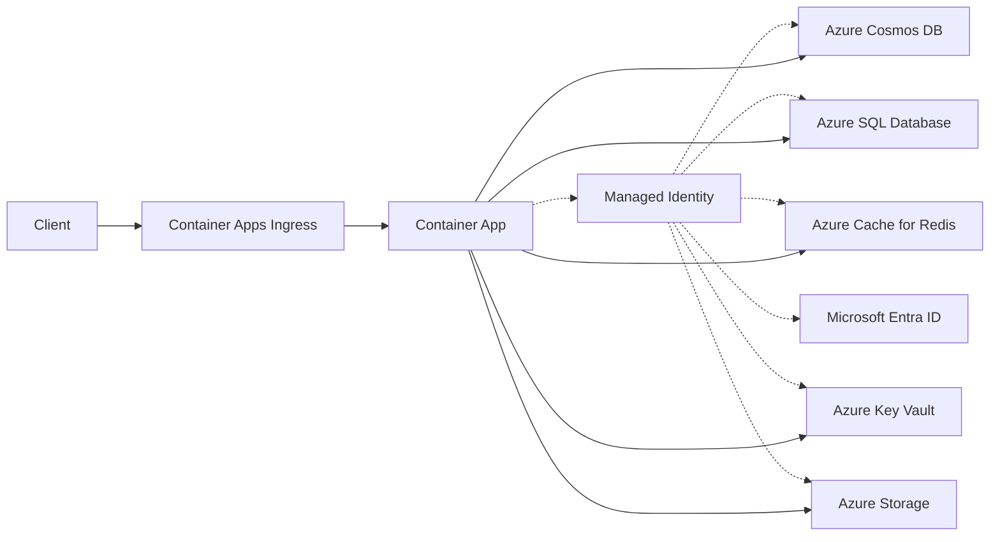

---
hide:
  - toc
content_sources:
  diagrams:
    - id: architecture
      type: flowchart
      source: mslearn-adapted
      based_on:
        - https://learn.microsoft.com/azure/container-apps/managed-identity
        - https://learn.microsoft.com/entra/identity/managed-identities-azure-resources/overview
---

# Passwordless Access with Managed Identity

Azure Container Apps (ACA) supports managed identities, allowing your Python application to securely access other Azure services without managing credentials like connection strings or API keys.

## Architecture

<!-- diagram-id: architecture -->


Solid arrows show runtime data flow. Dashed arrows show identity and authentication.

## Types of Managed Identity

- **System-assigned:** Tied to the lifecycle of the Container App.
- **User-assigned:** Created as a separate resource and can be shared among multiple apps.

| Identity Type | Lifecycle | Best Use Case |
|---|---|---|
| System-assigned | Deleted with the app | Single app, simplest setup |
| User-assigned | Independent resource | Shared identity across multiple apps/jobs |

!!! warning "Role assignment propagation is eventually consistent"
    Newly assigned RBAC roles can take time to become effective.
    Build retries into startup checks for first-time deployments.

## Enabling Managed Identity

To enable a system-assigned managed identity for your app:

```bash
az containerapp identity assign \
  --name my-python-app \
  --resource-group my-aca-rg \
  --system-assigned
```

## Assigning Roles

Assign roles to the managed identity to grant access to other resources (e.g., Azure SQL, Blob Storage, Key Vault).

```bash
# Get the principal ID of the system-assigned identity
principalId=$(az containerapp show --name my-python-app --resource-group my-aca-rg --query identity.principalId -o tsv)

# Assign the 'Storage Blob Data Reader' role
az role assignment create \
  --assignee $principalId \
  --role "Storage Blob Data Reader" \
  --scope /subscriptions/<SUBSCRIPTION_ID>/resourceGroups/my-aca-rg/providers/Microsoft.Storage/storageAccounts/mystorageaccount
```

## Python Implementation

Use the `azure-identity` library in your Python code to authenticate using the managed identity.

```python
from azure.identity import DefaultAzureCredential
from azure.storage.blob import BlobServiceClient

# DefaultAzureCredential will automatically pick up the managed identity
credential = DefaultAzureCredential()

# Connect to the storage account using the credential
blob_service_client = BlobServiceClient(
    account_url="https://mystorageaccount.blob.core.windows.net",
    credential=credential
)
```

!!! tip "Use service-specific SDK clients with DefaultAzureCredential"
    Keep authorization centralized in managed identity and avoid embedding keys or SAS tokens in app configuration.

## Why use Managed Identity?

- **Zero Secret Management:** No need to rotate passwords or API keys.
- **Improved Security:** Access is granted based on the identity of the application itself.
- **Simplified Configuration:** No more connection strings in environment variables or secrets.

## See Also
- [Cosmos DB](../../language-guides/python/recipes/cosmosdb.md)
- [Azure SQL](../../language-guides/python/recipes/azure-sql.md)
- [Key Vault](key-vault.md)
- [Blob Storage and File Mounts](../../language-guides/python/recipes/storage.md)

## Sources
- [Managed identity in Azure Container Apps (Microsoft Learn)](https://learn.microsoft.com/azure/container-apps/managed-identity)
- [What are managed identities for Azure resources? (Microsoft Learn)](https://learn.microsoft.com/entra/identity/managed-identities-azure-resources/overview)
