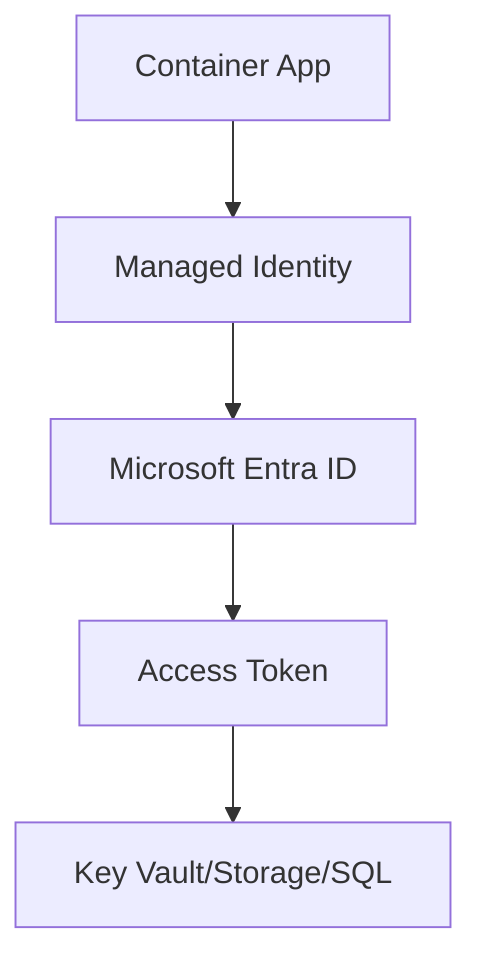
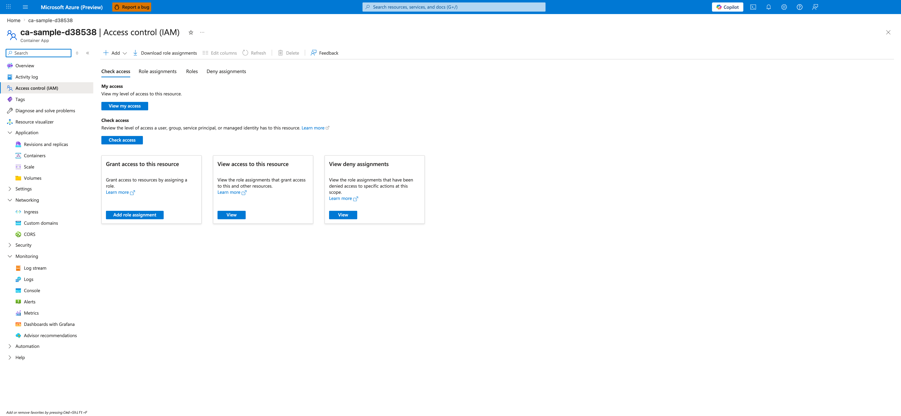

---
content_sources:
  diagrams:
  - id: enable-system-assigned-managed-identity
    type: flowchart
    source: mslearn-adapted
    based_on:
    - https://learn.microsoft.com/azure/container-apps/manage-secrets
    - https://learn.microsoft.com/azure/container-apps/managed-identity
content_validation:
  status: verified
  last_reviewed: '2026-04-12'
  reviewer: ai-agent
  core_claims:
  - claim: Azure Container Apps supports both system-assigned and user-assigned managed identities.
    source: https://learn.microsoft.com/azure/container-apps/managed-identity
    verified: true
  - claim: When a managed identity is added, deleted, or modified on a running container app, the app does not automatically
      restart and a new revision is not created.
    source: https://learn.microsoft.com/azure/container-apps/managed-identity
    verified: true
  - claim: The authentication and authorization middleware runs as a sidecar container on each replica in the application.
    source: https://learn.microsoft.com/azure/container-apps/authentication
    verified: true
  - claim: When authentication is enabled, the platform middleware injects identity information into HTTP request headers.
    source: https://learn.microsoft.com/azure/container-apps/authentication
    verified: true
  - claim: Require authentication can reject unauthenticated traffic by redirecting to a configured identity provider or by
      returning HTTP 401 or HTTP 403 responses.
    source: https://learn.microsoft.com/azure/container-apps/authentication
    verified: true
---
# Security Operations

This guide covers daily and periodic security operations: managed identity lifecycle, secret rotation, and Easy Auth policy management.

## Prerequisites

- A user-assigned or system-assigned managed identity strategy
- Secret owners and rotation intervals documented

```bash
export RG="rg-myapp"
export APP_NAME="ca-myapp"
export ENVIRONMENT_NAME="cae-myapp"
```

## Managed Identity Operations

Enable system-assigned managed identity:

<!-- diagram-id: enable-system-assigned-managed-identity -->


!!! warning "Identity and secret changes must be auditable"
    Apply security operations through automation and change records.
    Ad-hoc portal changes make incident forensics difficult.

```bash
az containerapp identity assign \
  --name "$APP_NAME" \
  --resource-group "$RG" \
  --system-assigned
```

| Command | Why it is used |
|---|---|
| `az containerapp identity assign ...` | Assigns or inspects managed identity configuration for the Container App. |

Check principal details:

```bash
az containerapp identity show \
  --name "$APP_NAME" \
  --resource-group "$RG" \
  --output json
```

| Command | Why it is used |
|---|---|
| `az containerapp identity show ...` | Assigns or inspects managed identity configuration for the Container App. |

Example output (PII masked):

```json
{
  "type": "SystemAssigned",
  "principalId": "xxxxxxxx-xxxx-xxxx-xxxx-xxxxxxxxxxxx",
  "tenantId": "<tenant-id>"
}
```

Grant least-privilege role assignment:

```bash
az role assignment create \
  --assignee-object-id "<object-id>" \
  --assignee-principal-type ServicePrincipal \
  --role "Key Vault Secrets User" \
  --scope "/subscriptions/<subscription-id>/resourceGroups/$RG/providers/Microsoft.KeyVault/vaults/<key-vault-name>"
```

## Secret Operations

Set or rotate secret values in Container Apps configuration:

```bash
az containerapp secret set \
  --name "$APP_NAME" \
  --resource-group "$RG" \
  --secrets "db-connection=<redacted-secret>"
```

Reference the secret as an environment variable in app template updates.

## Security Operations Cadence

| Operation | Suggested Frequency | Validation Signal |
|---|---|---|
| Managed identity review | Monthly | Unused roles removed |
| Secret rotation | Per policy (for example, 30-90 days) | Apps remain healthy after rotation |
| Easy Auth policy review | Monthly or after app route changes | Unauthorized access paths denied |
| RBAC scope audit | Quarterly | Least-privilege posture maintained |

!!! tip "Rotate secrets with staged rollout"
    Introduce new values, validate app health, then retire old values to avoid abrupt runtime failures.

### Portal view: Access control (IAM) blade



[Observed] The blade header reads `ca-sample-d38538 | Access control (IAM)` with the subtitle `Container App`. The command bar exposes `+ Add`, `Download role assignments`, `Edit columns`, `Refresh`, `Delete`, and `Feedback` controls. Four tabs are rendered: `Check access` (selected), `Role assignments`, `Roles`, and `Deny assignments`. The selected tab shows a `My access` section with a `View my access` button, a `Check access` section with a `Check access` button, and three cards titled `Grant access to this resource` (with an `Add role assignment` button), `View access to this resource` (with a `View` button), and `View deny assignments` (with a `View` button). The left navigation lists `Overview`, `Activity log`, `Access control (IAM)` (highlighted), `Tags`, `Diagnose and solve problems`, `Resource visualizer`, and grouped sections for `Application`, `Settings`, `Networking`, `Security`, `Monitoring`, `Automation`, and `Help`.

[Inferred] The four tabs (`Check access`, `Role assignments`, `Roles`, `Deny assignments`) and the three cards (`Grant access`, `View access`, `View deny assignments`) appear to map to the RBAC scope-audit cadence described in the table above, since the surface lets an operator inspect who has access at this resource scope without leaving the blade. The `+ Add` command and the `Add role assignment` card button are consistent with the role-creation surface invoked by `az role assignment create` shown in the Managed Identity Operations section.

[Not Proven] The screenshot does not include any `Role assignments` tab content, so the captured surface does not reveal which principals or roles are bound to this Container App. The `Check access` and `View my access` buttons are present but their result panels are not visible in this capture, so the rendered shape of those panels is outside the scope of this image.

## Easy Auth Operations

Review and enforce authentication settings:

```bash
az containerapp auth show \
  --name "$APP_NAME" \
  --resource-group "$RG" \
  --output json
```

| Command | Why it is used |
|---|---|
| `az containerapp auth show ...` | Runs the Azure CLI operation required by the documented step. |

Update auth to require login by default:

```bash
az containerapp auth update \
  --name "$APP_NAME" \
  --resource-group "$RG" \
  --enabled true \
  --unauthenticated-client-action Return401
```

| Command | Why it is used |
|---|---|
| `az containerapp auth update ...` | Runs the Azure CLI operation required by the documented step. |

## Verification Steps

```bash
az containerapp show \
  --name "$APP_NAME" \
  --resource-group "$RG" \
  --query "{identity:identity,auth:properties.configuration.auth}" \
  --output json
```

| Command | Why it is used |
|---|---|
| `az containerapp show ...` | Reads the Container App configuration so the documented setting can be verified. |

Example output (PII masked):

```json
{
  "identity": {
    "type": "SystemAssigned",
    "principalId": "xxxxxxxx-xxxx-xxxx-xxxx-xxxxxxxxxxxx",
    "tenantId": "<tenant-id>"
  },
  "auth": {
    "platform": {
      "enabled": true
    }
  }
}
```

## Troubleshooting

### Managed identity token requests fail

- Confirm identity is assigned to the app.
- Verify target resource role assignment scope.
- Wait for RBAC propagation, then retry.

### Easy Auth blocks expected traffic

- Validate allowed redirect URI and issuer configuration.
- Exclude health endpoints from auth if required by probes.

## Advanced Topics

- Use user-assigned identities for shared access policies.
- Rotate secrets via Key Vault references and automation.
- Add policy enforcement with Azure Policy for auth and identity baselines.

## See Also
- [Networking](../networking/index.md)
- [Observability](../../operations/monitoring/index.md)
- [Managed Identity Recipe](managed-identity.md)
- [Easy Auth Recipe](easy-auth.md)

## Sources
- [Container Apps security](https://learn.microsoft.com/azure/container-apps/manage-secrets)
- [Managed identity in Azure Container Apps (Microsoft Learn)](https://learn.microsoft.com/azure/container-apps/managed-identity)
