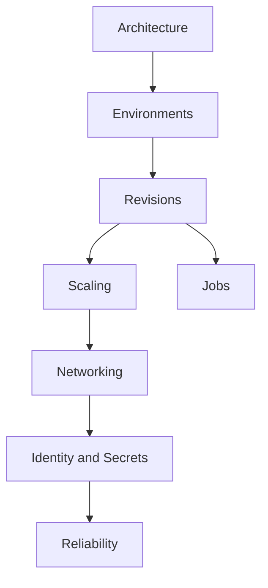
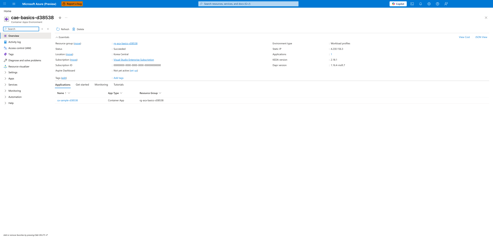

---
content_sources:
  diagrams:
  - id: documents
    type: flowchart
    source: mslearn-adapted
    based_on:
    - https://learn.microsoft.com/azure/container-apps/
content_validation:
  status: verified
  last_reviewed: '2026-05-23'
  reviewer: agent
  core_claims:
  - claim: This page uses Microsoft Learn as the primary source basis for its Azure-specific
      guidance.
    source: https://learn.microsoft.com/azure/container-apps/
    verified: true
---
# Concepts

This section explains Azure Container Apps platform behavior in a language-agnostic way. Use these documents to understand architecture, scaling, and networking before diving into implementation.

## Main Content

### Documents

| Document | Description |
|---|---|
| [Architecture: Resource Relationships](architecture/resource-relationships.md) | Control plane vs data plane, environment and app resource hierarchy |
| [Environments](environments/index.md) | Regional boundary for apps, consumption vs workload profiles |
| [Revisions](revisions/index.md) | Immutable snapshots, single vs multi-revision mode, traffic splitting |
| [Scaling](scaling/index.md) | KEDA autoscaling, HTTP/event/custom scale rules, replica management |
| [Networking](networking/index.md) | Ingress, VNet integration, private endpoints, service discovery |
| [Jobs](jobs/index.md) | Scheduled, event-driven, and manual job execution |
| [Identity and Secrets](identity-and-secrets/managed-identity.md) | Managed identity setup and RBAC patterns (see also Key Vault, Easy Auth, Security Operations pages) |
| [Reliability](reliability/health-recovery.md) | Health probes, graceful shutdown, zone redundancy, recovery |

<!-- diagram-id: documents -->

### Recommended reading order

1. Start with architecture and resource relationships
2. Understand environment boundaries and profile choices
3. Learn revision lifecycle and traffic splitting
4. Design scaling envelope with KEDA rules
5. Finalize networking controls and ingress
6. Validate identity, secrets, and reliability patterns

!!! tip "Read by decision sequence"
    If you are designing a new workload, treat this section as a dependency chain: architecture and environments first, then revisions/scaling, and finally networking plus identity controls.

!!! warning "Do not skip platform concepts"
    Jumping directly to language guides without understanding revision mode, ingress boundaries, and scaling behavior often leads to production misconfigurations.

### Verify platform surfaces in Azure Portal

**[Observed]** `cae-basics-d38538` `Container Apps Environment` `Refresh` `Delete` `Essentials` `View Cost` `JSON View` `Resource group (move)` `rg-aca-basics-d38538` `Status` `Succeeded` `Location (move)` `Korea Central` `Subscription (move)` `Visual Studio Enterprise Subscription` `Subscription ID` `00000000-0000-0000-0000-000000000000` `Aspire Dashboard` `Not yet active (set up)` `Tags (edit)` `Add tags` `Environment type` `Workload profiles` `Static IP` `4.230.156.3` `Applications` `1` `KEDA version` `2.18.1` `Dapr version` `1.16.4-msft.7` `Applications` `Get started` `Monitoring` `Tutorials` `Name` `App Type` `Resource Group` `ca-sample-d38538` `Container App` `rg-aca-basics-d38538`.

**[Inferred]** The `Container Apps Environment` `cae-basics-d38538` value with its nested `ca-sample-d38538` `Container App` row is consistent with the environment-to-app resource hierarchy summarized in [Documents](#documents).

**[Not Proven]** Additional platform component detail, revision detail, scale-rule configuration detail, and networking detail are not visible on this view.

## Advanced Topics

- Build architecture decision records (ADRs) per environment
- Standardize profile and scaling baselines by workload class
- Define SLO-driven scaling and networking review checkpoints

!!! note "Platform docs are language-agnostic"
    Implementation snippets in language guides should follow the architectural boundaries defined here, not the other way around.

## Language-Specific Details

For language-specific implementation details, see:
- [Python Guide](../language-guides/python/index.md)

## See Also

- [Operations](../operations/index.md)
- [Best Practices](../best-practices/index.md)
- [Reference](../reference/index.md)

## Sources

- [Azure Container Apps documentation (Microsoft Learn)](https://learn.microsoft.com/azure/container-apps/)
