# Platform: Understanding Azure Container Apps

This section explains **how Azure Container Apps works** so you can make better design decisions before writing deployment scripts.

Use these concept guides to understand platform behavior (revisions, scaling, ingress, environments) and choose the right architecture for production workloads.

## Concept Map

```mermaid
graph TD
    A[Azure Container Apps Fundamentals] --> B[How Container Apps Works]
    A --> C[Environments and Apps]
    A --> D[Scaling with KEDA]
    A --> E[Networking]
    A --> F[Container Apps Jobs]
    A --> G[Identity and Secrets]
    A --> H[Reliability]

    B --> B1[Control plane vs data plane]
    B --> B2[Revisions and traffic splitting]
    B --> B3[Dapr and managed runtime]

    C --> C1[Consumption vs Workload profiles]
    C --> C2[Environment boundaries]

    D --> D1[Event-driven autoscaling]
    D --> D2[Scale rules and limits]

    E --> E1[Ingress and Envoy]
    E --> E2[Service discovery]
    E --> E3[VNet integration]

    F --> F1[On-demand vs Scheduled jobs]
    F --> F2[Event-driven jobs]

    G --> G1[Managed identity]
    G --> G2[Key Vault integration]

    H --> H1[Health probes]
    H --> H2[Graceful shutdown]
```

## Section Highlights

-   **[Architecture](architecture/resource-relationships.md)**: Explore how the platform separates the control plane from the data plane.
-   **[Environments](environments/index.md)**: Understand the regional boundary where apps share networking and observability.
-   **[Revisions](../operations/revision-management/index.md)**: Learn how to use immutable snapshots for low-risk rollouts and fast rollbacks.
-   **[Scaling](../operations/scaling/index.md)**: Deep dive into KEDA-based autoscaling for HTTP, queues, and custom metrics.
-   **[Networking](networking/index.md)**: Design VNet integration, ingress, and service discovery patterns.
-   **[Jobs](../start-here/overview.md)**: Run event-driven or scheduled tasks without long-running containers.
-   **[Identity & Secrets](identity-and-secrets/managed-identity.md)**: Secure your app with managed identities and integrated secret management.
-   **[Reliability](reliability/health-recovery.md)**: Configure health probes and handle graceful shutdowns.

## Who Should Read This

-   Teams moving from App Service or AKS to Container Apps.
-   Developers planning revision-based rollouts.
-   Platform engineers designing network boundaries and autoscaling behavior.

## How to Use This Section

1. Start with [How Container Apps Works](../start-here/overview.md) in the Start Here section.
2. Read [Environments and Apps](environments/index.md) before provisioning any resources.
3. Review [Scaling](../operations/scaling/index.md) and [Networking](networking/index.md) to define your production architecture.
4. Use the [Troubleshooting](../troubleshooting/index.md) hub if your design doesn't behave as expected.

## See Also

- [Start Here - Overview](../start-here/overview.md)
- [Operations Guide](../operations/index.md)
- [Language Guides](../language-guides/index.md)
