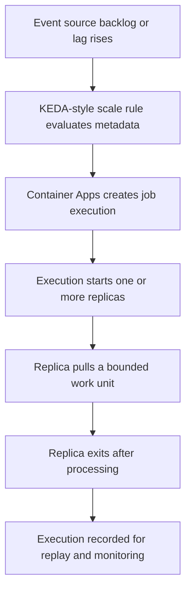

---
content_sources:
  diagrams:
    - id: event-driven-job-flow
      type: flowchart
      source: self-generated
      justification: Synthesized from repository event-driven job examples and Microsoft Learn Jobs/scale guidance while the exact scaler support matrix remained unconfirmed.
      based_on:
        - https://learn.microsoft.com/azure/container-apps/jobs
        - https://learn.microsoft.com/azure/container-apps/scale-app#jobs
content_validation:
  status: pending_review
  last_reviewed: "2026-04-26"
  reviewer: ai-agent
  core_claims:
    - claim: "Azure Container Apps Jobs support event-driven triggering."
      source: "https://learn.microsoft.com/azure/container-apps/jobs"
      verified: true
    - claim: "Jobs can use scale-rule metadata and authentication patterns similar to other Container Apps scale integrations."
      source: "https://learn.microsoft.com/azure/container-apps/scale-app#jobs"
      verified: true
---

# Event-Driven Jobs

Event-Driven Jobs create discrete executions when an external event source indicates work is available. This model fits queue backlogs, asynchronous integration pipelines, and bursty background workloads.

## Main Content

### How event triggering works

Event-driven Jobs combine a job definition with KEDA-style scale metadata. Instead of keeping a worker process alive, the platform creates an execution when the event rule indicates work should be pulled.

```bash
export RG="rg-aca-prod"
export ENVIRONMENT_NAME="aca-env-prod"
export JOB_NAME="job-orders-queue"
export IMAGE_NAME="acrsharedprod.azurecr.io/jobs/orders-consumer:v1.0.0"

az containerapp job create \
  --name "$JOB_NAME" \
  --resource-group "$RG" \
  --environment "$ENVIRONMENT_NAME" \
  --trigger-type "Event" \
  --scale-rule-name "orders-queue" \
  --scale-rule-type "azure-servicebus" \
  --scale-rule-metadata "queueName=orders" "messageCount=10" "namespace=<servicebus-namespace>.servicebus.windows.net" \
  --replica-timeout 900 \
  --replica-retry-limit 2 \
  --image "$IMAGE_NAME"
```

### Event sources and scaler support

The repository already uses Azure Service Bus as the clearest event-driven Jobs example. Broader scaler support should be treated carefully until you verify the current Jobs-specific support matrix.

| Topic | Conservative guidance |
|---|---|
| Safest documented example in this guide | Azure Service Bus |
| Other likely candidates | Storage Queue, Event Hubs, Kafka, and other KEDA-backed sources may be possible, but verify current Jobs support explicitly |
| Operational rule | Do not assume feature parity with continuously running Container Apps |

!!! warning "Jobs scaler coverage was not fully re-verified"
    The source-collection run did not complete with direct quotes for the exact event-scaler matrix specific to Jobs.
    Verify the current Container Apps Jobs documentation before you assume that every scaler available to apps is also supported for event-driven Jobs.

### Polling interval and scale rules

Event-driven Jobs depend on the scaler configuration to decide when new executions are created. In practice, the two most important operator inputs are:

- Threshold metadata such as queue length or lag
- Authentication details that let the scaler inspect the source

!!! warning "Polling interval details depend on the scaler"
    This guide does not assert a universal polling interval for all event-driven Jobs.
    Confirm the current scaler-specific defaults and tunables before you use queue-latency SLOs or cost projections.

### Authentication choices

Prefer this order:

1. Managed identity when the scaler and event source support it.
2. Secret-backed connection metadata when identity is not available.
3. Separate identities or secrets per job when blast radius must stay narrow.

### Jobs vs event-driven apps

Use an event-driven Job when:

- Each run should pull a bounded unit of work and exit.
- Cold start per execution is acceptable.
- You want explicit execution history and replay behavior.

Use an event-driven Container App when:

- A long-running worker should keep consuming continuously.
- Warm process state or connection reuse materially improves throughput.
- The consumer should scale existing replicas up and down rather than launch one-shot executions.

### Event-driven execution model

<!-- diagram-id: event-driven-job-flow -->


## See Also

- [Container Apps Jobs Overview](index.md)
- [Execution Lifecycle](execution-lifecycle.md)
- [Jobs vs Apps](jobs-vs-apps.md)
- [Job Design](../../best-practices/job-design.md)

## Sources

- [Jobs in Azure Container Apps (Microsoft Learn)](https://learn.microsoft.com/azure/container-apps/jobs)
- [Scale jobs in Azure Container Apps (Microsoft Learn)](https://learn.microsoft.com/azure/container-apps/scale-app#jobs)
