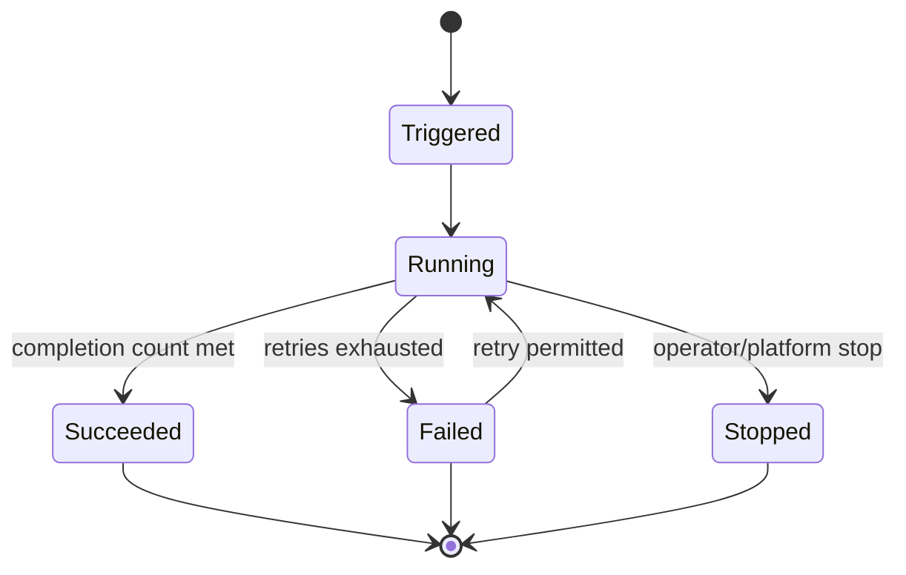

---
content_sources:
  diagrams:
    - id: job-execution-state-model
      type: state
      source: self-generated
      justification: Conceptual state model synthesized from existing repository job troubleshooting evidence and Microsoft Learn Jobs guidance pending final quote verification.
      based_on:
        - https://learn.microsoft.com/azure/container-apps/jobs
        - https://learn.microsoft.com/azure/container-apps/scale-app#jobs
content_validation:
  status: pending_review
  last_reviewed: "2026-04-26"
  reviewer: ai-agent
  core_claims:
    - claim: "A Container Apps Job execution can run one or more replicas."
      source: "https://learn.microsoft.com/azure/container-apps/jobs"
      verified: true
    - claim: "Scheduled and event-based jobs keep only a limited recent execution history."
      source: "https://learn.microsoft.com/azure/container-apps/jobs"
      verified: true
---

# Execution Lifecycle

Understanding the execution lifecycle is the key to sizing parallelism, handling retries safely, and building useful monitoring for Jobs.

## Main Content

### Conceptual execution states

At a high level, a Job execution moves through trigger, runtime, and terminal phases.

| Phase | Operator meaning |
|---|---|
| Triggered / Created | The platform has registered a new execution |
| Running | One or more replicas are executing |
| Succeeded | Completion criteria were met |
| Failed | Retries were exhausted or the execution could not complete |
| Stopped | An operator or platform action ended the run before successful completion |

!!! warning "State labels below are conceptual unless re-verified against the live API"
    Use this page to understand transitions, not to hard-code enum values.
    Before parsing execution status in automation, verify the exact current labels exposed by Azure CLI or the management API.

### Replica fan-out: `parallelism` and `replicaCompletionCount`

An execution can fan out to multiple replicas.

- `parallelism` limits how many replicas can run at once.
- `replicaCompletionCount` defines how many successful replicas are required before the execution is treated as complete.

This gives you two useful models:

- **All replicas required**: every partition must succeed.
- **n-of-m completion**: a subset of replicas can satisfy the execution.

Choose n-of-m only when downstream correctness explicitly allows partial success.

### Retry and timeout controls

Use `replicaRetryLimit` and `replicaTimeout` together:

| Setting | Primary purpose | Failure mode if mis-tuned |
|---|---|---|
| `replicaRetryLimit` | Recover from transient failure | Retry storms or repeated side effects |
| `replicaTimeout` | Stop stuck or unexpectedly long replicas | Silent hangs or premature termination |

Design guidance:

1. Measure normal and p95 duration.
2. Set timeout above p95 with headroom.
3. Retry only failures that are truly transient.
4. Make all external writes idempotent before increasing retry counts.

### History retention

The current repository already documents that scheduled and event-based Jobs retain only the most recent 100 successful and failed executions.

Operational implications:

- Export important execution evidence to dashboards or tickets quickly.
- Keep longer-term success-rate reporting in Log Analytics or Application Insights.
- Do not rely on the platform execution list alone for long-term audit history.

!!! warning "Manual-job retention behavior should be confirmed before using it as an audit log"
    The 100-execution retention statement is already cited for scheduled and event-driven Jobs in this repository.
    Re-verify manual execution retention separately if long-running audit history matters for your workload.

### Lifecycle state model

<!-- diagram-id: job-execution-state-model -->

## See Also

- [Container Apps Jobs Overview](index.md)
- [Manual Jobs](manual-jobs.md)
- [Scheduled Jobs](scheduled-jobs.md)
- [Event-Driven Jobs](event-driven-jobs.md)
- [Jobs Operations](../../operations/jobs/index.md)

## Sources

- [Jobs in Azure Container Apps (Microsoft Learn)](https://learn.microsoft.com/azure/container-apps/jobs)
- [Scale jobs in Azure Container Apps (Microsoft Learn)](https://learn.microsoft.com/azure/container-apps/scale-app#jobs)
