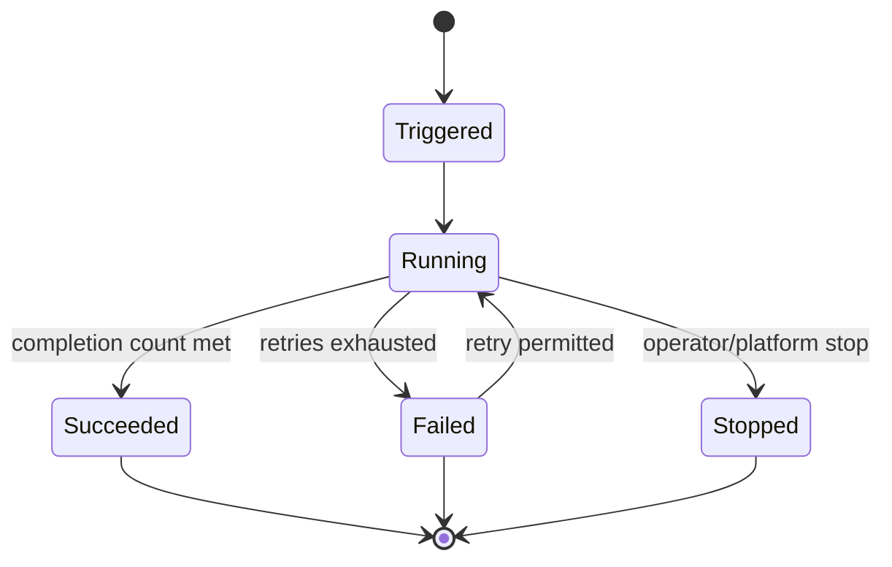
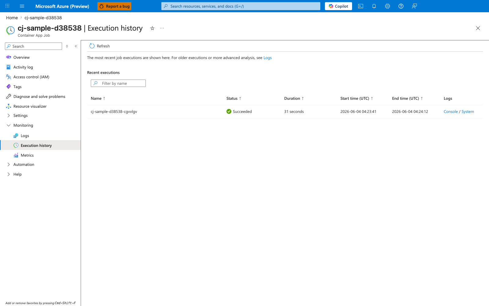

---
content_sources:
  diagrams:
  - id: job-execution-state-model
    type: state
    source: self-generated
    justification: Conceptual state model synthesized from existing repository job troubleshooting evidence and Microsoft
      Learn Jobs guidance pending final quote verification.
    based_on:
    - https://learn.microsoft.com/azure/container-apps/jobs
    - https://learn.microsoft.com/azure/container-apps/scale-app#jobs
content_validation:
  status: pending_review
  last_reviewed: '2026-04-26'
  reviewer: ai-agent
  core_claims:
  - claim: A Container Apps Job execution can run one or more replicas.
    source: https://learn.microsoft.com/azure/container-apps/jobs
    verified: true
  - claim: Scheduled and event-based jobs keep only a limited recent execution history.
    source: https://learn.microsoft.com/azure/container-apps/jobs
    verified: true
---
# Execution Lifecycle

Understanding the execution lifecycle is the key to sizing parallelism, handling retries safely, and building useful monitoring for Jobs.

## Main Content

### Conceptual execution states

At a high level, a Job execution moves through trigger, runtime, and terminal phases.

| Phase | Operator meaning |
|---|---|
| Triggered / Created | The platform has registered a new execution |
| Running | One or more replicas are executing |
| Succeeded | Completion criteria were met |
| Failed | Retries were exhausted or the execution could not complete |
| Stopped | An operator or platform action ended the run before successful completion |

!!! warning "State labels below are conceptual unless re-verified against the live API"
    Use this page to understand transitions, not to hard-code enum values.
    Before parsing execution status in automation, verify the exact current labels exposed by Azure CLI or the management API.

### Replica fan-out: `parallelism` and `replicaCompletionCount`

An execution can fan out to multiple replicas.

- `parallelism` limits how many replicas can run at once.
- `replicaCompletionCount` defines how many successful replicas are required before the execution is treated as complete.

This gives you two useful models:

- **All replicas required**: every partition must succeed.
- **n-of-m completion**: a subset of replicas can satisfy the execution.

Choose n-of-m only when downstream correctness explicitly allows partial success.

### Retry and timeout controls

Use `replicaRetryLimit` and `replicaTimeout` together:

| Setting | Primary purpose | Failure mode if mis-tuned |
|---|---|---|
| `replicaRetryLimit` | Recover from transient failure | Retry storms or repeated side effects |
| `replicaTimeout` | Stop stuck or unexpectedly long replicas | Silent hangs or premature termination |

Design guidance:

1. Measure normal and p95 duration.
2. Set timeout above p95 with headroom.
3. Retry only failures that are truly transient.
4. Make all external writes idempotent before increasing retry counts.

### History retention

The current repository already documents that scheduled and event-based Jobs retain only the most recent 100 successful and failed executions.

Operational implications:

- Export important execution evidence to dashboards or tickets quickly.
- Keep longer-term success-rate reporting in Log Analytics or Application Insights.
- Do not rely on the platform execution list alone for long-term audit history.

!!! warning "Manual-job retention behavior should be confirmed before using it as an audit log"
    The 100-execution retention statement is already cited for scheduled and event-driven Jobs in this repository.
    Re-verify manual execution retention separately if long-running audit history matters for your workload.

### Lifecycle state model

<!-- diagram-id: job-execution-state-model -->

### Portal view of execution history

**[Observed]** The blade title reads `Container App Job` and `Execution history`. The left navigation shows `Monitoring` expanded with `Logs`, `Execution history`, and `Metrics`. A `Refresh` control appears above the table. The text reads `The most recent job executions are shown here. For older executions or more advanced analysis, see Logs`. The section is labeled `Recent executions` with a `Filter by name` search box. The table columns are `Name`, `Status`, `Duration`, `Start time (UTC)`, `End time (UTC)`, and `Logs`. One row appears: `Status` of `Succeeded`, `Duration` of `31 seconds`, `Start time (UTC)` of `2026-06-04 04:23:41`, `End time (UTC)` of `2026-06-04 04:24:12`, with `Console` and `System` links in the `Logs` column.

**[Inferred]** The `Status` column of `Succeeded` appears consistent with the `Succeeded` terminal state in the [Conceptual execution states](#conceptual-execution-states) table. The `Duration`, `Start time (UTC)`, and `End time (UTC)` columns appear to surface the runtime window referenced by `replicaTimeout` in [Retry and timeout controls](#retry-and-timeout-controls). The presence of a single row alongside the `For older executions or more advanced analysis, see Logs` text is consistent with the bounded-retention point made in [History retention](#history-retention).

**[Not Proven]** No `Failed` or `Stopped` row is visible in this PNG. The number of replicas per execution is not shown on this blade. Retry counts are not shown on this blade. The trigger type that started this execution is not shown on this blade.

## See Also

- [Container Apps Jobs Overview](index.md)
- [Manual Jobs](manual-jobs.md)
- [Scheduled Jobs](scheduled-jobs.md)
- [Event-Driven Jobs](event-driven-jobs.md)
- [Jobs Operations](../../operations/jobs/index.md)

## Sources

- [Jobs in Azure Container Apps (Microsoft Learn)](https://learn.microsoft.com/azure/container-apps/jobs)
- [Scale jobs in Azure Container Apps (Microsoft Learn)](https://learn.microsoft.com/azure/container-apps/scale-app#jobs)
