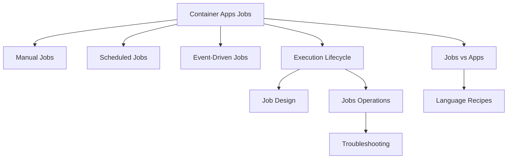

---
content_sources:
  diagrams:
    - id: jobs-document-map
      type: flowchart
      source: self-generated
      justification: Synthesized from existing repository Jobs content and Microsoft Learn Jobs/scale guidance while quote collection remained incomplete.
      based_on:
        - https://learn.microsoft.com/azure/container-apps/jobs
        - https://learn.microsoft.com/azure/container-apps/scale-app#jobs
content_validation:
  status: pending_review
  last_reviewed: "2026-04-26"
  reviewer: ai-agent
  core_claims:
    - claim: "Azure Container Apps Jobs are designed for finite background execution rather than continuously serving traffic."
      source: "https://learn.microsoft.com/azure/container-apps/jobs"
      verified: true
    - claim: "Azure Container Apps Jobs support manual, schedule, and event triggers."
      source: "https://learn.microsoft.com/azure/container-apps/jobs"
      verified: true
    - claim: "Scheduled and event-driven job history is retained only for a limited number of recent executions."
      source: "https://learn.microsoft.com/azure/container-apps/jobs"
      verified: true
---

# Container Apps Jobs

Azure Container Apps Jobs run bounded background work with a defined start and finish. Use this section to choose a trigger model, understand execution fan-out, and operate jobs safely in production.

## Main Content

### What this section covers

- [Manual Jobs](manual-jobs.md) for operator-driven backfills, maintenance, and replay.
- [Scheduled Jobs](scheduled-jobs.md) for cron-based recurring execution.
- [Event-Driven Jobs](event-driven-jobs.md) for queue- or event-triggered one-shot processing.
- [Execution Lifecycle](execution-lifecycle.md) for execution states, retries, timeouts, and retention.
- [Jobs vs Apps](jobs-vs-apps.md) for workload selection.

### When to choose Jobs

Choose Jobs when:

- Work is finite and success is defined by completion.
- Retries can safely re-run the same unit of work.
- Triggering should happen manually, on a schedule, or from an event source.

Choose Container Apps instead when:

- You expose ingress and continuously handle requests.
- A process should stay warm and consume work continuously.
- You want scale decisions to adjust long-running replicas instead of starting discrete executions.

### Reading path

1. Start with the trigger guide that matches your workload.
2. Read [Execution Lifecycle](execution-lifecycle.md) before tuning parallelism or retries.
3. Use [Jobs vs Apps](jobs-vs-apps.md) if the workload boundary is still unclear.
4. Apply [Job Design](../../best-practices/job-design.md) before production rollout.
5. Use [Jobs Operations](../../operations/jobs/index.md) for replay, inspection, and monitoring.

!!! warning "Advanced Jobs details need final source re-verification"
    During this update, background source collection for exact schema/property quotes did not complete.
    This section keeps verified high-level concepts, but pages that discuss exact cron semantics, execution state labels, Log Analytics columns, or event-scaler coverage call out those areas explicitly before you automate against them.

### Jobs document map

<!-- diagram-id: jobs-document-map -->

## See Also

- [Platform Overview](../index.md)
- [Job Design](../../best-practices/job-design.md)
- [Jobs Best Practices](../../best-practices/jobs.md)
- [Jobs Operations](../../operations/jobs/index.md)
- [Python Jobs Recipe](../../language-guides/python/recipes/jobs.md)

## Sources

- [Jobs in Azure Container Apps (Microsoft Learn)](https://learn.microsoft.com/azure/container-apps/jobs)
- [Scale jobs in Azure Container Apps (Microsoft Learn)](https://learn.microsoft.com/azure/container-apps/scale-app#jobs)
