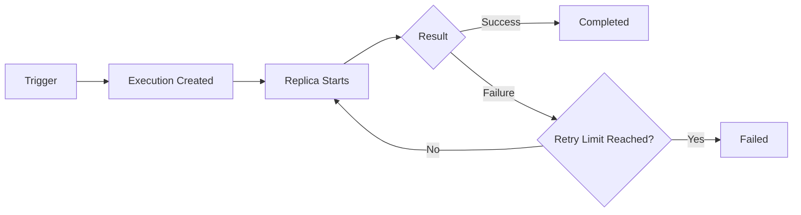

---
hide:
  - toc
---

# Container Apps Jobs

Azure Container Apps Jobs run **finite background work** instead of continuously serving traffic. Use jobs when execution has a clear start and finish, such as scheduled cleanup, data import, queue processing, and file transformation.

## What are Jobs?

A Container App is optimized for long-running API or worker services. A Container Apps Job is optimized for one execution unit that can complete, fail, and retry according to policy.

Use jobs when:

- Work is bounded and can be retried safely.
- You need manual, scheduled, or event-driven triggers.
- Scale behavior is tied to execution count, not HTTP traffic.

Use apps when:

- You need always-on request handling.
- You expose an ingress endpoint to clients.
- You maintain long-lived process state in memory.

!!! warning "Jobs must be idempotent"
    Retries and parallel executions can reprocess the same work item.
    Design input handling so duplicate execution does not corrupt state.

## Execution Models

### Manual trigger

Manual jobs are ideal for one-off tasks: backfills, schema migrations, reprocessing failed records, or operator-driven maintenance.

```bash
az containerapp job start \
  --name "$JOB_NAME" \
  --resource-group "$RG"
```

### Scheduled

Scheduled jobs run by cron expression and are useful for recurring operations such as nightly compaction, report generation, and stale artifact cleanup.

```bash
az containerapp job create \
  --name "$JOB_NAME" \
  --resource-group "$RG" \
  --environment "$ENVIRONMENT_NAME" \
  --trigger-type "Schedule" \
  --cron-expression "0 */6 * * *" \
  --image "$ACR_NAME.azurecr.io/python-job:v1"
```

### Event-driven

Event-driven jobs react to external signals such as queue depth or blob events. This model is suited for asynchronous throughput pipelines where scale and cost efficiency matter.

```bash
az containerapp job create \
  --name "$JOB_NAME" \
  --resource-group "$RG" \
  --environment "$ENVIRONMENT_NAME" \
  --trigger-type "Event" \
  --scale-rule-name "queue-processor" \
  --scale-rule-type "azure-servicebus" \
  --scale-rule-metadata "queueName=jobs" "messageCount=10" "namespace=<servicebus-namespace>.servicebus.windows.net" \
  --image "$ACR_NAME.azurecr.io/python-job:v1"
```

## App vs Job Decision Matrix

| Decision area | Container App | Container Apps Job |
|---|---|---|
| Primary workload | API/service traffic | Batch or async task execution |
| Lifetime model | Long-running process | Finite run with completion |
| Trigger model | HTTP/event-driven scaling | Manual, cron, event trigger |
| Ingress requirement | Common | Usually none |
| Retry behavior | App-level logic | Job execution retry policy |
| Cost profile | Baseline runtime + scale | Pay during execution windows |
| Best examples | Public API, internal service | ETL, cleanup, periodic reporting |

## Configuration Patterns

### Timeout and retry settings

- Set `--replica-timeout` based on worst-case execution plus headroom.
- Use `--replica-retry-limit` for transient failures only.
- Ensure your code is idempotent before increasing retry counts.

### Parallelism and replica completion

- `--parallelism` controls concurrent replicas for one execution.
- `--replica-completion-count` controls how many successful replicas mark completion.
- Start with conservative values, then scale after verifying external dependency limits.

### Trigger configuration

- Manual: prefer for operator-controlled execution.
- Scheduled: use UTC cron and document business timezone assumptions.
- Event-driven: verify scale rule metadata and identity permissions to event source.

## Identity and Secrets

Jobs use the same identity patterns as apps:

- Prefer user-assigned or system-assigned managed identity.
- Assign least-privilege RBAC to data stores and messaging services.
- Store configuration in environment variables and sensitive values in secrets.
- Use Key Vault references for centralized secret lifecycle management.

## Monitoring Job Executions

Track executions and troubleshoot failures with Azure CLI:

```bash
az containerapp job execution list \
  --name "$JOB_NAME" \
  --resource-group "$RG" \
  --output table
```

```bash
az containerapp job logs show \
  --name "$JOB_NAME" \
  --resource-group "$RG"
```

Monitor these signals:

- Execution success/failure ratio
- Retry count trend
- Duration distribution (p50/p95)
- Dependency-specific errors (authentication, throttling, timeout)

!!! tip "Set timeouts from measured runtime"
    Start from observed p95 execution duration and add headroom.
    Avoid unlimited timeout behavior that hides stuck executions.

## Common Patterns

### Data processing pipeline

Ingest file or queue item, transform it, then write canonical output. Keep each step idempotent so retries are safe.

### Scheduled cleanup

Run daily cleanup to remove expired blobs, temporary records, or stale artifacts. Add dry-run mode for safe validation.

### Event-driven media processing

Trigger on new uploads, transcode or enrich content, and emit completion metadata for downstream consumers.

## Job Lifecycle



## Reference Implementation

- [Python Reference Job README](https://github.com/yeongseon/azure-container-apps-practical-guide/tree/main/jobs/python)
- [Python Job Source](https://github.com/yeongseon/azure-container-apps-practical-guide/blob/main/jobs/python/src/job.py)

## See Also

- [Platform Overview](../index.md)
- [Identity and Secrets](../identity-and-secrets/managed-identity.md)
- [Operations - Monitoring](../../operations/monitoring/index.md)

## Sources

- [Jobs in Azure Container Apps (Microsoft Learn)](https://learn.microsoft.com/azure/container-apps/jobs)
- [Scale jobs in Azure Container Apps (Microsoft Learn)](https://learn.microsoft.com/azure/container-apps/scale-app#jobs)
