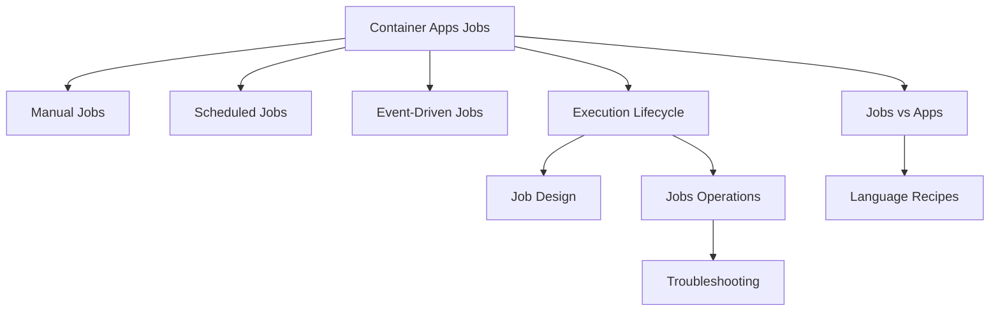
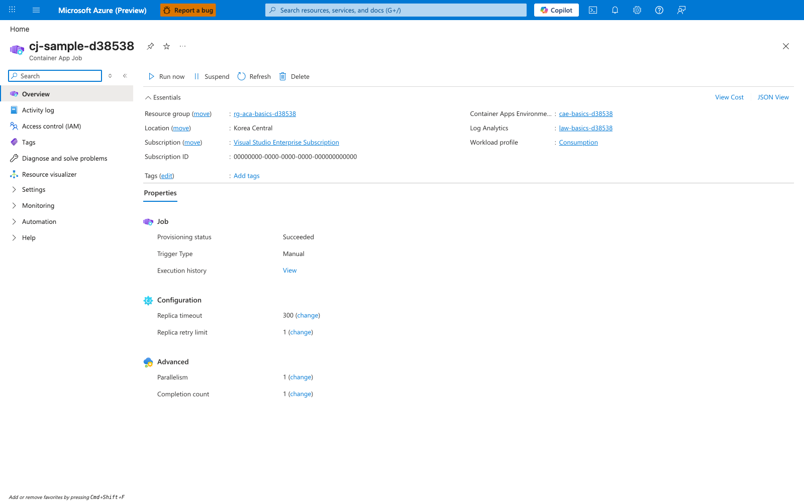

---
content_sources:
  diagrams:
  - id: jobs-document-map
    type: flowchart
    source: self-generated
    justification: Synthesized from existing repository Jobs content and Microsoft Learn Jobs/scale guidance while quote collection
      remained incomplete.
    based_on:
    - https://learn.microsoft.com/azure/container-apps/jobs
    - https://learn.microsoft.com/azure/container-apps/scale-app#jobs
content_validation:
  status: pending_review
  last_reviewed: '2026-04-26'
  reviewer: ai-agent
  core_claims:
  - claim: Azure Container Apps Jobs are designed for finite background execution rather than continuously serving traffic.
    source: https://learn.microsoft.com/azure/container-apps/jobs
    verified: true
  - claim: Azure Container Apps Jobs support manual, schedule, and event triggers.
    source: https://learn.microsoft.com/azure/container-apps/jobs
    verified: true
  - claim: Scheduled and event-driven job history is retained only for a limited number of recent executions.
    source: https://learn.microsoft.com/azure/container-apps/jobs
    verified: true
---
# Container Apps Jobs

Azure Container Apps Jobs run bounded background work with a defined start and finish. Use this section to choose a trigger model, understand execution fan-out, and operate jobs safely in production.

## Main Content

### What this section covers

- [Manual Jobs](manual-jobs.md) for operator-driven backfills, maintenance, and replay.
- [Scheduled Jobs](scheduled-jobs.md) for cron-based recurring execution.
- [Event-Driven Jobs](event-driven-jobs.md) for queue- or event-triggered one-shot processing.
- [Execution Lifecycle](execution-lifecycle.md) for execution states, retries, timeouts, and retention.
- [Jobs vs Apps](jobs-vs-apps.md) for workload selection.

### When to choose Jobs

Choose Jobs when:

- Work is finite and success is defined by completion.
- Retries can safely re-run the same unit of work.
- Triggering should happen manually, on a schedule, or from an event source.

Choose Container Apps instead when:

- You expose ingress and continuously handle requests.
- A process should stay warm and consume work continuously.
- You want scale decisions to adjust long-running replicas instead of starting discrete executions.

### Reading path

1. Start with the trigger guide that matches your workload.
2. Read [Execution Lifecycle](execution-lifecycle.md) before tuning parallelism or retries.
3. Use [Jobs vs Apps](jobs-vs-apps.md) if the workload boundary is still unclear.
4. Apply [Job Design](../../best-practices/job-design.md) before production rollout.
5. Use [Jobs Operations](../../operations/jobs/index.md) for replay, inspection, and monitoring.

!!! warning "Advanced Jobs details need final source re-verification"
    During this update, background source collection for exact schema/property quotes did not complete.
    This section keeps verified high-level concepts, but pages that discuss exact cron semantics, execution state labels, Log Analytics columns, or event-scaler coverage call out those areas explicitly before you automate against them.

### Jobs document map

<!-- diagram-id: jobs-document-map -->

## Portal View: Job Resource with Trigger and Lifecycle Fields

**[Observed]** `cj-sample-d38538`. `Container App Job`. `Run now`. `Suspend`. `Refresh`. `Delete`. `Resource group`. `rg-aca-basics-d38538`. `Location`. `Korea Central`. `Subscription`. `Visual Studio Enterprise Subscription`. `Subscription ID`. `00000000-0000-0000-0000-000000000000`. `Container Apps Environme...`. `cae-basics-d38538`. `Log Analytics`. `law-basics-d38538`. `Workload profile`. `Consumption`. `Properties`. `Job`. `Provisioning status`. `Succeeded`. `Trigger Type`. `Manual`. `Execution history`. `View`. `Configuration`. `Replica timeout`. `300`. `Replica retry limit`. `1`. `Advanced`. `Parallelism`. `1`. `Completion count`. `1`.

**[Inferred]** The `Trigger Type` field reading `Manual` appears to map to the trigger taxonomy enumerated under [What this section covers](#what-this-section-covers), which lists Manual, Scheduled, and Event-Driven trigger pages. The `Replica timeout`, `Replica retry limit`, `Parallelism`, and `Completion count` fields appear to map to the execution parameters covered by [Execution Lifecycle](execution-lifecycle.md), which the [Reading path](#reading-path) calls out as the next step before tuning. The dedicated `Container App Job` resource type label is consistent with [Jobs vs Apps](jobs-vs-apps.md) being a distinct workload boundary documented on this page.

**[Not Proven]** The trigger taxonomy enumerated on this page (Manual, Schedule, Event) is not enumerable from this single blade — only the current `Manual` selection is shown. The cron field for Schedule triggers is not shown on this Manual job. The event scaler field for Event-Driven triggers is not shown on this Manual job. Whether the `Suspend` toolbar action interrupts a running execution cannot be determined from this static view.

## Review Matrix

| Review area | Page-specific check |
|---|---|
| Scope | Confirm the guidance applies to Container Apps Jobs. |
| Source basis | Validate the recommendation against the Microsoft Learn sources in this page. |
| Evidence | Capture command output, portal state, metrics, logs, or screenshots before treating the result as proven. |

## See Also

- [Platform Overview](../index.md)
- [Job Design](../../best-practices/job-design.md)
- [Jobs Best Practices](../../best-practices/jobs.md)
- [Jobs Operations](../../operations/jobs/index.md)
- [Python Jobs Recipe](../../language-guides/python/recipes/jobs.md)

## Sources

- [Jobs in Azure Container Apps (Microsoft Learn)](https://learn.microsoft.com/azure/container-apps/jobs)
- [Scale jobs in Azure Container Apps (Microsoft Learn)](https://learn.microsoft.com/azure/container-apps/scale-app#jobs)
