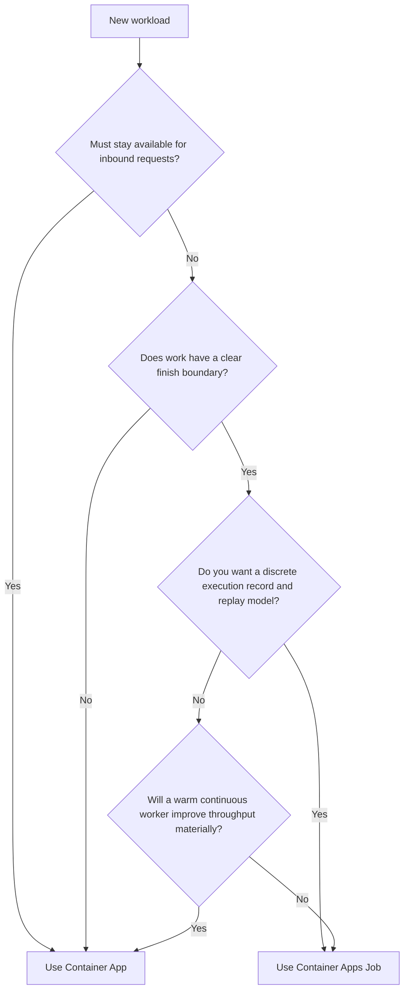

---
content_sources:
  diagrams:
    - id: jobs-vs-apps-decision-tree
      type: flowchart
      source: self-generated
      justification: Synthesized from Microsoft Learn Jobs, scaling, and Container Apps overview guidance for workload selection.
      based_on:
        - https://learn.microsoft.com/azure/container-apps/jobs
        - https://learn.microsoft.com/azure/container-apps/scale-app#jobs
        - https://learn.microsoft.com/azure/container-apps/overview
content_validation:
  status: pending_review
  last_reviewed: "2026-04-26"
  reviewer: ai-agent
  core_claims:
    - claim: "Jobs are designed for finite execution while Container Apps are designed for continuously running services and workers."
      source: "https://learn.microsoft.com/azure/container-apps/jobs"
      verified: true
    - claim: "Container Apps can scale long-running replicas, while Jobs create separate executions."
      source: "https://learn.microsoft.com/azure/container-apps/scale-app#jobs"
      verified: true
---

# Jobs vs Apps

Container Apps and Container Apps Jobs share the same environment capabilities, but they solve different workload shapes.

## Main Content

### Decision matrix

| Decision area | Container Apps Job | Container App |
|---|---|---|
| Lifetime | Bounded execution with a start and finish | Continuous process that can stay warm |
| Trigger | Manual, schedule, or event-driven execution creation | Ingress traffic or scaler-driven replica changes |
| Processing style | One-shot pull and exit | Continuous consumption or request serving |
| Best fit | Batch, replay, reconciliation, queue drains | APIs, background workers, long-lived consumers |
| Replay model | Start a new execution | Keep serving with scaled replicas |
| Operational artifact | Execution history | Revision/replica state |

### Cost model framing

Use this simple operator model:

- Jobs concentrate cost into execution windows.
- Apps can still scale to zero in some designs, but they are optimized for a continuously available service or worker model.

!!! warning "This page uses an operator cost model, not a billing quote"
    Actual billing depends on plan, workload profile, resource sizing, and execution duration.
    Confirm pricing with the current Azure Container Apps pricing documentation before making a cost commitment.

### When Jobs are the better choice

Use Jobs when:

- Completion matters more than low-latency warm handling.
- The workload can cleanly start, process, and exit.
- Operators need explicit replay and execution history.

### When Apps are the better choice

Use Apps when:

- The workload must stay ready for inbound requests.
- You need persistent worker connections or warm caches.
- Scaling should add or remove replicas of a continuously running process.

### Event-driven Jobs vs event-driven apps

For event processing:

- **Job**: create an execution, pull a bounded work unit, exit.
- **App**: keep a worker process alive and scale that worker fleet up or down.

Choose Jobs when each event batch should map to a discrete run. Choose apps when the worker should keep polling or receiving continuously.

### Decision tree

<!-- diagram-id: jobs-vs-apps-decision-tree -->

## See Also

- [Container Apps Jobs Overview](index.md)
- [Event-Driven Jobs](event-driven-jobs.md)
- [Job Design](../../best-practices/job-design.md)
- [Operations](../../operations/index.md)

## Sources

- [Jobs in Azure Container Apps (Microsoft Learn)](https://learn.microsoft.com/azure/container-apps/jobs)
- [Scale jobs in Azure Container Apps (Microsoft Learn)](https://learn.microsoft.com/azure/container-apps/scale-app#jobs)
- [Azure Container Apps overview (Microsoft Learn)](https://learn.microsoft.com/azure/container-apps/overview)
