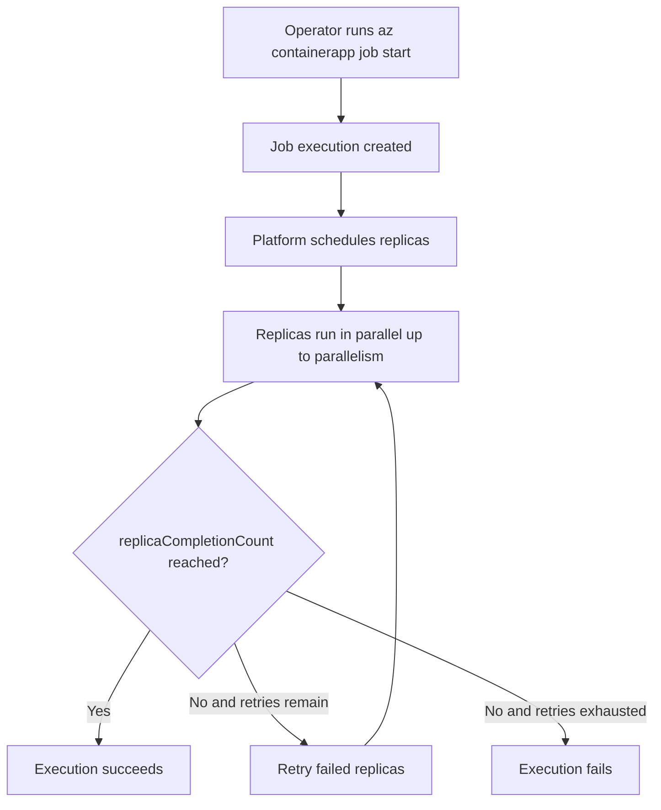

---
content_sources:
  diagrams:
    - id: manual-job-trigger-to-completion
      type: flowchart
      source: self-generated
      justification: Synthesized from Microsoft Learn Jobs guidance and existing repository job examples while exact schema quotes remained pending.
      based_on:
        - https://learn.microsoft.com/azure/container-apps/jobs
        - https://learn.microsoft.com/azure/container-apps/scale-app#jobs
content_validation:
  status: pending_review
  last_reviewed: "2026-04-26"
  reviewer: ai-agent
  core_claims:
    - claim: "Azure Container Apps Jobs can be started manually."
      source: "https://learn.microsoft.com/azure/container-apps/jobs"
      verified: true
    - claim: "Job executions can run multiple replicas and use retry and timeout settings."
      source: "https://learn.microsoft.com/azure/container-apps/jobs"
      verified: true
---

# Manual Jobs

Manual Jobs are best for ad-hoc execution: data repair, one-time backfills, controlled maintenance windows, and manual replay after a failed run.

## Main Content

### How a manual job is triggered

Create the job once, then start executions on demand:

```bash
export RG="rg-aca-prod"
export ENVIRONMENT_NAME="aca-env-prod"
export JOB_NAME="job-orders-backfill"
export IMAGE_NAME="acrsharedprod.azurecr.io/jobs/orders-backfill:v1.0.0"

az containerapp job create \
  --name "$JOB_NAME" \
  --resource-group "$RG" \
  --environment "$ENVIRONMENT_NAME" \
  --trigger-type "Manual" \
  --parallelism 2 \
  --replica-completion-count 2 \
  --replica-retry-limit 1 \
  --replica-timeout 1800 \
  --image "$IMAGE_NAME"

az containerapp job start \
  --name "$JOB_NAME" \
  --resource-group "$RG"
```

### Execution lifecycle for operator-driven runs

Manual triggering creates a job execution, then the platform starts one or more replicas from the job template.

- The execution is the platform record you inspect later.
- Replicas are the actual container instances that run the work.
- Success or failure is determined by completion rules and retry/timeout policy.

!!! warning "Exact execution state strings need current-source verification"
    This guide uses operator-friendly labels such as `Running`, `Succeeded`, `Failed`, and `Stopped`.
    Before you build automation around API or CLI output, confirm the exact state names currently emitted by Microsoft Learn, Azure CLI, or the ARM/management API.

### Parallelism and `replicaCompletionCount`

Use the two execution fan-out controls together:

| Setting | What it controls | Typical use |
|---|---|---|
| `--parallelism` | Maximum replicas that may run concurrently for one execution | Parallel shard processing |
| `--replica-completion-count` | How many successful replicas are required before the execution is considered complete | All-partitions-required or n-of-m patterns |

Practical patterns:

- `parallelism=1`, `replica-completion-count=1`: one execution, one worker.
- `parallelism=4`, `replica-completion-count=4`: all four partitions must succeed.
- `parallelism=8`, `replica-completion-count=3`: n-of-m completion semantics, only use this when partial completion is acceptable by design.

### Retry behavior with `replicaRetryLimit`

`--replica-retry-limit` controls how many times a failed replica may be retried before the execution settles as failed.

Use low retry counts when:

- Failure is data-dependent rather than transient.
- The workload has expensive side effects.
- An operator wants a failed execution to stop quickly for inspection.

Use higher retry counts only when:

- The workload is idempotent.
- Failures are transient, such as short dependency outages.
- You have measured that replay does not overload the downstream system.

### Recommended manual-job pattern

Manual Jobs work best when the operator can answer three questions before starting a run:

1. What exact input or partition set is being processed?
2. Is the job safe to retry if one or more replicas fail?
3. What log or dashboard proves that the run completed correctly?

### Manual trigger flow

<!-- diagram-id: manual-job-trigger-to-completion -->


## See Also

- [Container Apps Jobs Overview](index.md)
- [Execution Lifecycle](execution-lifecycle.md)
- [Job Design](../../best-practices/job-design.md)
- [Jobs Operations](../../operations/jobs/index.md)

## Sources

- [Jobs in Azure Container Apps (Microsoft Learn)](https://learn.microsoft.com/azure/container-apps/jobs)
- [Scale jobs in Azure Container Apps (Microsoft Learn)](https://learn.microsoft.com/azure/container-apps/scale-app#jobs)
